# RuralKG Ontology

An ontology which serves the schema for the cross-domain knowledge graph (Rural-KG) to integrate health and justice data for rural resilience.

URI: rural-kg

Name: rural-kg

## Schema Diagram

```mermaid
erDiagram
Any {

}
RuralAdministrativeareaAdministrativeArea {

}
RuralAdministrativeareaCity {
    integer rural_administrativearea_ranking  
    float rural_administrativearea_longitude  
    string rural_administrativearea_name  
    float rural_administrativearea_latitude  
}
RuralAdministrativeareaCounty {
    string rural_administrativearea_fips  
    string rural_administrativearea_name  
}
RuralAdministrativeareaState {
    string rural_administrativearea_abbreviation  
    string rural_administrativearea_fips  
    string rural_administrativearea_name  
}
RuralMentalhealthserviceMentalHealth {

}
RuralMentalhealthserviceMentalHealthService {
    string rural_mentalhealthservice_description  
    string rural_mentalhealthservice_code  
    integer rural_mentalhealthservice_year  
    string rural_mentalhealthservice_name  
}
RuralMentalhealthserviceMentalHealthServiceCategory {
    string rural_mentalhealthservice_code  
    string rural_mentalhealthservice_name  
    integer rural_mentalhealthservice_year  
}
RuralSettlementtypeCountyStatus {
    integer rural_settlementtype_year  
    integer rural_settlementtype_population  
}
RuralSettlementtypeRUCC {
    string rural_settlementtype_code  
    integer rural_settlementtype_year  
    string rural_settlementtype_description  
}
RuralSettlementtypeSettlementType {

}
RuralSubstanceabuseSubstance {
    string rural_substanceabuse_name  
    integer rural_substanceabuse_year  
    string rural_substanceabuse_sourceDataset  
    string rural_substanceabuse_code  
}
RuralSubstanceabuseSubstanceAbuse {

}
RuralSubstanceabuseSubstanceRelatedIncident {
    string rural_substanceabuse_name  
    string rural_substanceabuse_sourceDataset  
    integer rural_substanceabuse_year  
}
RuralTreatmentproviderTreatmentProvider {
    string rural_treatmentprovider_name  
    string rural_treatmentprovider_alias  
    string rural_treatmentprovider_address  
    string rural_treatmentprovider_phone  
    string rural_treatmentprovider_zipcode  
}

RuralAdministrativeareaCity ||--|o RuralAdministrativeareaCounty : "rural_administrativearea_primaryCounty"
RuralAdministrativeareaState ||--|o RuralAdministrativeareaCounty : "rural_administrativearea_containsPlace"
RuralMentalhealthserviceMentalHealthServiceCategory ||--|o RuralMentalhealthserviceMentalHealthService : "rural_mentalhealthservice_containsService"
RuralSettlementtypeCountyStatus ||--|o RuralAdministrativeareaCounty : "rural_settlementtype_censusCounty"
RuralSettlementtypeCountyStatus ||--|o RuralSettlementtypeRUCC : "rural_settlementtype_hasRUCC"
RuralTreatmentproviderTreatmentProvider ||--|o RuralMentalhealthserviceMentalHealthService : "rural_treatmentprovider_providesService"
RuralTreatmentproviderTreatmentProvider ||--|o Any : "rural_treatmentprovider_inCity"

```

## Classes

| Class | Description |
| --- | --- |
| [Any](classes/Any.md) | None |
| [RuralAdministrativeareaAdministrativeArea](classes/RuralAdministrativeareaAdministrativeArea.md) | None |
| &nbsp;&nbsp;&nbsp;&nbsp;&nbsp;&nbsp;&nbsp;&nbsp;[RuralAdministrativeareaCity](classes/RuralAdministrativeareaCity.md) | City entities within a county or state. |
| &nbsp;&nbsp;&nbsp;&nbsp;&nbsp;&nbsp;&nbsp;&nbsp;[RuralAdministrativeareaCounty](classes/RuralAdministrativeareaCounty.md) | Defines counties within a state. |
| &nbsp;&nbsp;&nbsp;&nbsp;&nbsp;&nbsp;&nbsp;&nbsp;[RuralAdministrativeareaState](classes/RuralAdministrativeareaState.md) | Represents individual states within U.S. |
| [RuralMentalhealthserviceMentalHealth](classes/RuralMentalhealthserviceMentalHealth.md) | Mental health services, sourcing from services defined in National Directory Of Mental Health Treatment Facilities. |
| &nbsp;&nbsp;&nbsp;&nbsp;&nbsp;&nbsp;&nbsp;&nbsp;[RuralMentalhealthserviceMentalHealthService](classes/RuralMentalhealthserviceMentalHealthService.md) | Specific mental health services offered. |
| &nbsp;&nbsp;&nbsp;&nbsp;&nbsp;&nbsp;&nbsp;&nbsp;[RuralMentalhealthserviceMentalHealthServiceCategory](classes/RuralMentalhealthserviceMentalHealthServiceCategory.md) | Categories of mental health services. |
| [RuralSettlementtypeSettlementType](classes/RuralSettlementtypeSettlementType.md) | None |
| &nbsp;&nbsp;&nbsp;&nbsp;&nbsp;&nbsp;&nbsp;&nbsp;[RuralSettlementtypeCountyStatus](classes/RuralSettlementtypeCountyStatus.md) | Status of a county in terms of rural or urban classification. |
| &nbsp;&nbsp;&nbsp;&nbsp;&nbsp;&nbsp;&nbsp;&nbsp;[RuralSettlementtypeRUCC](classes/RuralSettlementtypeRUCC.md) | Rural-Urban Continuum Code classification. |
| [RuralSubstanceabuseSubstanceAbuse](classes/RuralSubstanceabuseSubstanceAbuse.md) | Categories of substance type and related incident types, extracted from National Survey on Drug Use and Health (NSDUH). |
| &nbsp;&nbsp;&nbsp;&nbsp;&nbsp;&nbsp;&nbsp;&nbsp;[RuralSubstanceabuseSubstance](classes/RuralSubstanceabuseSubstance.md) | Types of substances that can be abused. |
| &nbsp;&nbsp;&nbsp;&nbsp;&nbsp;&nbsp;&nbsp;&nbsp;[RuralSubstanceabuseSubstanceRelatedIncident](classes/RuralSubstanceabuseSubstanceRelatedIncident.md) | Types of incidents related to substance abuse. |
| [RuralTreatmentproviderTreatmentProvider](classes/RuralTreatmentproviderTreatmentProvider.md) | Entities that provide treatment services, sourcing from National Directory Of Mental Health Treatment Facilities. |

## Slots

| Slot | Description |
| --- | --- |
| [rural_administrativearea_abbreviation](slots/rural_administrativearea_abbreviation.md) | TODO -- tell the world what this slot (predicate) describes |
| [rural_administrativearea_containsPlace](slots/rural_administrativearea_containsPlace.md) | TODO -- tell the world what this slot (predicate) describes |
| [rural_administrativearea_fips](slots/rural_administrativearea_fips.md) | TODO -- tell the world what this slot (predicate) describes |
| [rural_administrativearea_latitude](slots/rural_administrativearea_latitude.md) | TODO -- tell the world what this slot (predicate) describes |
| [rural_administrativearea_longitude](slots/rural_administrativearea_longitude.md) | TODO -- tell the world what this slot (predicate) describes |
| [rural_administrativearea_name](slots/rural_administrativearea_name.md) | TODO -- tell the world what this slot (predicate) describes |
| [rural_administrativearea_primaryCounty](slots/rural_administrativearea_primaryCounty.md) | TODO -- tell the world what this slot (predicate) describes |
| [rural_administrativearea_ranking](slots/rural_administrativearea_ranking.md) | TODO -- tell the world what this slot (predicate) describes |
| [rural_mentalhealthservice_code](slots/rural_mentalhealthservice_code.md) | TODO -- tell the world what this slot (predicate) describes |
| [rural_mentalhealthservice_containsService](slots/rural_mentalhealthservice_containsService.md) | TODO -- tell the world what this slot (predicate) describes |
| [rural_mentalhealthservice_description](slots/rural_mentalhealthservice_description.md) | TODO -- tell the world what this slot (predicate) describes |
| [rural_mentalhealthservice_name](slots/rural_mentalhealthservice_name.md) | TODO -- tell the world what this slot (predicate) describes |
| [rural_mentalhealthservice_year](slots/rural_mentalhealthservice_year.md) | TODO -- tell the world what this slot (predicate) describes |
| [rural_settlementtype_censusCounty](slots/rural_settlementtype_censusCounty.md) | TODO -- tell the world what this slot (predicate) describes |
| [rural_settlementtype_code](slots/rural_settlementtype_code.md) | TODO -- tell the world what this slot (predicate) describes |
| [rural_settlementtype_description](slots/rural_settlementtype_description.md) | TODO -- tell the world what this slot (predicate) describes |
| [rural_settlementtype_hasRUCC](slots/rural_settlementtype_hasRUCC.md) | TODO -- tell the world what this slot (predicate) describes |
| [rural_settlementtype_population](slots/rural_settlementtype_population.md) | TODO -- tell the world what this slot (predicate) describes |
| [rural_settlementtype_year](slots/rural_settlementtype_year.md) | TODO -- tell the world what this slot (predicate) describes |
| [rural_substanceabuse_code](slots/rural_substanceabuse_code.md) | TODO -- tell the world what this slot (predicate) describes |
| [rural_substanceabuse_name](slots/rural_substanceabuse_name.md) | TODO -- tell the world what this slot (predicate) describes |
| [rural_substanceabuse_sourceDataset](slots/rural_substanceabuse_sourceDataset.md) | TODO -- tell the world what this slot (predicate) describes |
| [rural_substanceabuse_year](slots/rural_substanceabuse_year.md) | TODO -- tell the world what this slot (predicate) describes |
| [rural_treatmentprovider_address](slots/rural_treatmentprovider_address.md) | TODO -- tell the world what this slot (predicate) describes |
| [rural_treatmentprovider_alias](slots/rural_treatmentprovider_alias.md) | TODO -- tell the world what this slot (predicate) describes |
| [rural_treatmentprovider_inCity](slots/rural_treatmentprovider_inCity.md) | TODO -- tell the world what this slot (predicate) describes |
| [rural_treatmentprovider_name](slots/rural_treatmentprovider_name.md) | TODO -- tell the world what this slot (predicate) describes |
| [rural_treatmentprovider_phone](slots/rural_treatmentprovider_phone.md) | TODO -- tell the world what this slot (predicate) describes |
| [rural_treatmentprovider_providesService](slots/rural_treatmentprovider_providesService.md) | TODO -- tell the world what this slot (predicate) describes |
| [rural_treatmentprovider_zipcode](slots/rural_treatmentprovider_zipcode.md) | TODO -- tell the world what this slot (predicate) describes |

## Enumerations

| Enumeration | Description |
| --- | --- |

## Types

| Type | Description |
| --- | --- |

## Subsets

| Subset | Description |
| --- | --- |
