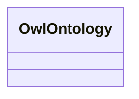

# Class: TODO -- what's a good name for what this class (type) describes? (owl_Ontology)


_TODO -- tell the world what this class (type) describes._


URI: [owl:Ontology](http://www.w3.org/2002/07/owl#Ontology)





<!-- no inheritance hierarchy -->


## Slots

| Name | Cardinality and Range | Description | Inheritance |
| ---  | --- | --- | --- |


## Usages

| used by | used in | type | used |
| ---  | --- | --- | --- |
| [RdfsClass](../classes/RdfsClass.md) | [rdfs_isDefinedBy](../slots/rdfs_isDefinedBy.md) | range | [OwlOntology](../classes/OwlOntology.md) |


## Examples

| Value |
| --- |
| rural:ontology |

## TODOs

* TODO -- Todos for this class go here
* or you can delete the todos
* if you think the class is perfect.

## Identifier and Mapping Information


### Schema Source


* from schema: rural-kg


## Mappings

| Mapping Type | Mapped Value |
| ---  | ---  |
| self | owl:Ontology |
| native | rural-kg/:OwlOntology |


## LinkML Source

<!-- TODO: investigate https://stackoverflow.com/questions/37606292/how-to-create-tabbed-code-blocks-in-mkdocs-or-sphinx -->

### Direct

<details>
```yaml
name: owl_Ontology
description: TODO -- tell the world what this class (type) describes.
title: TODO -- what's a good name for what this class (type) describes?
todos:
- TODO -- Todos for this class go here
- or you can delete the todos
- if you think the class is perfect.
notes:
- There are 1 instances of this class.
examples:
- value: rural:ontology
from_schema: rural-kg
class_uri: owl:Ontology

```
</details>

### Induced

<details>
```yaml
name: owl_Ontology
description: TODO -- tell the world what this class (type) describes.
title: TODO -- what's a good name for what this class (type) describes?
todos:
- TODO -- Todos for this class go here
- or you can delete the todos
- if you think the class is perfect.
notes:
- There are 1 instances of this class.
examples:
- value: rural:ontology
from_schema: rural-kg
class_uri: owl:Ontology

```
</details>