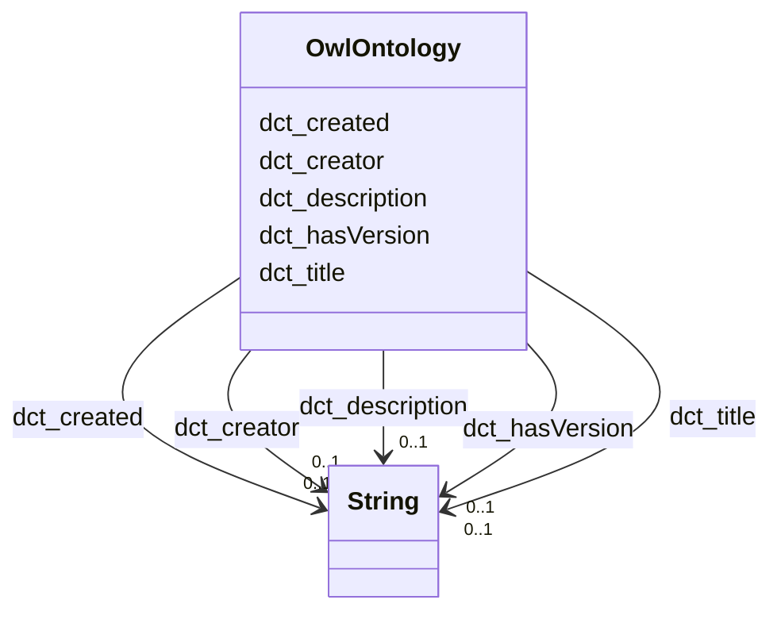

# Class: TODO -- what's a good name for what this class (type) describes? (owl_Ontology)


_TODO -- tell the world what this class (type) describes._


URI: [owl:Ontology](http://www.w3.org/2002/07/owl#Ontology)





<!-- no inheritance hierarchy -->


## Slots

| Name | Cardinality and Range | Description | Inheritance |
| ---  | --- | --- | --- |
| [dct_creator](../slots/dct_creator.md) | 0..1 <br/> [xsd:string](http://www.w3.org/2001/XMLSchema#string) | TODO -- tell the world what this slot (predicate) describes | direct |
| [dct_hasVersion](../slots/dct_hasVersion.md) | 0..1 <br/> [xsd:string](http://www.w3.org/2001/XMLSchema#string) | TODO -- tell the world what this slot (predicate) describes | direct |
| [dct_title](../slots/dct_title.md) | 0..1 <br/> [xsd:string](http://www.w3.org/2001/XMLSchema#string) | TODO -- tell the world what this slot (predicate) describes | direct |
| [dct_description](../slots/dct_description.md) | 0..1 <br/> [xsd:string](http://www.w3.org/2001/XMLSchema#string) | TODO -- tell the world what this slot (predicate) describes | direct |
| [dct_created](../slots/dct_created.md) | 0..1 <br/> [xsd:string](http://www.w3.org/2001/XMLSchema#string) | TODO -- tell the world what this slot (predicate) describes | direct |


## Usages

| used by | used in | type | used |
| ---  | --- | --- | --- |
| [RdfsClass](../classes/RdfsClass.md) | [rdfs_isDefinedBy](../slots/rdfs_isDefinedBy.md) | range | [OwlOntology](../classes/OwlOntology.md) |


## Examples

| Value |
| --- |
| rural:ontology |

## TODOs

* TODO -- Todos for this class go here
* or you can delete the todos
* if you think the class is perfect.

## Identifier and Mapping Information


### Schema Source


* from schema: rural-kg


## Mappings

| Mapping Type | Mapped Value |
| ---  | ---  |
| self | owl:Ontology |
| native | rural-kg/:OwlOntology |


## LinkML Source

<!-- TODO: investigate https://stackoverflow.com/questions/37606292/how-to-create-tabbed-code-blocks-in-mkdocs-or-sphinx -->

### Direct

<details>
```yaml
name: owl_Ontology
description: TODO -- tell the world what this class (type) describes.
title: TODO -- what's a good name for what this class (type) describes?
todos:
- TODO -- Todos for this class go here
- or you can delete the todos
- if you think the class is perfect.
notes:
- There are 1 instances of this class.
examples:
- value: rural:ontology
from_schema: rural-kg
slots:
- dct_creator
- dct_hasVersion
- dct_title
- dct_description
- dct_created
class_uri: owl:Ontology

```
</details>

### Induced

<details>
```yaml
name: owl_Ontology
description: TODO -- tell the world what this class (type) describes.
title: TODO -- what's a good name for what this class (type) describes?
todos:
- TODO -- Todos for this class go here
- or you can delete the todos
- if you think the class is perfect.
notes:
- There are 1 instances of this class.
examples:
- value: rural:ontology
from_schema: rural-kg
attributes:
  dct_creator:
    name: dct_creator
    description: TODO -- tell the world what this slot (predicate) describes.
    todos:
    - TODO -- Todos for this slot go here
    - or you can delete the todos
    - if you think the class is perfect.
    comments:
    - 1 occurrences with subject type owl_Ontology and object type string.
    examples:
    - value: rural:ontology dct:creator University of Alabama, SAIL Lab, RuralKG Team
    from_schema: rural-kg
    rank: 1000
    slot_uri: dct:creator
    alias: dct_creator
    owner: owl_Ontology
    domain_of:
    - owl_Ontology
    range: string
  dct_hasVersion:
    name: dct_hasVersion
    description: TODO -- tell the world what this slot (predicate) describes.
    todos:
    - TODO -- Todos for this slot go here
    - or you can delete the todos
    - if you think the class is perfect.
    comments:
    - 1 occurrences with subject type owl_Ontology and object type string.
    examples:
    - value: rural:ontology dct:hasVersion 0.1.0
    from_schema: rural-kg
    rank: 1000
    slot_uri: dct:hasVersion
    alias: dct_hasVersion
    owner: owl_Ontology
    domain_of:
    - owl_Ontology
    range: string
  dct_title:
    name: dct_title
    description: TODO -- tell the world what this slot (predicate) describes.
    todos:
    - TODO -- Todos for this slot go here
    - or you can delete the todos
    - if you think the class is perfect.
    comments:
    - 1 occurrences with subject type owl_Ontology and object type string.
    examples:
    - value: rural:ontology dct:title RuralKG Ontology
    from_schema: rural-kg
    rank: 1000
    slot_uri: dct:title
    alias: dct_title
    owner: owl_Ontology
    domain_of:
    - owl_Ontology
    range: string
  dct_description:
    name: dct_description
    description: TODO -- tell the world what this slot (predicate) describes.
    todos:
    - TODO -- Todos for this slot go here
    - or you can delete the todos
    - if you think the class is perfect.
    comments:
    - 1 occurrences with subject type owl_Ontology and object type string.
    examples:
    - value: rural:ontology dct:description An ontology which serves the schema for
        the cross-domain knowledge graph (Rural-KG) to integrate health and justice
        data for rural resilience.
    from_schema: rural-kg
    rank: 1000
    slot_uri: dct:description
    alias: dct_description
    owner: owl_Ontology
    domain_of:
    - owl_Ontology
    range: string
  dct_created:
    name: dct_created
    description: TODO -- tell the world what this slot (predicate) describes.
    todos:
    - TODO -- Todos for this slot go here
    - or you can delete the todos
    - if you think the class is perfect.
    comments:
    - 1 occurrences with subject type owl_Ontology and object type string.
    examples:
    - value: rural:ontology dct:created 2024-06-07T12:00:00
    from_schema: rural-kg
    rank: 1000
    slot_uri: dct:created
    alias: dct_created
    owner: owl_Ontology
    domain_of:
    - owl_Ontology
    range: string
class_uri: owl:Ontology

```
</details>