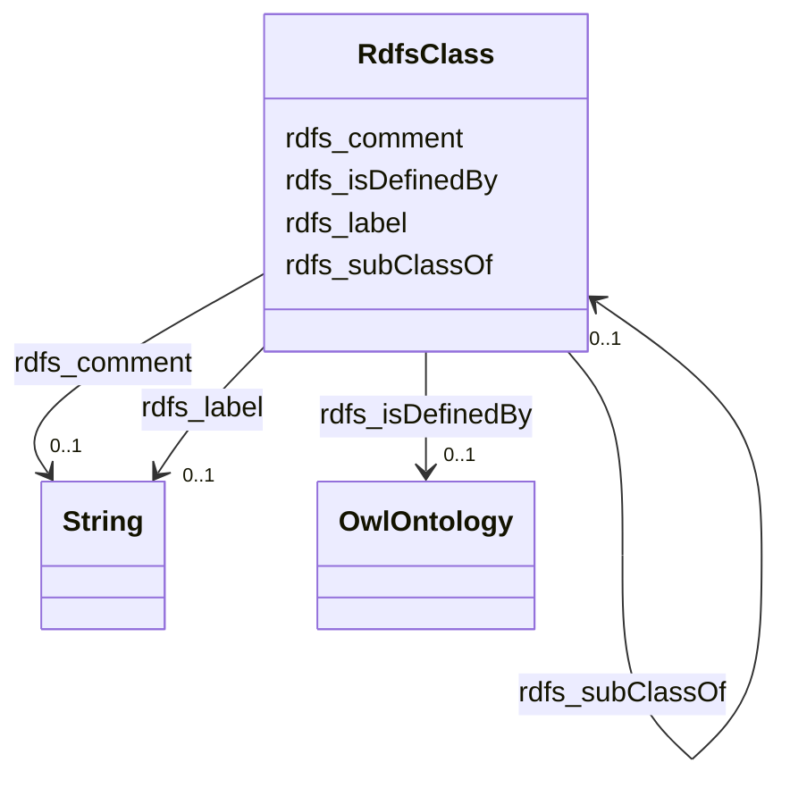

# Class: TODO -- what's a good name for what this class (type) describes? (rdfs_Class)


_TODO -- tell the world what this class (type) describes._


URI: [rdfs:Class](http://www.w3.org/2000/01/rdf-schema#Class)





<!-- no inheritance hierarchy -->


## Slots

| Name | Cardinality and Range | Description | Inheritance |
| ---  | --- | --- | --- |
| [rdfs_subClassOf](../slots/rdfs_subClassOf.md) | 0..1 <br/> [RdfsClass](../classes/RdfsClass.md) | TODO -- tell the world what this slot (predicate) describes | direct |
| [rdfs_isDefinedBy](../slots/rdfs_isDefinedBy.md) | 0..1 <br/> [OwlOntology](../classes/OwlOntology.md) | TODO -- tell the world what this slot (predicate) describes | direct |
| [rdfs_comment](../slots/rdfs_comment.md) | 0..1 <br/> [xsd:string](http://www.w3.org/2001/XMLSchema#string) | TODO -- tell the world what this slot (predicate) describes | direct |
| [rdfs_label](../slots/rdfs_label.md) | 0..1 <br/> [xsd:string](http://www.w3.org/2001/XMLSchema#string) | TODO -- tell the world what this slot (predicate) describes | direct |


## Usages

| used by | used in | type | used |
| ---  | --- | --- | --- |
| [RdfsClass](../classes/RdfsClass.md) | [rdfs_subClassOf](../slots/rdfs_subClassOf.md) | range | [RdfsClass](../classes/RdfsClass.md) |


## Examples

| Value |
| --- |
| rural:substanceabuse/Substance |

## TODOs

* TODO -- Todos for this class go here
* or you can delete the todos
* if you think the class is perfect.

## Identifier and Mapping Information


### Schema Source


* from schema: rural-kg


## Mappings

| Mapping Type | Mapped Value |
| ---  | ---  |
| self | rdfs:Class |
| native | rural-kg/:RdfsClass |


## LinkML Source

<!-- TODO: investigate https://stackoverflow.com/questions/37606292/how-to-create-tabbed-code-blocks-in-mkdocs-or-sphinx -->

### Direct

<details>
```yaml
name: rdfs_Class
description: TODO -- tell the world what this class (type) describes.
title: TODO -- what's a good name for what this class (type) describes?
todos:
- TODO -- Todos for this class go here
- or you can delete the todos
- if you think the class is perfect.
notes:
- There are 14 instances of this class.
examples:
- value: rural:substanceabuse/Substance
from_schema: rural-kg
slots:
- rdfs_subClassOf
- rdfs_isDefinedBy
- rdfs_comment
- rdfs_label
class_uri: rdfs:Class

```
</details>

### Induced

<details>
```yaml
name: rdfs_Class
description: TODO -- tell the world what this class (type) describes.
title: TODO -- what's a good name for what this class (type) describes?
todos:
- TODO -- Todos for this class go here
- or you can delete the todos
- if you think the class is perfect.
notes:
- There are 14 instances of this class.
examples:
- value: rural:substanceabuse/Substance
from_schema: rural-kg
attributes:
  rdfs_subClassOf:
    name: rdfs_subClassOf
    description: TODO -- tell the world what this slot (predicate) describes.
    todos:
    - TODO -- Todos for this slot go here
    - or you can delete the todos
    - if you think the class is perfect.
    comments:
    - 9 occurrences with subject type rdfs_Class and object type rdfs_Class.
    examples:
    - value: rural:administrativearea/County rdfs:subClassOf rural:administrativearea/AdministrativeArea
    from_schema: rural-kg
    rank: 1000
    slot_uri: rdfs:subClassOf
    alias: rdfs_subClassOf
    owner: rdfs_Class
    domain_of:
    - rdfs_Class
    range: rdfs_Class
  rdfs_isDefinedBy:
    name: rdfs_isDefinedBy
    description: TODO -- tell the world what this slot (predicate) describes.
    todos:
    - TODO -- Todos for this slot go here
    - or you can delete the todos
    - if you think the class is perfect.
    comments:
    - 5 occurrences with subject type rdfs_Class and object type owl_Ontology.
    examples:
    - value: rural:treatmentprovider/TreatmentProvider rdfs:isDefinedBy rural:ontology
    from_schema: rural-kg
    rank: 1000
    slot_uri: rdfs:isDefinedBy
    alias: rdfs_isDefinedBy
    owner: rdfs_Class
    domain_of:
    - rdfs_Class
    range: owl_Ontology
  rdfs_comment:
    name: rdfs_comment
    description: TODO -- tell the world what this slot (predicate) describes.
    todos:
    - TODO -- Todos for this slot go here
    - or you can delete the todos
    - if you think the class is perfect.
    comments:
    - 14 occurrences with subject type rdfs_Class and object type string.
    examples:
    - value: rural:mentalhealthservice/MentalHealthServiceCategory rdfs:comment Categories
        of mental health services.
    from_schema: rural-kg
    rank: 1000
    slot_uri: rdfs:comment
    alias: rdfs_comment
    owner: rdfs_Class
    domain_of:
    - rdfs_Class
    range: string
  rdfs_label:
    name: rdfs_label
    description: TODO -- tell the world what this slot (predicate) describes.
    todos:
    - TODO -- Todos for this slot go here
    - or you can delete the todos
    - if you think the class is perfect.
    comments:
    - 5 occurrences with subject type rdfs_Class and object type string.
    examples:
    - value: rural:treatmentprovider/TreatmentProvider rdfs:label Treatment Provider
    from_schema: rural-kg
    rank: 1000
    slot_uri: rdfs:label
    alias: rdfs_label
    owner: rdfs_Class
    domain_of:
    - rdfs_Class
    range: string
class_uri: rdfs:Class

```
</details>