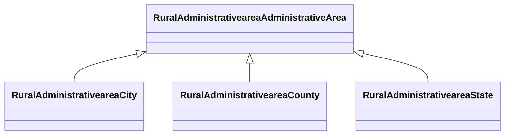

# Class: Administrative Area (rural_administrativearea_AdministrativeArea)


_Covers all administrative regions, including State, City, County, and MSA (undergoing)._


URI: [rural:administrativearea/AdministrativeArea](http://sail.ua.edu/ruralkg/administrativearea/AdministrativeArea)





## Inheritance
* **RuralAdministrativeareaAdministrativeArea**
    * [RuralAdministrativeareaCity](../classes/RuralAdministrativeareaCity.md)
    * [RuralAdministrativeareaCounty](../classes/RuralAdministrativeareaCounty.md)
    * [RuralAdministrativeareaState](../classes/RuralAdministrativeareaState.md)


## Slots

| Name | Cardinality and Range | Description | Inheritance | Occurrences |
| ---  | --- | --- | --- | --- |


## LinkML Source

<!-- TODO: investigate https://stackoverflow.com/questions/37606292/how-to-create-tabbed-code-blocks-in-mkdocs-or-sphinx -->

### Direct

<details>

```yaml
name: rural_administrativearea_AdministrativeArea
description: Covers all administrative regions, including State, City, County, and
  MSA (undergoing).
title: Administrative Area
from_schema: okns:rural-kg
source: http://sail.ua.edu/ruralkg/ontology
rank: 1000
class_uri: rural:administrativearea/AdministrativeArea

```
</details>

### Induced

<details>

```yaml
name: rural_administrativearea_AdministrativeArea
description: Covers all administrative regions, including State, City, County, and
  MSA (undergoing).
title: Administrative Area
from_schema: okns:rural-kg
source: http://sail.ua.edu/ruralkg/ontology
rank: 1000
class_uri: rural:administrativearea/AdministrativeArea

```
</details>