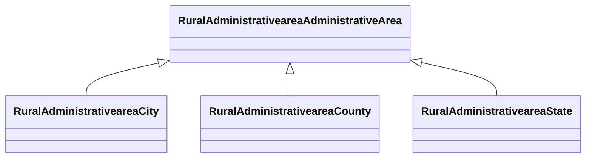

# Class: TODO -- this class is noted as a superclass of another class in this graph but has not itself been defined. (rural_administrativearea_AdministrativeArea)


URI: [rural:administrativearea/AdministrativeArea](http://sail.ua.edu/ruralkg/administrativearea/AdministrativeArea)





## Inheritance
* **RuralAdministrativeareaAdministrativeArea**
    * [RuralAdministrativeareaCity](../classes/RuralAdministrativeareaCity.md)
    * [RuralAdministrativeareaCounty](../classes/RuralAdministrativeareaCounty.md)
    * [RuralAdministrativeareaState](../classes/RuralAdministrativeareaState.md)


## Slots

| Name | Cardinality and Range | Description | Inheritance |
| ---  | --- | --- | --- |


## Identifier and Mapping Information


### Schema Source


* from schema: rural-kg


## Mappings

| Mapping Type | Mapped Value |
| ---  | ---  |
| self | rural:administrativearea/AdministrativeArea |
| native | rural-kg/:RuralAdministrativeareaAdministrativeArea |


## LinkML Source

<!-- TODO: investigate https://stackoverflow.com/questions/37606292/how-to-create-tabbed-code-blocks-in-mkdocs-or-sphinx -->

### Direct

<details>
```yaml
name: rural_administrativearea_AdministrativeArea
title: TODO -- this class is noted as a superclass of another class in this graph
  but has not itself been defined.
from_schema: rural-kg
class_uri: rural:administrativearea/AdministrativeArea

```
</details>

### Induced

<details>
```yaml
name: rural_administrativearea_AdministrativeArea
title: TODO -- this class is noted as a superclass of another class in this graph
  but has not itself been defined.
from_schema: rural-kg
class_uri: rural:administrativearea/AdministrativeArea

```
</details>