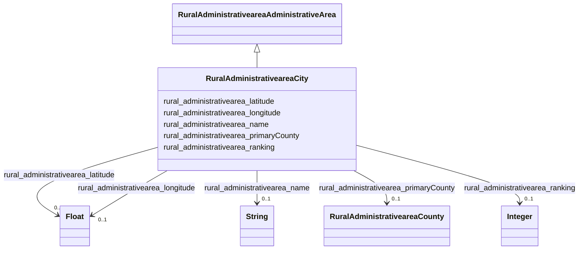

# Class: No class (type) name specified (rural_administrativearea_City)


_No class (type) description specified_


URI: [rural:administrativearea/City](http://sail.ua.edu/ruralkg/administrativearea/City)





## Inheritance
* [RuralAdministrativeareaAdministrativeArea](../classes/RuralAdministrativeareaAdministrativeArea.md)
    * **RuralAdministrativeareaCity**


## Slots

| Name | Cardinality and Range | Description | Inheritance |
| ---  | --- | --- | --- |
| [rural_administrativearea_latitude](../slots/rural_administrativearea_latitude.md) | 0..1 <br/> [xsd:float](xsd:float) | No slot (predicate) description specified <br/> 31120 occurrences with subject type rural_administrativearea_City and object type float. | direct |
| [rural_administrativearea_primaryCounty](../slots/rural_administrativearea_primaryCounty.md) | 0..1 <br/> [RuralAdministrativeareaCounty](../classes/RuralAdministrativeareaCounty.md) | No slot (predicate) description specified <br/> 31120 occurrences with subject type rural_administrativearea_City and object type rural_administrativearea_County. | direct |
| [rural_administrativearea_longitude](../slots/rural_administrativearea_longitude.md) | 0..1 <br/> [xsd:float](xsd:float) | No slot (predicate) description specified <br/> 31120 occurrences with subject type rural_administrativearea_City and object type float. | direct |
| [rural_administrativearea_ranking](../slots/rural_administrativearea_ranking.md) | 0..1 <br/> [xsd:integer](xsd:integer) | No slot (predicate) description specified <br/> 31120 occurrences with subject type rural_administrativearea_City and object type integer. | direct |
| [rural_administrativearea_name](../slots/rural_administrativearea_name.md) | 0..1 <br/> [xsd:string](xsd:string) | No slot (predicate) description specified <br/> 31120 occurrences with subject type rural_administrativearea_City and object type string.<br/>3253 occurrences with subject type rural_administrativearea_County and object type string.<br/>56 occurrences with subject type rural_administrativearea_State and object type string. | direct |


## Usages

| used by | used in | type | used |
| ---  | --- | --- | --- |
| [RuralTreatmentproviderTreatmentProvider](../classes/RuralTreatmentproviderTreatmentProvider.md) | [rural_treatmentprovider_inCity](../slots/rural_treatmentprovider_inCity.md) | any_of[range] | [RuralAdministrativeareaCity](../classes/RuralAdministrativeareaCity.md) |


## Comments

* City entities within a county or state.

## Identifier and Mapping Information


### Schema Source


* from schema: rural-kg


## Mappings

| Mapping Type | Mapped Value |
| ---  | ---  |
| self | rural:administrativearea/City |
| native | rural-kg/:RuralAdministrativeareaCity |


## LinkML Source

<!-- TODO: investigate https://stackoverflow.com/questions/37606292/how-to-create-tabbed-code-blocks-in-mkdocs-or-sphinx -->

### Direct

<details>
```yaml
name: rural_administrativearea_City
conforms_to: No schema conformance document specified
description: No class (type) description specified
title: No class (type) name specified
notes:
- Class with 31120 occurrences.
comments:
- City entities within a county or state.
from_schema: rural-kg
rank: 1000
is_a: rural_administrativearea_AdministrativeArea
slots:
- rural_administrativearea_latitude
- rural_administrativearea_primaryCounty
- rural_administrativearea_longitude
- rural_administrativearea_ranking
- rural_administrativearea_name
class_uri: rural:administrativearea/City

```
</details>

### Induced

<details>
```yaml
name: rural_administrativearea_City
conforms_to: No schema conformance document specified
description: No class (type) description specified
title: No class (type) name specified
notes:
- Class with 31120 occurrences.
comments:
- City entities within a county or state.
from_schema: rural-kg
rank: 1000
is_a: rural_administrativearea_AdministrativeArea
attributes:
  rural_administrativearea_latitude:
    name: rural_administrativearea_latitude
    description: No slot (predicate) description specified
    comments:
    - 31120 occurrences with subject type rural_administrativearea_City and object
      type float.
    examples:
    - description: rural_administrativearea_City → float
      object:
        example_object: '18.2319'
        example_predicate: rural:administrativearea/latitude
        example_subject: rural:administrativearea/City_1630023540
    from_schema: rural-kg
    rank: 1000
    slot_uri: rural:administrativearea/latitude
    alias: rural_administrativearea_latitude
    owner: rural_administrativearea_City
    domain_of:
    - rural_administrativearea_City
    range: float
  rural_administrativearea_primaryCounty:
    name: rural_administrativearea_primaryCounty
    description: No slot (predicate) description specified
    comments:
    - 31120 occurrences with subject type rural_administrativearea_City and object
      type rural_administrativearea_County.
    examples:
    - description: rural_administrativearea_City → rural_administrativearea_County
      object:
        example_object: rural:administrativearea/County_06083
        example_predicate: rural:administrativearea/primaryCounty
        example_subject: rural:administrativearea/City_1840153164
    from_schema: rural-kg
    rank: 1000
    slot_uri: rural:administrativearea/primaryCounty
    alias: rural_administrativearea_primaryCounty
    owner: rural_administrativearea_City
    domain_of:
    - rural_administrativearea_City
    range: rural_administrativearea_County
  rural_administrativearea_longitude:
    name: rural_administrativearea_longitude
    description: No slot (predicate) description specified
    comments:
    - 31120 occurrences with subject type rural_administrativearea_City and object
      type float.
    examples:
    - description: rural_administrativearea_City → float
      object:
        example_object: '-66.0388'
        example_predicate: rural:administrativearea/longitude
        example_subject: rural:administrativearea/City_1630023540
    from_schema: rural-kg
    rank: 1000
    slot_uri: rural:administrativearea/longitude
    alias: rural_administrativearea_longitude
    owner: rural_administrativearea_City
    domain_of:
    - rural_administrativearea_City
    range: float
  rural_administrativearea_ranking:
    name: rural_administrativearea_ranking
    description: No slot (predicate) description specified
    comments:
    - 31120 occurrences with subject type rural_administrativearea_City and object
      type integer.
    examples:
    - description: rural_administrativearea_City → integer
      object:
        example_object: '2'
        example_predicate: rural:administrativearea/ranking
        example_subject: rural:administrativearea/City_1630023540
    from_schema: rural-kg
    rank: 1000
    slot_uri: rural:administrativearea/ranking
    alias: rural_administrativearea_ranking
    owner: rural_administrativearea_City
    domain_of:
    - rural_administrativearea_City
    range: integer
  rural_administrativearea_name:
    name: rural_administrativearea_name
    description: No slot (predicate) description specified
    comments:
    - 31120 occurrences with subject type rural_administrativearea_City and object
      type string.
    - 3253 occurrences with subject type rural_administrativearea_County and object
      type string.
    - 56 occurrences with subject type rural_administrativearea_State and object type
      string.
    examples:
    - description: rural_administrativearea_City → string
      object:
        example_object: Caguas
        example_predicate: rural:administrativearea/name
        example_subject: rural:administrativearea/City_1630023540
    - description: rural_administrativearea_County → string
      object:
        example_object: Autauga
        example_predicate: rural:administrativearea/name
        example_subject: rural:administrativearea/County_01001
    - description: rural_administrativearea_State → string
      object:
        example_object: Alaska
        example_predicate: rural:administrativearea/name
        example_subject: rural:administrativearea/State_AK
    from_schema: rural-kg
    rank: 1000
    slot_uri: rural:administrativearea/name
    alias: rural_administrativearea_name
    owner: rural_administrativearea_City
    domain_of:
    - rural_administrativearea_City
    - rural_administrativearea_County
    - rural_administrativearea_State
    range: string
class_uri: rural:administrativearea/City

```
</details>