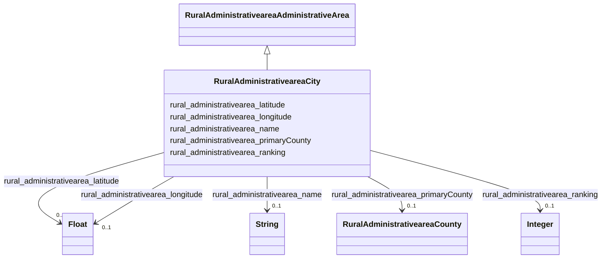

# Class: RuralAdministrativeareaCity


_City entities within a county or state._


This class occurs 31120 times.


URI: [rural:administrativearea/City](http://sail.ua.edu/ruralkg/administrativearea/City)





## Inheritance
* [RuralAdministrativeareaAdministrativeArea](../classes/RuralAdministrativeareaAdministrativeArea.md)
    * **RuralAdministrativeareaCity**


## Slots

| Name | Cardinality and Range | Description | Inheritance | Occurrences |
| ---  | --- | --- | --- | --- |
| [rural_administrativearea_latitude](../slots/rural_administrativearea_latitude.md) | 0..1 <br/> [xsd:float](xsd:float) |  <br/>  | direct | 31120 |
| [rural_administrativearea_primaryCounty](../slots/rural_administrativearea_primaryCounty.md) | 0..1 <br/> [RuralAdministrativeareaCounty](../classes/RuralAdministrativeareaCounty.md) |  <br/>  | direct | 31120 |
| [rural_administrativearea_name](../slots/rural_administrativearea_name.md) | 0..1 <br/> [xsd:string](xsd:string) |  <br/>  | direct | 31120 |
| [rural_administrativearea_ranking](../slots/rural_administrativearea_ranking.md) | 0..1 <br/> [xsd:integer](xsd:integer) |  <br/>  | direct | 31120 |
| [rural_administrativearea_longitude](../slots/rural_administrativearea_longitude.md) | 0..1 <br/> [xsd:float](xsd:float) |  <br/>  | direct | 31120 |


## Usages

| used by | used in | type | used |
| ---  | --- | --- | --- |
| [RuralTreatmentTreatmentProvider](../classes/RuralTreatmentTreatmentProvider.md) | [rural_treatment_inCity](../slots/rural_treatment_inCity.md) | any_of[range] | [RuralAdministrativeareaCity](../classes/RuralAdministrativeareaCity.md) |


## LinkML Source

<!-- TODO: investigate https://stackoverflow.com/questions/37606292/how-to-create-tabbed-code-blocks-in-mkdocs-or-sphinx -->

### Direct

<details>

```yaml
name: rural_administrativearea_City
description: City entities within a county or state.
from_schema: okns:rural-kg
rank: 1000
is_a: rural_administrativearea_AdministrativeArea
slots:
- rural_administrativearea_latitude
- rural_administrativearea_primaryCounty
- rural_administrativearea_name
- rural_administrativearea_ranking
- rural_administrativearea_longitude
class_uri: rural:administrativearea/City

```
</details>

### Induced

<details>

```yaml
name: rural_administrativearea_City
description: City entities within a county or state.
from_schema: okns:rural-kg
rank: 1000
is_a: rural_administrativearea_AdministrativeArea
attributes:
  rural_administrativearea_latitude:
    name: rural_administrativearea_latitude
    from_schema: okns:rural-kg
    rank: 1000
    slot_uri: rural:administrativearea/latitude
    alias: rural_administrativearea_latitude
    owner: rural_administrativearea_City
    domain_of:
    - rural_administrativearea_City
    range: float
  rural_administrativearea_primaryCounty:
    name: rural_administrativearea_primaryCounty
    from_schema: okns:rural-kg
    rank: 1000
    slot_uri: rural:administrativearea/primaryCounty
    alias: rural_administrativearea_primaryCounty
    owner: rural_administrativearea_City
    domain_of:
    - rural_administrativearea_City
    range: rural_administrativearea_County
  rural_administrativearea_name:
    name: rural_administrativearea_name
    from_schema: okns:rural-kg
    rank: 1000
    slot_uri: rural:administrativearea/name
    alias: rural_administrativearea_name
    owner: rural_administrativearea_City
    domain_of:
    - rural_administrativearea_City
    - rural_administrativearea_County
    - rural_administrativearea_State
    range: string
  rural_administrativearea_ranking:
    name: rural_administrativearea_ranking
    from_schema: okns:rural-kg
    rank: 1000
    slot_uri: rural:administrativearea/ranking
    alias: rural_administrativearea_ranking
    owner: rural_administrativearea_City
    domain_of:
    - rural_administrativearea_City
    range: integer
  rural_administrativearea_longitude:
    name: rural_administrativearea_longitude
    from_schema: okns:rural-kg
    rank: 1000
    slot_uri: rural:administrativearea/longitude
    alias: rural_administrativearea_longitude
    owner: rural_administrativearea_City
    domain_of:
    - rural_administrativearea_City
    range: float
class_uri: rural:administrativearea/City

```
</details>