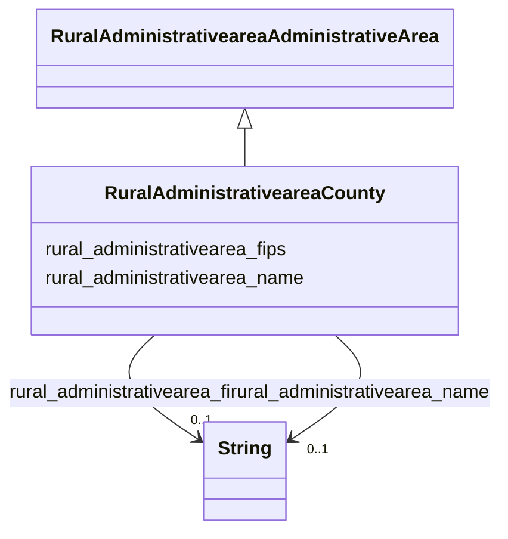

# Class: RuralAdministrativeareaCounty


_Defines counties within a state._


This class occurs 3253 times.


URI: [rural:administrativearea/County](http://sail.ua.edu/ruralkg/administrativearea/County)





## Inheritance
* [RuralAdministrativeareaAdministrativeArea](../classes/RuralAdministrativeareaAdministrativeArea.md)
    * **RuralAdministrativeareaCounty**


## Slots

| Name | Cardinality and Range | Description | Inheritance | Occurrences |
| ---  | --- | --- | --- | --- |
| [rural_administrativearea_fips](../slots/rural_administrativearea_fips.md) | 0..1 <br/> [xsd:string](xsd:string) |  <br/>  | direct | 3253 |
| [rural_administrativearea_name](../slots/rural_administrativearea_name.md) | 0..1 <br/> [xsd:string](xsd:string) |  <br/>  | direct | 3253 |


## Usages

| used by | used in | type | used |
| ---  | --- | --- | --- |
| [RuralAdministrativeareaCity](../classes/RuralAdministrativeareaCity.md) | [rural_administrativearea_primaryCounty](../slots/rural_administrativearea_primaryCounty.md) | range | [RuralAdministrativeareaCounty](../classes/RuralAdministrativeareaCounty.md) |
| [RuralAdministrativeareaState](../classes/RuralAdministrativeareaState.md) | [rural_administrativearea_containsPlace](../slots/rural_administrativearea_containsPlace.md) | range | [RuralAdministrativeareaCounty](../classes/RuralAdministrativeareaCounty.md) |
| [RuralSettlementtypeCountyStatus](../classes/RuralSettlementtypeCountyStatus.md) | [rural_settlementtype_censusCounty](../slots/rural_settlementtype_censusCounty.md) | range | [RuralAdministrativeareaCounty](../classes/RuralAdministrativeareaCounty.md) |


## LinkML Source

<!-- TODO: investigate https://stackoverflow.com/questions/37606292/how-to-create-tabbed-code-blocks-in-mkdocs-or-sphinx -->

### Direct

<details>

```yaml
name: rural_administrativearea_County
description: Defines counties within a state.
from_schema: okns:rural-kg
rank: 1000
is_a: rural_administrativearea_AdministrativeArea
slots:
- rural_administrativearea_fips
- rural_administrativearea_name
class_uri: rural:administrativearea/County

```
</details>

### Induced

<details>

```yaml
name: rural_administrativearea_County
description: Defines counties within a state.
from_schema: okns:rural-kg
rank: 1000
is_a: rural_administrativearea_AdministrativeArea
attributes:
  rural_administrativearea_fips:
    name: rural_administrativearea_fips
    from_schema: okns:rural-kg
    rank: 1000
    slot_uri: rural:administrativearea/fips
    alias: rural_administrativearea_fips
    owner: rural_administrativearea_County
    domain_of:
    - rural_administrativearea_County
    - rural_administrativearea_State
    range: string
  rural_administrativearea_name:
    name: rural_administrativearea_name
    from_schema: okns:rural-kg
    rank: 1000
    slot_uri: rural:administrativearea/name
    alias: rural_administrativearea_name
    owner: rural_administrativearea_County
    domain_of:
    - rural_administrativearea_City
    - rural_administrativearea_County
    - rural_administrativearea_State
    range: string
class_uri: rural:administrativearea/County

```
</details>