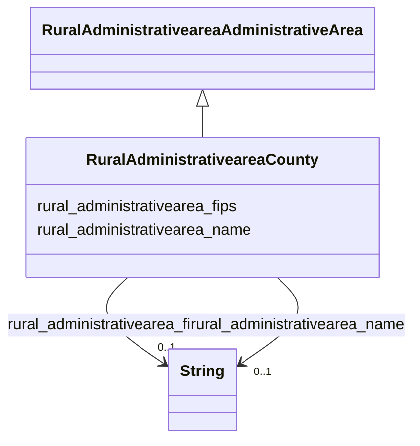

# Class: No class (type) name specified (rural_administrativearea_County)


_No class (type) description specified_


URI: [rural:administrativearea/County](http://sail.ua.edu/ruralkg/administrativearea/County)





## Inheritance
* [RuralAdministrativeareaAdministrativeArea](../classes/RuralAdministrativeareaAdministrativeArea.md)
    * **RuralAdministrativeareaCounty**


## Slots

| Name | Cardinality and Range | Description | Inheritance |
| ---  | --- | --- | --- |
| [rural_administrativearea_fips](../slots/rural_administrativearea_fips.md) | 0..1 <br/> [xsd:string](xsd:string) | No slot (predicate) description specified <br/> 3253 occurrences with subject type rural_administrativearea_County and object type string.<br/>56 occurrences with subject type rural_administrativearea_State and object type string. | direct |
| [rural_administrativearea_name](../slots/rural_administrativearea_name.md) | 0..1 <br/> [xsd:string](xsd:string) | No slot (predicate) description specified <br/> 31120 occurrences with subject type rural_administrativearea_City and object type string.<br/>3253 occurrences with subject type rural_administrativearea_County and object type string.<br/>56 occurrences with subject type rural_administrativearea_State and object type string. | direct |


## Usages

| used by | used in | type | used |
| ---  | --- | --- | --- |
| [RuralAdministrativeareaCity](../classes/RuralAdministrativeareaCity.md) | [rural_administrativearea_primaryCounty](../slots/rural_administrativearea_primaryCounty.md) | range | [RuralAdministrativeareaCounty](../classes/RuralAdministrativeareaCounty.md) |
| [RuralAdministrativeareaState](../classes/RuralAdministrativeareaState.md) | [rural_administrativearea_containsPlace](../slots/rural_administrativearea_containsPlace.md) | range | [RuralAdministrativeareaCounty](../classes/RuralAdministrativeareaCounty.md) |
| [RuralSettlementtypeCountyStatus](../classes/RuralSettlementtypeCountyStatus.md) | [rural_settlementtype_censusCounty](../slots/rural_settlementtype_censusCounty.md) | range | [RuralAdministrativeareaCounty](../classes/RuralAdministrativeareaCounty.md) |


## Comments

* Defines counties within a state.

## Identifier and Mapping Information


### Schema Source


* from schema: rural-kg


## Mappings

| Mapping Type | Mapped Value |
| ---  | ---  |
| self | rural:administrativearea/County |
| native | rural-kg/:RuralAdministrativeareaCounty |


## LinkML Source

<!-- TODO: investigate https://stackoverflow.com/questions/37606292/how-to-create-tabbed-code-blocks-in-mkdocs-or-sphinx -->

### Direct

<details>
```yaml
name: rural_administrativearea_County
conforms_to: No schema conformance document specified
description: No class (type) description specified
title: No class (type) name specified
notes:
- Class with 3253 occurrences.
comments:
- Defines counties within a state.
from_schema: rural-kg
rank: 1000
is_a: rural_administrativearea_AdministrativeArea
slots:
- rural_administrativearea_fips
- rural_administrativearea_name
class_uri: rural:administrativearea/County

```
</details>

### Induced

<details>
```yaml
name: rural_administrativearea_County
conforms_to: No schema conformance document specified
description: No class (type) description specified
title: No class (type) name specified
notes:
- Class with 3253 occurrences.
comments:
- Defines counties within a state.
from_schema: rural-kg
rank: 1000
is_a: rural_administrativearea_AdministrativeArea
attributes:
  rural_administrativearea_fips:
    name: rural_administrativearea_fips
    description: No slot (predicate) description specified
    comments:
    - 3253 occurrences with subject type rural_administrativearea_County and object
      type string.
    - 56 occurrences with subject type rural_administrativearea_State and object type
      string.
    examples:
    - description: rural_administrativearea_County → string
      object:
        example_object: '01001'
        example_predicate: rural:administrativearea/fips
        example_subject: rural:administrativearea/County_01001
    - description: rural_administrativearea_State → string
      object:
        example_object: '02'
        example_predicate: rural:administrativearea/fips
        example_subject: rural:administrativearea/State_AK
    from_schema: rural-kg
    rank: 1000
    slot_uri: rural:administrativearea/fips
    alias: rural_administrativearea_fips
    owner: rural_administrativearea_County
    domain_of:
    - rural_administrativearea_County
    - rural_administrativearea_State
    range: string
  rural_administrativearea_name:
    name: rural_administrativearea_name
    description: No slot (predicate) description specified
    comments:
    - 31120 occurrences with subject type rural_administrativearea_City and object
      type string.
    - 3253 occurrences with subject type rural_administrativearea_County and object
      type string.
    - 56 occurrences with subject type rural_administrativearea_State and object type
      string.
    examples:
    - description: rural_administrativearea_City → string
      object:
        example_object: Caguas
        example_predicate: rural:administrativearea/name
        example_subject: rural:administrativearea/City_1630023540
    - description: rural_administrativearea_County → string
      object:
        example_object: Autauga
        example_predicate: rural:administrativearea/name
        example_subject: rural:administrativearea/County_01001
    - description: rural_administrativearea_State → string
      object:
        example_object: Alaska
        example_predicate: rural:administrativearea/name
        example_subject: rural:administrativearea/State_AK
    from_schema: rural-kg
    rank: 1000
    slot_uri: rural:administrativearea/name
    alias: rural_administrativearea_name
    owner: rural_administrativearea_County
    domain_of:
    - rural_administrativearea_City
    - rural_administrativearea_County
    - rural_administrativearea_State
    range: string
class_uri: rural:administrativearea/County

```
</details>