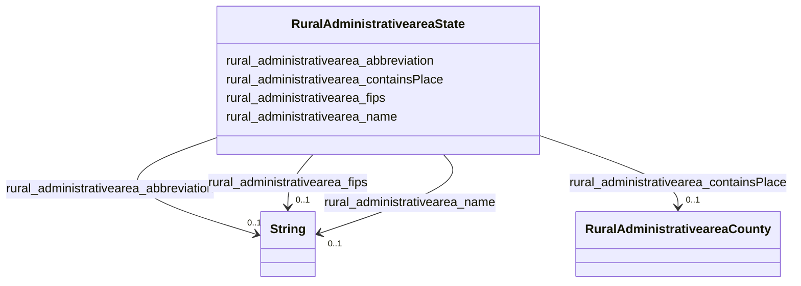

# Class: TODO -- what's a good name for what this class (type) describes? (rural_administrativearea_State)


_TODO -- tell the world what this class (type) describes._


URI: [rural:administrativearea/State](http://sail.ua.edu/ruralkg/administrativearea/State)





<!-- no inheritance hierarchy -->


## Slots

| Name | Cardinality and Range | Description | Inheritance |
| ---  | --- | --- | --- |
| [rural_administrativearea_containsPlace](../slots/rural_administrativearea_containsPlace.md) | 0..1 <br/> [RuralAdministrativeareaCounty](../classes/RuralAdministrativeareaCounty.md) | TODO -- tell the world what this slot (predicate) describes | direct |
| [rural_administrativearea_abbreviation](../slots/rural_administrativearea_abbreviation.md) | 0..1 <br/> [xsd:string](http://www.w3.org/2001/XMLSchema#string) | TODO -- tell the world what this slot (predicate) describes | direct |
| [rural_administrativearea_name](../slots/rural_administrativearea_name.md) | 0..1 <br/> [xsd:string](http://www.w3.org/2001/XMLSchema#string) | TODO -- tell the world what this slot (predicate) describes | direct |
| [rural_administrativearea_fips](../slots/rural_administrativearea_fips.md) | 0..1 <br/> [xsd:string](http://www.w3.org/2001/XMLSchema#string) | TODO -- tell the world what this slot (predicate) describes | direct |


## Examples

| Value |
| --- |
| rural:administrativearea/State_NJ |

## TODOs

* TODO -- Todos for this class go here
* or you can delete the todos
* if you think the class is perfect.

## Identifier and Mapping Information


### Schema Source


* from schema: rural-kg


## Mappings

| Mapping Type | Mapped Value |
| ---  | ---  |
| self | rural:administrativearea/State |
| native | rural-kg/:RuralAdministrativeareaState |


## LinkML Source

<!-- TODO: investigate https://stackoverflow.com/questions/37606292/how-to-create-tabbed-code-blocks-in-mkdocs-or-sphinx -->

### Direct

<details>
```yaml
name: rural_administrativearea_State
description: TODO -- tell the world what this class (type) describes.
title: TODO -- what's a good name for what this class (type) describes?
todos:
- TODO -- Todos for this class go here
- or you can delete the todos
- if you think the class is perfect.
notes:
- There are 56 instances of this class.
examples:
- value: rural:administrativearea/State_NJ
from_schema: rural-kg
slots:
- rural_administrativearea_containsPlace
- rural_administrativearea_abbreviation
- rural_administrativearea_name
- rural_administrativearea_fips
class_uri: rural:administrativearea/State

```
</details>

### Induced

<details>
```yaml
name: rural_administrativearea_State
description: TODO -- tell the world what this class (type) describes.
title: TODO -- what's a good name for what this class (type) describes?
todos:
- TODO -- Todos for this class go here
- or you can delete the todos
- if you think the class is perfect.
notes:
- There are 56 instances of this class.
examples:
- value: rural:administrativearea/State_NJ
from_schema: rural-kg
attributes:
  rural_administrativearea_containsPlace:
    name: rural_administrativearea_containsPlace
    description: TODO -- tell the world what this slot (predicate) describes.
    todos:
    - TODO -- Todos for this slot go here
    - or you can delete the todos
    - if you think the class is perfect.
    comments:
    - 3253 occurrences with subject type rural_administrativearea_State and object
      type rural_administrativearea_County.
    examples:
    - value: rural:administrativearea/State_IN rural:administrativearea/containsPlace
        rural:administrativearea/County_18103
    from_schema: rural-kg
    rank: 1000
    slot_uri: rural:administrativearea/containsPlace
    alias: rural_administrativearea_containsPlace
    owner: rural_administrativearea_State
    domain_of:
    - rural_administrativearea_State
    range: rural_administrativearea_County
  rural_administrativearea_abbreviation:
    name: rural_administrativearea_abbreviation
    description: TODO -- tell the world what this slot (predicate) describes.
    todos:
    - TODO -- Todos for this slot go here
    - or you can delete the todos
    - if you think the class is perfect.
    comments:
    - 56 occurrences with subject type rural_administrativearea_State and object type
      string.
    examples:
    - value: rural:administrativearea/State_MO rural:administrativearea/abbreviation
        MO
    from_schema: rural-kg
    rank: 1000
    slot_uri: rural:administrativearea/abbreviation
    alias: rural_administrativearea_abbreviation
    owner: rural_administrativearea_State
    domain_of:
    - rural_administrativearea_State
    range: string
  rural_administrativearea_name:
    name: rural_administrativearea_name
    description: TODO -- tell the world what this slot (predicate) describes.
    todos:
    - TODO -- Todos for this slot go here
    - or you can delete the todos
    - if you think the class is perfect.
    comments:
    - 31120 occurrences with subject type rural_administrativearea_City and object
      type string.
    - 3253 occurrences with subject type rural_administrativearea_County and object
      type string.
    - 56 occurrences with subject type rural_administrativearea_State and object type
      string.
    examples:
    - value: rural:administrativearea/City_1840017624 rural:administrativearea/name
        El Granada
    - value: rural:administrativearea/County_37133 rural:administrativearea/name Onslow
    - value: rural:administrativearea/State_AR rural:administrativearea/name Arkansas
    from_schema: rural-kg
    rank: 1000
    slot_uri: rural:administrativearea/name
    alias: rural_administrativearea_name
    owner: rural_administrativearea_State
    domain_of:
    - rural_administrativearea_City
    - rural_administrativearea_County
    - rural_administrativearea_State
    range: string
  rural_administrativearea_fips:
    name: rural_administrativearea_fips
    description: TODO -- tell the world what this slot (predicate) describes.
    todos:
    - TODO -- Todos for this slot go here
    - or you can delete the todos
    - if you think the class is perfect.
    comments:
    - 3253 occurrences with subject type rural_administrativearea_County and object
      type string.
    - 56 occurrences with subject type rural_administrativearea_State and object type
      string.
    examples:
    - value: rural:administrativearea/County_20185 rural:administrativearea/fips 20185
    - value: rural:administrativearea/State_OR rural:administrativearea/fips 41
    from_schema: rural-kg
    rank: 1000
    slot_uri: rural:administrativearea/fips
    alias: rural_administrativearea_fips
    owner: rural_administrativearea_State
    domain_of:
    - rural_administrativearea_County
    - rural_administrativearea_State
    range: string
class_uri: rural:administrativearea/State

```
</details>