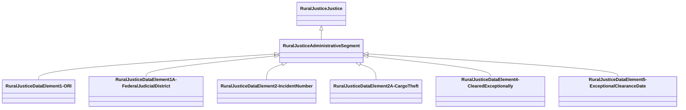

# Class: Administrative Segment (rural_justice_AdministrativeSegment)


_NIBRS Administrative Segment_


URI: [rural:justice/AdministrativeSegment](http://sail.ua.edu/ruralkg/justice/AdministrativeSegment)





## Inheritance
* [RuralJusticeJustice](../classes/RuralJusticeJustice.md)
    * **RuralJusticeAdministrativeSegment**
        * [RuralJusticeDataElement1-ORI](../classes/RuralJusticeDataElement1-ORI.md)
        * [RuralJusticeDataElement1A-FederalJudicialDistrict](../classes/RuralJusticeDataElement1A-FederalJudicialDistrict.md)
        * [RuralJusticeDataElement2-IncidentNumber](../classes/RuralJusticeDataElement2-IncidentNumber.md)
        * [RuralJusticeDataElement2A-CargoTheft](../classes/RuralJusticeDataElement2A-CargoTheft.md)
        * [RuralJusticeDataElement4-ClearedExceptionally](../classes/RuralJusticeDataElement4-ClearedExceptionally.md)
        * [RuralJusticeDataElement5-ExceptionalClearanceDate](../classes/RuralJusticeDataElement5-ExceptionalClearanceDate.md)


## Slots

| Name | Cardinality and Range | Description | Inheritance | Occurrences |
| ---  | --- | --- | --- | --- |


## LinkML Source

<!-- TODO: investigate https://stackoverflow.com/questions/37606292/how-to-create-tabbed-code-blocks-in-mkdocs-or-sphinx -->

### Direct

<details>

```yaml
name: rural_justice_AdministrativeSegment
description: NIBRS Administrative Segment
title: Administrative Segment
from_schema: okns:rural-kg
rank: 1000
is_a: rural_justice_Justice
class_uri: rural:justice/AdministrativeSegment

```
</details>

### Induced

<details>

```yaml
name: rural_justice_AdministrativeSegment
description: NIBRS Administrative Segment
title: Administrative Segment
from_schema: okns:rural-kg
rank: 1000
is_a: rural_justice_Justice
class_uri: rural:justice/AdministrativeSegment

```
</details>