# Class: Arrestee Segment (rural_justice_ArresteeSegment)


_NIBRS Arrestee Segment_


URI: [rural:justice/ArresteeSegment](http://sail.ua.edu/ruralkg/justice/ArresteeSegment)

```mermaid
 classDiagram
    class RuralJusticeArresteeSegment
    click RuralJusticeArresteeSegment href "../RuralJusticeArresteeSegment"
      RuralJusticeJustice <|-- RuralJusticeArresteeSegment
        click RuralJusticeJustice href "../RuralJusticeJustice"
      

      RuralJusticeArresteeSegment <|-- RuralJusticeDataElement40-ArresteeSequenceNumber
        click RuralJusticeDataElement40-ArresteeSequenceNumber href "../RuralJusticeDataElement40-ArresteeSequenceNumber"
      RuralJusticeArresteeSegment <|-- RuralJusticeDataElement41-ArrestTransactionNumber
        click RuralJusticeDataElement41-ArrestTransactionNumber href "../RuralJusticeDataElement41-ArrestTransactionNumber"
      RuralJusticeArresteeSegment <|-- RuralJusticeDataElement42-ArrestDate
        click RuralJusticeDataElement42-ArrestDate href "../RuralJusticeDataElement42-ArrestDate"
      RuralJusticeArresteeSegment <|-- RuralJusticeDataElement43-TypeofArrest
        click RuralJusticeDataElement43-TypeofArrest href "../RuralJusticeDataElement43-TypeofArrest"
      RuralJusticeArresteeSegment <|-- RuralJusticeDataElement44-MultipleArresteeSegmentsIndicator
        click RuralJusticeDataElement44-MultipleArresteeSegmentsIndicator href "../RuralJusticeDataElement44-MultipleArresteeSegmentsIndicator"
      RuralJusticeArresteeSegment <|-- RuralJusticeDataElement45-UCRArrestOffenseCode
        click RuralJusticeDataElement45-UCRArrestOffenseCode href "../RuralJusticeDataElement45-UCRArrestOffenseCode"
      RuralJusticeArresteeSegment <|-- RuralJusticeDataElement46-ArresteeWasArmedWith
        click RuralJusticeDataElement46-ArresteeWasArmedWith href "../RuralJusticeDataElement46-ArresteeWasArmedWith"
      RuralJusticeArresteeSegment <|-- RuralJusticeDataElement47-AgeofArrestee
        click RuralJusticeDataElement47-AgeofArrestee href "../RuralJusticeDataElement47-AgeofArrestee"
      RuralJusticeArresteeSegment <|-- RuralJusticeDataElement48-SexofArrestee
        click RuralJusticeDataElement48-SexofArrestee href "../RuralJusticeDataElement48-SexofArrestee"
      RuralJusticeArresteeSegment <|-- RuralJusticeDataElement49-RaceofArrestee
        click RuralJusticeDataElement49-RaceofArrestee href "../RuralJusticeDataElement49-RaceofArrestee"
      RuralJusticeArresteeSegment <|-- RuralJusticeDataElement50-EthnicityofArrestee
        click RuralJusticeDataElement50-EthnicityofArrestee href "../RuralJusticeDataElement50-EthnicityofArrestee"
      RuralJusticeArresteeSegment <|-- RuralJusticeDataElement51-ResidentStatusofArrestee
        click RuralJusticeDataElement51-ResidentStatusofArrestee href "../RuralJusticeDataElement51-ResidentStatusofArrestee"
      RuralJusticeArresteeSegment <|-- RuralJusticeDataElement52-DispositionofArresteeUnder18
        click RuralJusticeDataElement52-DispositionofArresteeUnder18 href "../RuralJusticeDataElement52-DispositionofArresteeUnder18"
      RuralJusticeArresteeSegment <|-- RuralJusticeDataElement52-DispositionofArresteeUnder19
        click RuralJusticeDataElement52-DispositionofArresteeUnder19 href "../RuralJusticeDataElement52-DispositionofArresteeUnder19"
      RuralJusticeArresteeSegment <|-- RuralJusticeDataElement52-DispositionofArresteeUnder20
        click RuralJusticeDataElement52-DispositionofArresteeUnder20 href "../RuralJusticeDataElement52-DispositionofArresteeUnder20"
      
      
      
```





## Inheritance
* [RuralJusticeJustice](../classes/RuralJusticeJustice.md)
    * **RuralJusticeArresteeSegment**
        * [RuralJusticeDataElement40-ArresteeSequenceNumber](../classes/RuralJusticeDataElement40-ArresteeSequenceNumber.md)
        * [RuralJusticeDataElement41-ArrestTransactionNumber](../classes/RuralJusticeDataElement41-ArrestTransactionNumber.md)
        * [RuralJusticeDataElement42-ArrestDate](../classes/RuralJusticeDataElement42-ArrestDate.md)
        * [RuralJusticeDataElement43-TypeofArrest](../classes/RuralJusticeDataElement43-TypeofArrest.md)
        * [RuralJusticeDataElement44-MultipleArresteeSegmentsIndicator](../classes/RuralJusticeDataElement44-MultipleArresteeSegmentsIndicator.md)
        * [RuralJusticeDataElement45-UCRArrestOffenseCode](../classes/RuralJusticeDataElement45-UCRArrestOffenseCode.md)
        * [RuralJusticeDataElement46-ArresteeWasArmedWith](../classes/RuralJusticeDataElement46-ArresteeWasArmedWith.md)
        * [RuralJusticeDataElement47-AgeofArrestee](../classes/RuralJusticeDataElement47-AgeofArrestee.md)
        * [RuralJusticeDataElement48-SexofArrestee](../classes/RuralJusticeDataElement48-SexofArrestee.md)
        * [RuralJusticeDataElement49-RaceofArrestee](../classes/RuralJusticeDataElement49-RaceofArrestee.md)
        * [RuralJusticeDataElement50-EthnicityofArrestee](../classes/RuralJusticeDataElement50-EthnicityofArrestee.md)
        * [RuralJusticeDataElement51-ResidentStatusofArrestee](../classes/RuralJusticeDataElement51-ResidentStatusofArrestee.md)
        * [RuralJusticeDataElement52-DispositionofArresteeUnder18](../classes/RuralJusticeDataElement52-DispositionofArresteeUnder18.md)
        * [RuralJusticeDataElement52-DispositionofArresteeUnder19](../classes/RuralJusticeDataElement52-DispositionofArresteeUnder19.md)
        * [RuralJusticeDataElement52-DispositionofArresteeUnder20](../classes/RuralJusticeDataElement52-DispositionofArresteeUnder20.md)


## Slots

| Name | Cardinality and Range | Description | Inheritance | Occurrences |
| ---  | --- | --- | --- | --- |


## LinkML Source

<!-- TODO: investigate https://stackoverflow.com/questions/37606292/how-to-create-tabbed-code-blocks-in-mkdocs-or-sphinx -->

### Direct

<details>

```yaml
name: rural_justice_ArresteeSegment
description: NIBRS Arrestee Segment
title: Arrestee Segment
from_schema: okns:rural-kg
rank: 1000
is_a: rural_justice_Justice
class_uri: rural:justice/ArresteeSegment

```
</details>

### Induced

<details>

```yaml
name: rural_justice_ArresteeSegment
description: NIBRS Arrestee Segment
title: Arrestee Segment
from_schema: okns:rural-kg
rank: 1000
is_a: rural_justice_Justice
class_uri: rural:justice/ArresteeSegment

```
</details>