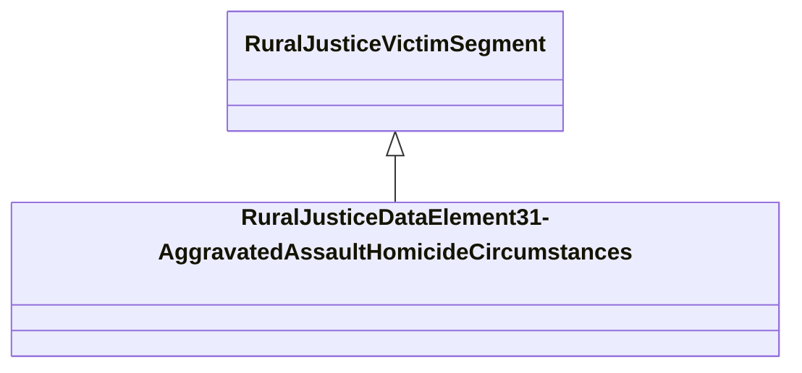

# Class: Data Element 31 - Aggravated Assault/Homicide Circumstances (rural_justice_DataElement31-AggravatedAssault_HomicideCircumstances)


_NIBRS data element: Data Element 31 - Aggravated Assault/Homicide Circumstances_


URI: [rural:justice/DataElement31-AggravatedAssault_HomicideCircumstances](http://sail.ua.edu/ruralkg/justice/DataElement31-AggravatedAssault_HomicideCircumstances)





## Inheritance
* [RuralJusticeJustice](../classes/RuralJusticeJustice.md)
    * [RuralJusticeVictimSegment](../classes/RuralJusticeVictimSegment.md)
        * **RuralJusticeDataElement31-AggravatedAssaultHomicideCircumstances**


## Slots

| Name | Cardinality and Range | Description | Inheritance | Occurrences |
| ---  | --- | --- | --- | --- |


## LinkML Source

<!-- TODO: investigate https://stackoverflow.com/questions/37606292/how-to-create-tabbed-code-blocks-in-mkdocs-or-sphinx -->

### Direct

<details>

```yaml
name: rural_justice_DataElement31-AggravatedAssault_HomicideCircumstances
description: 'NIBRS data element: Data Element 31 - Aggravated Assault/Homicide Circumstances'
title: Data Element 31 - Aggravated Assault/Homicide Circumstances
from_schema: okns:rural-kg
rank: 1000
is_a: rural_justice_VictimSegment
class_uri: rural:justice/DataElement31-AggravatedAssault_HomicideCircumstances

```
</details>

### Induced

<details>

```yaml
name: rural_justice_DataElement31-AggravatedAssault_HomicideCircumstances
description: 'NIBRS data element: Data Element 31 - Aggravated Assault/Homicide Circumstances'
title: Data Element 31 - Aggravated Assault/Homicide Circumstances
from_schema: okns:rural-kg
rank: 1000
is_a: rural_justice_VictimSegment
class_uri: rural:justice/DataElement31-AggravatedAssault_HomicideCircumstances

```
</details>