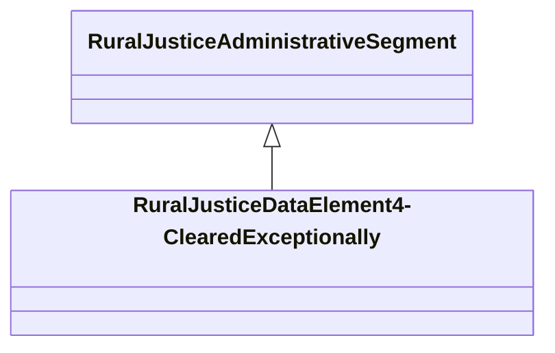

# Class: Data Element 4 - Cleared Exceptionally (rural_justice_DataElement4-ClearedExceptionally)


_NIBRS data element: Data Element 4 - Cleared Exceptionally_


URI: [rural:justice/DataElement4-ClearedExceptionally](http://sail.ua.edu/ruralkg/justice/DataElement4-ClearedExceptionally)





## Inheritance
* [RuralJusticeJustice](../classes/RuralJusticeJustice.md)
    * [RuralJusticeAdministrativeSegment](../classes/RuralJusticeAdministrativeSegment.md)
        * **RuralJusticeDataElement4-ClearedExceptionally**


## Slots

| Name | Cardinality and Range | Description | Inheritance | Occurrences |
| ---  | --- | --- | --- | --- |


## LinkML Source

<!-- TODO: investigate https://stackoverflow.com/questions/37606292/how-to-create-tabbed-code-blocks-in-mkdocs-or-sphinx -->

### Direct

<details>

```yaml
name: rural_justice_DataElement4-ClearedExceptionally
description: 'NIBRS data element: Data Element 4 - Cleared Exceptionally'
title: Data Element 4 - Cleared Exceptionally
from_schema: okns:rural-kg
rank: 1000
is_a: rural_justice_AdministrativeSegment
class_uri: rural:justice/DataElement4-ClearedExceptionally

```
</details>

### Induced

<details>

```yaml
name: rural_justice_DataElement4-ClearedExceptionally
description: 'NIBRS data element: Data Element 4 - Cleared Exceptionally'
title: Data Element 4 - Cleared Exceptionally
from_schema: okns:rural-kg
rank: 1000
is_a: rural_justice_AdministrativeSegment
class_uri: rural:justice/DataElement4-ClearedExceptionally

```
</details>