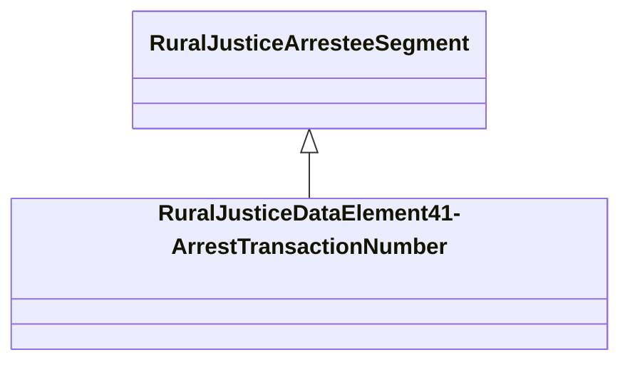

# Class: Data Element 41 - Arrest Transaction Number (rural_justice_DataElement41-ArrestTransactionNumber)


_NIBRS data element: Data Element 41 - Arrest Transaction Number_


URI: [rural:justice/DataElement41-ArrestTransactionNumber](http://sail.ua.edu/ruralkg/justice/DataElement41-ArrestTransactionNumber)





## Inheritance
* [RuralJusticeJustice](../classes/RuralJusticeJustice.md)
    * [RuralJusticeArresteeSegment](../classes/RuralJusticeArresteeSegment.md)
        * **RuralJusticeDataElement41-ArrestTransactionNumber**


## Slots

| Name | Cardinality and Range | Description | Inheritance | Occurrences |
| ---  | --- | --- | --- | --- |


## LinkML Source

<!-- TODO: investigate https://stackoverflow.com/questions/37606292/how-to-create-tabbed-code-blocks-in-mkdocs-or-sphinx -->

### Direct

<details>

```yaml
name: rural_justice_DataElement41-ArrestTransactionNumber
description: 'NIBRS data element: Data Element 41 - Arrest Transaction Number'
title: Data Element 41 - Arrest Transaction Number
from_schema: okns:rural-kg
rank: 1000
is_a: rural_justice_ArresteeSegment
class_uri: rural:justice/DataElement41-ArrestTransactionNumber

```
</details>

### Induced

<details>

```yaml
name: rural_justice_DataElement41-ArrestTransactionNumber
description: 'NIBRS data element: Data Element 41 - Arrest Transaction Number'
title: Data Element 41 - Arrest Transaction Number
from_schema: okns:rural-kg
rank: 1000
is_a: rural_justice_ArresteeSegment
class_uri: rural:justice/DataElement41-ArrestTransactionNumber

```
</details>