# Class: Justice (rural_justice_Justice)


_Justice data, including crime data, extracted from National Incident-Based Reporting System (NIBRS)._


URI: [rural:justice/Justice](http://sail.ua.edu/ruralkg/justice/Justice)

```mermaid
 classDiagram
    class RuralJusticeJustice
    click RuralJusticeJustice href "../RuralJusticeJustice"
      RuralJusticeJustice <|-- RuralJusticeAdministrativeSegment
        click RuralJusticeAdministrativeSegment href "../RuralJusticeAdministrativeSegment"
      RuralJusticeJustice <|-- RuralJusticeArresteeSegment
        click RuralJusticeArresteeSegment href "../RuralJusticeArresteeSegment"
      RuralJusticeJustice <|-- RuralJusticeGroupBArrestReportSegment
        click RuralJusticeGroupBArrestReportSegment href "../RuralJusticeGroupBArrestReportSegment"
      RuralJusticeJustice <|-- RuralJusticeOffenderSegment
        click RuralJusticeOffenderSegment href "../RuralJusticeOffenderSegment"
      RuralJusticeJustice <|-- RuralJusticeOffenseSegment
        click RuralJusticeOffenseSegment href "../RuralJusticeOffenseSegment"
      RuralJusticeJustice <|-- RuralJusticePropertySegment
        click RuralJusticePropertySegment href "../RuralJusticePropertySegment"
      RuralJusticeJustice <|-- RuralJusticeVictimSegment
        click RuralJusticeVictimSegment href "../RuralJusticeVictimSegment"
      RuralJusticeJustice <|-- RuralJusticeZeroReportSegment
        click RuralJusticeZeroReportSegment href "../RuralJusticeZeroReportSegment"
      
      
```





## Inheritance
* **RuralJusticeJustice**
    * [RuralJusticeAdministrativeSegment](../classes/RuralJusticeAdministrativeSegment.md)
    * [RuralJusticeArresteeSegment](../classes/RuralJusticeArresteeSegment.md)
    * [RuralJusticeGroupBArrestReportSegment](../classes/RuralJusticeGroupBArrestReportSegment.md)
    * [RuralJusticeOffenderSegment](../classes/RuralJusticeOffenderSegment.md)
    * [RuralJusticeOffenseSegment](../classes/RuralJusticeOffenseSegment.md)
    * [RuralJusticePropertySegment](../classes/RuralJusticePropertySegment.md)
    * [RuralJusticeVictimSegment](../classes/RuralJusticeVictimSegment.md)
    * [RuralJusticeZeroReportSegment](../classes/RuralJusticeZeroReportSegment.md)


## Slots

| Name | Cardinality and Range | Description | Inheritance | Occurrences |
| ---  | --- | --- | --- | --- |


## LinkML Source

<!-- TODO: investigate https://stackoverflow.com/questions/37606292/how-to-create-tabbed-code-blocks-in-mkdocs-or-sphinx -->

### Direct

<details>

```yaml
name: rural_justice_Justice
description: Justice data, including crime data, extracted from National Incident-Based
  Reporting System (NIBRS).
title: Justice
from_schema: okns:rural-kg
source: http://sail.ua.edu/ruralkg/ontology
rank: 1000
class_uri: rural:justice/Justice

```
</details>

### Induced

<details>

```yaml
name: rural_justice_Justice
description: Justice data, including crime data, extracted from National Incident-Based
  Reporting System (NIBRS).
title: Justice
from_schema: okns:rural-kg
source: http://sail.ua.edu/ruralkg/ontology
rank: 1000
class_uri: rural:justice/Justice

```
</details>