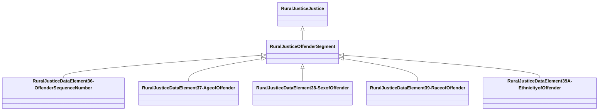

# Class: Offender Segment (rural_justice_OffenderSegment)


_NIBRS Offender Segment_


URI: [rural:justice/OffenderSegment](http://sail.ua.edu/ruralkg/justice/OffenderSegment)





## Inheritance
* [RuralJusticeJustice](../classes/RuralJusticeJustice.md)
    * **RuralJusticeOffenderSegment**
        * [RuralJusticeDataElement36-OffenderSequenceNumber](../classes/RuralJusticeDataElement36-OffenderSequenceNumber.md)
        * [RuralJusticeDataElement37-AgeofOffender](../classes/RuralJusticeDataElement37-AgeofOffender.md)
        * [RuralJusticeDataElement38-SexofOffender](../classes/RuralJusticeDataElement38-SexofOffender.md)
        * [RuralJusticeDataElement39-RaceofOffender](../classes/RuralJusticeDataElement39-RaceofOffender.md)
        * [RuralJusticeDataElement39A-EthnicityofOffender](../classes/RuralJusticeDataElement39A-EthnicityofOffender.md)


## Slots

| Name | Cardinality and Range | Description | Inheritance | Occurrences |
| ---  | --- | --- | --- | --- |


## LinkML Source

<!-- TODO: investigate https://stackoverflow.com/questions/37606292/how-to-create-tabbed-code-blocks-in-mkdocs-or-sphinx -->

### Direct

<details>

```yaml
name: rural_justice_OffenderSegment
description: NIBRS Offender Segment
title: Offender Segment
from_schema: okns:rural-kg
rank: 1000
is_a: rural_justice_Justice
class_uri: rural:justice/OffenderSegment

```
</details>

### Induced

<details>

```yaml
name: rural_justice_OffenderSegment
description: NIBRS Offender Segment
title: Offender Segment
from_schema: okns:rural-kg
rank: 1000
is_a: rural_justice_Justice
class_uri: rural:justice/OffenderSegment

```
</details>