# Class: Offense Segment (rural_justice_OffenseSegment)


_NIBRS Offense Segment_


URI: [rural:justice/OffenseSegment](http://sail.ua.edu/ruralkg/justice/OffenseSegment)

```mermaid
 classDiagram
    class RuralJusticeOffenseSegment
    click RuralJusticeOffenseSegment href "../RuralJusticeOffenseSegment"
      RuralJusticeJustice <|-- RuralJusticeOffenseSegment
        click RuralJusticeJustice href "../RuralJusticeJustice"
      

      RuralJusticeOffenseSegment <|-- RuralJusticeDataElement08A-BiasMotivation
        click RuralJusticeDataElement08A-BiasMotivation href "../RuralJusticeDataElement08A-BiasMotivation"
      RuralJusticeOffenseSegment <|-- RuralJusticeDataElement10-NumberofPremisesEntered
        click RuralJusticeDataElement10-NumberofPremisesEntered href "../RuralJusticeDataElement10-NumberofPremisesEntered"
      RuralJusticeOffenseSegment <|-- RuralJusticeDataElement11-MethodofEntry
        click RuralJusticeDataElement11-MethodofEntry href "../RuralJusticeDataElement11-MethodofEntry"
      RuralJusticeOffenseSegment <|-- RuralJusticeDataElement12-TypeCriminalActivityGangInformation
        click RuralJusticeDataElement12-TypeCriminalActivityGangInformation href "../RuralJusticeDataElement12-TypeCriminalActivityGangInformation"
      RuralJusticeOffenseSegment <|-- RuralJusticeDataElement13-TypeWeaponForceInvolved
        click RuralJusticeDataElement13-TypeWeaponForceInvolved href "../RuralJusticeDataElement13-TypeWeaponForceInvolved"
      RuralJusticeOffenseSegment <|-- RuralJusticeDataElement6-UCROffenseCode
        click RuralJusticeDataElement6-UCROffenseCode href "../RuralJusticeDataElement6-UCROffenseCode"
      RuralJusticeOffenseSegment <|-- RuralJusticeDataElement7-OffenseAttemptedCompleted
        click RuralJusticeDataElement7-OffenseAttemptedCompleted href "../RuralJusticeDataElement7-OffenseAttemptedCompleted"
      RuralJusticeOffenseSegment <|-- RuralJusticeDataElement8-OffenderSuspectedofUsing
        click RuralJusticeDataElement8-OffenderSuspectedofUsing href "../RuralJusticeDataElement8-OffenderSuspectedofUsing"
      RuralJusticeOffenseSegment <|-- RuralJusticeDataElement9-LocationType
        click RuralJusticeDataElement9-LocationType href "../RuralJusticeDataElement9-LocationType"
      
      
      
```





## Inheritance
* [RuralJusticeJustice](../classes/RuralJusticeJustice.md)
    * **RuralJusticeOffenseSegment**
        * [RuralJusticeDataElement08A-BiasMotivation](../classes/RuralJusticeDataElement08A-BiasMotivation.md)
        * [RuralJusticeDataElement10-NumberofPremisesEntered](../classes/RuralJusticeDataElement10-NumberofPremisesEntered.md)
        * [RuralJusticeDataElement11-MethodofEntry](../classes/RuralJusticeDataElement11-MethodofEntry.md)
        * [RuralJusticeDataElement12-TypeCriminalActivityGangInformation](../classes/RuralJusticeDataElement12-TypeCriminalActivityGangInformation.md)
        * [RuralJusticeDataElement13-TypeWeaponForceInvolved](../classes/RuralJusticeDataElement13-TypeWeaponForceInvolved.md)
        * [RuralJusticeDataElement6-UCROffenseCode](../classes/RuralJusticeDataElement6-UCROffenseCode.md)
        * [RuralJusticeDataElement7-OffenseAttemptedCompleted](../classes/RuralJusticeDataElement7-OffenseAttemptedCompleted.md)
        * [RuralJusticeDataElement8-OffenderSuspectedofUsing](../classes/RuralJusticeDataElement8-OffenderSuspectedofUsing.md)
        * [RuralJusticeDataElement9-LocationType](../classes/RuralJusticeDataElement9-LocationType.md)


## Slots

| Name | Cardinality and Range | Description | Inheritance | Occurrences |
| ---  | --- | --- | --- | --- |


## LinkML Source

<!-- TODO: investigate https://stackoverflow.com/questions/37606292/how-to-create-tabbed-code-blocks-in-mkdocs-or-sphinx -->

### Direct

<details>

```yaml
name: rural_justice_OffenseSegment
description: NIBRS Offense Segment
title: Offense Segment
from_schema: okns:rural-kg
rank: 1000
is_a: rural_justice_Justice
class_uri: rural:justice/OffenseSegment

```
</details>

### Induced

<details>

```yaml
name: rural_justice_OffenseSegment
description: NIBRS Offense Segment
title: Offense Segment
from_schema: okns:rural-kg
rank: 1000
is_a: rural_justice_Justice
class_uri: rural:justice/OffenseSegment

```
</details>