# Class: Victim Segment (rural_justice_VictimSegment)


_NIBRS Victim Segment_


URI: [rural:justice/VictimSegment](http://sail.ua.edu/ruralkg/justice/VictimSegment)

```mermaid
 classDiagram
    class RuralJusticeVictimSegment
    click RuralJusticeVictimSegment href "../RuralJusticeVictimSegment"
      RuralJusticeJustice <|-- RuralJusticeVictimSegment
        click RuralJusticeJustice href "../RuralJusticeJustice"
      

      RuralJusticeVictimSegment <|-- RuralJusticeDataElement23-VictimSequenceNumber
        click RuralJusticeDataElement23-VictimSequenceNumber href "../RuralJusticeDataElement23-VictimSequenceNumber"
      RuralJusticeVictimSegment <|-- RuralJusticeDataElement24-VictimConnectedtoUCROffenseCode
        click RuralJusticeDataElement24-VictimConnectedtoUCROffenseCode href "../RuralJusticeDataElement24-VictimConnectedtoUCROffenseCode"
      RuralJusticeVictimSegment <|-- RuralJusticeDataElement25-TypeofVictim
        click RuralJusticeDataElement25-TypeofVictim href "../RuralJusticeDataElement25-TypeofVictim"
      RuralJusticeVictimSegment <|-- RuralJusticeDataElement25A-TypeofOfficerActivityCircumstance
        click RuralJusticeDataElement25A-TypeofOfficerActivityCircumstance href "../RuralJusticeDataElement25A-TypeofOfficerActivityCircumstance"
      RuralJusticeVictimSegment <|-- RuralJusticeDataElement25B-OfficerAssignmentType
        click RuralJusticeDataElement25B-OfficerAssignmentType href "../RuralJusticeDataElement25B-OfficerAssignmentType"
      RuralJusticeVictimSegment <|-- RuralJusticeDataElement25C-Officer-ORIOtherJurisdiction
        click RuralJusticeDataElement25C-Officer-ORIOtherJurisdiction href "../RuralJusticeDataElement25C-Officer-ORIOtherJurisdiction"
      RuralJusticeVictimSegment <|-- RuralJusticeDataElement26-AgeofVictim
        click RuralJusticeDataElement26-AgeofVictim href "../RuralJusticeDataElement26-AgeofVictim"
      RuralJusticeVictimSegment <|-- RuralJusticeDataElement27-SexofVictim
        click RuralJusticeDataElement27-SexofVictim href "../RuralJusticeDataElement27-SexofVictim"
      RuralJusticeVictimSegment <|-- RuralJusticeDataElement28-RaceofVictim
        click RuralJusticeDataElement28-RaceofVictim href "../RuralJusticeDataElement28-RaceofVictim"
      RuralJusticeVictimSegment <|-- RuralJusticeDataElement29-EthnicityofVictim
        click RuralJusticeDataElement29-EthnicityofVictim href "../RuralJusticeDataElement29-EthnicityofVictim"
      RuralJusticeVictimSegment <|-- RuralJusticeDataElement30-ResidentStatusofVictim
        click RuralJusticeDataElement30-ResidentStatusofVictim href "../RuralJusticeDataElement30-ResidentStatusofVictim"
      RuralJusticeVictimSegment <|-- RuralJusticeDataElement31-AggravatedAssaultHomicideCircumstances
        click RuralJusticeDataElement31-AggravatedAssaultHomicideCircumstances href "../RuralJusticeDataElement31-AggravatedAssaultHomicideCircumstances"
      RuralJusticeVictimSegment <|-- RuralJusticeDataElement32-AdditionalJustifiableHomicideCircumstances
        click RuralJusticeDataElement32-AdditionalJustifiableHomicideCircumstances href "../RuralJusticeDataElement32-AdditionalJustifiableHomicideCircumstances"
      RuralJusticeVictimSegment <|-- RuralJusticeDataElement33-TypeInjury
        click RuralJusticeDataElement33-TypeInjury href "../RuralJusticeDataElement33-TypeInjury"
      RuralJusticeVictimSegment <|-- RuralJusticeDataElement34-OffenderNumbertobeRelated
        click RuralJusticeDataElement34-OffenderNumbertobeRelated href "../RuralJusticeDataElement34-OffenderNumbertobeRelated"
      RuralJusticeVictimSegment <|-- RuralJusticeDataElement35-RelationshipofVictimtoOffender
        click RuralJusticeDataElement35-RelationshipofVictimtoOffender href "../RuralJusticeDataElement35-RelationshipofVictimtoOffender"
      
      
      
```





## Inheritance
* [RuralJusticeJustice](../classes/RuralJusticeJustice.md)
    * **RuralJusticeVictimSegment**
        * [RuralJusticeDataElement23-VictimSequenceNumber](../classes/RuralJusticeDataElement23-VictimSequenceNumber.md)
        * [RuralJusticeDataElement24-VictimConnectedtoUCROffenseCode](../classes/RuralJusticeDataElement24-VictimConnectedtoUCROffenseCode.md)
        * [RuralJusticeDataElement25-TypeofVictim](../classes/RuralJusticeDataElement25-TypeofVictim.md)
        * [RuralJusticeDataElement25A-TypeofOfficerActivityCircumstance](../classes/RuralJusticeDataElement25A-TypeofOfficerActivityCircumstance.md)
        * [RuralJusticeDataElement25B-OfficerAssignmentType](../classes/RuralJusticeDataElement25B-OfficerAssignmentType.md)
        * [RuralJusticeDataElement25C-Officer-ORIOtherJurisdiction](../classes/RuralJusticeDataElement25C-Officer-ORIOtherJurisdiction.md)
        * [RuralJusticeDataElement26-AgeofVictim](../classes/RuralJusticeDataElement26-AgeofVictim.md)
        * [RuralJusticeDataElement27-SexofVictim](../classes/RuralJusticeDataElement27-SexofVictim.md)
        * [RuralJusticeDataElement28-RaceofVictim](../classes/RuralJusticeDataElement28-RaceofVictim.md)
        * [RuralJusticeDataElement29-EthnicityofVictim](../classes/RuralJusticeDataElement29-EthnicityofVictim.md)
        * [RuralJusticeDataElement30-ResidentStatusofVictim](../classes/RuralJusticeDataElement30-ResidentStatusofVictim.md)
        * [RuralJusticeDataElement31-AggravatedAssaultHomicideCircumstances](../classes/RuralJusticeDataElement31-AggravatedAssaultHomicideCircumstances.md)
        * [RuralJusticeDataElement32-AdditionalJustifiableHomicideCircumstances](../classes/RuralJusticeDataElement32-AdditionalJustifiableHomicideCircumstances.md)
        * [RuralJusticeDataElement33-TypeInjury](../classes/RuralJusticeDataElement33-TypeInjury.md)
        * [RuralJusticeDataElement34-OffenderNumbertobeRelated](../classes/RuralJusticeDataElement34-OffenderNumbertobeRelated.md)
        * [RuralJusticeDataElement35-RelationshipofVictimtoOffender](../classes/RuralJusticeDataElement35-RelationshipofVictimtoOffender.md)


## Slots

| Name | Cardinality and Range | Description | Inheritance | Occurrences |
| ---  | --- | --- | --- | --- |


## LinkML Source

<!-- TODO: investigate https://stackoverflow.com/questions/37606292/how-to-create-tabbed-code-blocks-in-mkdocs-or-sphinx -->

### Direct

<details>

```yaml
name: rural_justice_VictimSegment
description: NIBRS Victim Segment
title: Victim Segment
from_schema: okns:rural-kg
rank: 1000
is_a: rural_justice_Justice
class_uri: rural:justice/VictimSegment

```
</details>

### Induced

<details>

```yaml
name: rural_justice_VictimSegment
description: NIBRS Victim Segment
title: Victim Segment
from_schema: okns:rural-kg
rank: 1000
is_a: rural_justice_Justice
class_uri: rural:justice/VictimSegment

```
</details>