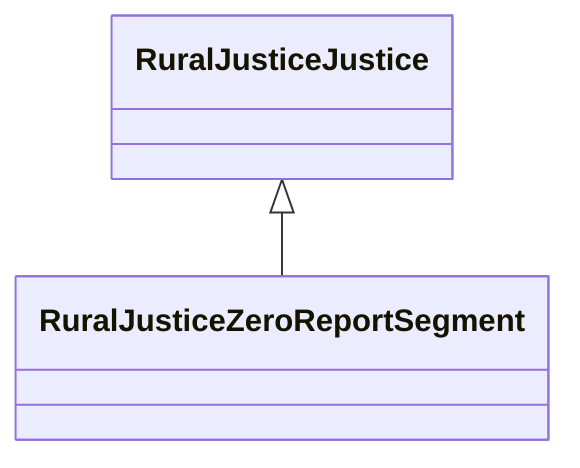

# Class: Zero Report Segment (rural_justice_ZeroReportSegment)


_NIBRS Zero Report Segment_


URI: [rural:justice/ZeroReportSegment](http://sail.ua.edu/ruralkg/justice/ZeroReportSegment)





## Inheritance
* [RuralJusticeJustice](../classes/RuralJusticeJustice.md)
    * **RuralJusticeZeroReportSegment**


## Slots

| Name | Cardinality and Range | Description | Inheritance | Occurrences |
| ---  | --- | --- | --- | --- |


## LinkML Source

<!-- TODO: investigate https://stackoverflow.com/questions/37606292/how-to-create-tabbed-code-blocks-in-mkdocs-or-sphinx -->

### Direct

<details>

```yaml
name: rural_justice_ZeroReportSegment
description: NIBRS Zero Report Segment
title: Zero Report Segment
from_schema: okns:rural-kg
rank: 1000
is_a: rural_justice_Justice
class_uri: rural:justice/ZeroReportSegment

```
</details>

### Induced

<details>

```yaml
name: rural_justice_ZeroReportSegment
description: NIBRS Zero Report Segment
title: Zero Report Segment
from_schema: okns:rural-kg
rank: 1000
is_a: rural_justice_Justice
class_uri: rural:justice/ZeroReportSegment

```
</details>