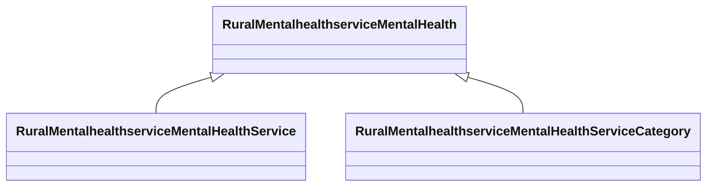

# Class: Mental Health (rural_mentalhealthservice_MentalHealth)


_Mental health services, sourcing from services defined in National Directory Of Mental Health Treatment Facilities._


URI: [rural:mentalhealthservice/MentalHealth](http://sail.ua.edu/ruralkg/mentalhealthservice/MentalHealth)





## Inheritance
* **RuralMentalhealthserviceMentalHealth**
    * [RuralMentalhealthserviceMentalHealthService](../classes/RuralMentalhealthserviceMentalHealthService.md)
    * [RuralMentalhealthserviceMentalHealthServiceCategory](../classes/RuralMentalhealthserviceMentalHealthServiceCategory.md)


## Slots

| Name | Cardinality and Range | Description | Inheritance |
| ---  | --- | --- | --- |


## TODOs

* TODO -- Todos for this class go here
* or you can delete the todos
* if you think the class is perfect.

## Identifier and Mapping Information


### Schema Source


* from schema: rural-kg


## Mappings

| Mapping Type | Mapped Value |
| ---  | ---  |
| self | rural:mentalhealthservice/MentalHealth |
| native | rural-kg/:RuralMentalhealthserviceMentalHealth |


## LinkML Source

<!-- TODO: investigate https://stackoverflow.com/questions/37606292/how-to-create-tabbed-code-blocks-in-mkdocs-or-sphinx -->

### Direct

<details>
```yaml
name: rural_mentalhealthservice_MentalHealth
description: Mental health services, sourcing from services defined in National Directory
  Of Mental Health Treatment Facilities.
title: Mental Health
todos:
- TODO -- Todos for this class go here
- or you can delete the todos
- if you think the class is perfect.
notes:
- There are 0 instances of this class.
from_schema: rural-kg
rank: 1000
class_uri: rural:mentalhealthservice/MentalHealth

```
</details>

### Induced

<details>
```yaml
name: rural_mentalhealthservice_MentalHealth
description: Mental health services, sourcing from services defined in National Directory
  Of Mental Health Treatment Facilities.
title: Mental Health
todos:
- TODO -- Todos for this class go here
- or you can delete the todos
- if you think the class is perfect.
notes:
- There are 0 instances of this class.
from_schema: rural-kg
rank: 1000
class_uri: rural:mentalhealthservice/MentalHealth

```
</details>