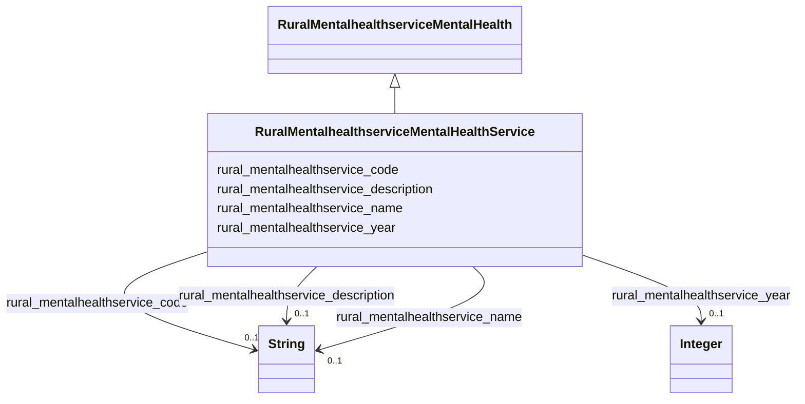

# Class: TODO -- what's a good name for what this class (type) describes? (rural_mentalhealthservice_MentalHealthService)


_Specific mental health services offered._


URI: [rural:mentalhealthservice/MentalHealthService](http://sail.ua.edu/ruralkg/mentalhealthservice/MentalHealthService)





## Inheritance
* [RuralMentalhealthserviceMentalHealth](../classes/RuralMentalhealthserviceMentalHealth.md)
    * **RuralMentalhealthserviceMentalHealthService**


## Slots

| Name | Cardinality and Range | Description | Inheritance |
| ---  | --- | --- | --- |
| [rural_mentalhealthservice_description](../slots/rural_mentalhealthservice_description.md) | 0..1 <br/> [xsd:string](http://www.w3.org/2001/XMLSchema#string) | No slot description provided | direct |
| [rural_mentalhealthservice_code](../slots/rural_mentalhealthservice_code.md) | 0..1 <br/> [xsd:string](http://www.w3.org/2001/XMLSchema#string) | No slot description provided | direct |
| [rural_mentalhealthservice_year](../slots/rural_mentalhealthservice_year.md) | 0..1 <br/> [xsd:integer](http://www.w3.org/2001/XMLSchema#integer) | No slot description provided | direct |
| [rural_mentalhealthservice_name](../slots/rural_mentalhealthservice_name.md) | 0..1 <br/> [xsd:string](http://www.w3.org/2001/XMLSchema#string) | No slot description provided | direct |


## Usages

| used by | used in | type | used |
| ---  | --- | --- | --- |
| [RuralMentalhealthserviceMentalHealthServiceCategory](../classes/RuralMentalhealthserviceMentalHealthServiceCategory.md) | [rural_mentalhealthservice_containsService](../slots/rural_mentalhealthservice_containsService.md) | range | [RuralMentalhealthserviceMentalHealthService](../classes/RuralMentalhealthserviceMentalHealthService.md) |
| [RuralTreatmentproviderTreatmentProvider](../classes/RuralTreatmentproviderTreatmentProvider.md) | [rural_treatmentprovider_providesService](../slots/rural_treatmentprovider_providesService.md) | range | [RuralMentalhealthserviceMentalHealthService](../classes/RuralMentalhealthserviceMentalHealthService.md) |


## Examples

| Value |
| --- |
| rural:mentalhealthservice/MHS_SNR |

## TODOs

* TODO -- Todos for this class go here
* or you can delete the todos
* if you think the class is perfect.

## Identifier and Mapping Information


### Schema Source


* from schema: rural-kg


## Mappings

| Mapping Type | Mapped Value |
| ---  | ---  |
| self | rural:mentalhealthservice/MentalHealthService |
| native | rural-kg/:RuralMentalhealthserviceMentalHealthService |


## LinkML Source

<!-- TODO: investigate https://stackoverflow.com/questions/37606292/how-to-create-tabbed-code-blocks-in-mkdocs-or-sphinx -->

### Direct

<details>
```yaml
name: rural_mentalhealthservice_MentalHealthService
description: Specific mental health services offered.
title: TODO -- what's a good name for what this class (type) describes?
todos:
- TODO -- Todos for this class go here
- or you can delete the todos
- if you think the class is perfect.
notes:
- There are 176 instances of this class.
examples:
- value: rural:mentalhealthservice/MHS_SNR
from_schema: rural-kg
rank: 1000
is_a: rural_mentalhealthservice_MentalHealth
slots:
- rural_mentalhealthservice_description
- rural_mentalhealthservice_code
- rural_mentalhealthservice_year
- rural_mentalhealthservice_name
class_uri: rural:mentalhealthservice/MentalHealthService

```
</details>

### Induced

<details>
```yaml
name: rural_mentalhealthservice_MentalHealthService
description: Specific mental health services offered.
title: TODO -- what's a good name for what this class (type) describes?
todos:
- TODO -- Todos for this class go here
- or you can delete the todos
- if you think the class is perfect.
notes:
- There are 176 instances of this class.
examples:
- value: rural:mentalhealthservice/MHS_SNR
from_schema: rural-kg
rank: 1000
is_a: rural_mentalhealthservice_MentalHealth
attributes:
  rural_mentalhealthservice_description:
    name: rural_mentalhealthservice_description
    description: No slot description provided
    todos:
    - TODO -- Todos for this slot go here
    - or you can delete the todos
    - if you think the class is perfect.
    comments:
    - 176 occurrences with subject type rural_mentalhealthservice_MentalHealthService
      and object type string.
    examples:
    - value: 'rural:mentalhealthservice/MHS_PVTN rural:mentalhealthservice/description
        A charitable organization that does not qualify as a public charity.

        '
    from_schema: rural-kg
    rank: 1000
    slot_uri: rural:mentalhealthservice/description
    alias: rural_mentalhealthservice_description
    owner: rural_mentalhealthservice_MentalHealthService
    domain_of:
    - rural_mentalhealthservice_MentalHealthService
    range: string
  rural_mentalhealthservice_code:
    name: rural_mentalhealthservice_code
    description: No slot description provided
    todos:
    - TODO -- Todos for this slot go here
    - or you can delete the todos
    - if you think the class is perfect.
    comments:
    - 176 occurrences with subject type rural_mentalhealthservice_MentalHealthService
      and object type string.
    - 21 occurrences with subject type rural_mentalhealthservice_MentalHealthServiceCategory
      and object type string.
    examples:
    - value: rural:mentalhealthservice/MHS_AH rural:mentalhealthservice/code AH
    - value: rural:mentalhealthservice/MHSC_OL rural:mentalhealthservice/code OL
    from_schema: rural-kg
    rank: 1000
    slot_uri: rural:mentalhealthservice/code
    alias: rural_mentalhealthservice_code
    owner: rural_mentalhealthservice_MentalHealthService
    domain_of:
    - rural_mentalhealthservice_MentalHealthService
    - rural_mentalhealthservice_MentalHealthServiceCategory
    range: string
  rural_mentalhealthservice_year:
    name: rural_mentalhealthservice_year
    description: No slot description provided
    todos:
    - TODO -- Todos for this slot go here
    - or you can delete the todos
    - if you think the class is perfect.
    comments:
    - 176 occurrences with subject type rural_mentalhealthservice_MentalHealthService
      and object type integer.
    - 21 occurrences with subject type rural_mentalhealthservice_MentalHealthServiceCategory
      and object type integer.
    examples:
    - value: rural:mentalhealthservice/MHS_PEER rural:mentalhealthservice/year 2022
    - value: rural:mentalhealthservice/MHSC_SCR rural:mentalhealthservice/year 2022
    from_schema: rural-kg
    rank: 1000
    slot_uri: rural:mentalhealthservice/year
    alias: rural_mentalhealthservice_year
    owner: rural_mentalhealthservice_MentalHealthService
    domain_of:
    - rural_mentalhealthservice_MentalHealthService
    - rural_mentalhealthservice_MentalHealthServiceCategory
    range: integer
  rural_mentalhealthservice_name:
    name: rural_mentalhealthservice_name
    description: No slot description provided
    todos:
    - TODO -- Todos for this slot go here
    - or you can delete the todos
    - if you think the class is perfect.
    comments:
    - 176 occurrences with subject type rural_mentalhealthservice_MentalHealthService
      and object type string.
    - 21 occurrences with subject type rural_mentalhealthservice_MentalHealthServiceCategory
      and object type string.
    examples:
    - value: rural:mentalhealthservice/MHS_HIVT rural:mentalhealthservice/name HIV
        testing
    - value: rural:mentalhealthservice/MHSC_FOP rural:mentalhealthservice/name Facility
        Operation (e.g., Private, Public)
    from_schema: rural-kg
    rank: 1000
    slot_uri: rural:mentalhealthservice/name
    alias: rural_mentalhealthservice_name
    owner: rural_mentalhealthservice_MentalHealthService
    domain_of:
    - rural_mentalhealthservice_MentalHealthService
    - rural_mentalhealthservice_MentalHealthServiceCategory
    range: string
class_uri: rural:mentalhealthservice/MentalHealthService

```
</details>