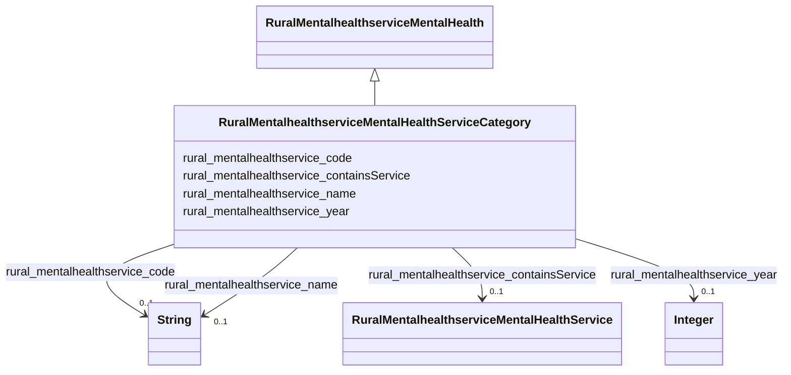

# Class: No class (type) name specified (rural_mentalhealthservice_MentalHealthServiceCategory)


_No class (type) description specified_


URI: [rural:mentalhealthservice/MentalHealthServiceCategory](http://sail.ua.edu/ruralkg/mentalhealthservice/MentalHealthServiceCategory)





## Inheritance
* [RuralMentalhealthserviceMentalHealth](../classes/RuralMentalhealthserviceMentalHealth.md)
    * **RuralMentalhealthserviceMentalHealthServiceCategory**


## Slots

| Name | Cardinality and Range | Description | Inheritance |
| ---  | --- | --- | --- |
| [rural_mentalhealthservice_name](../slots/rural_mentalhealthservice_name.md) | 0..1 <br/> [xsd:string](xsd:string) | No slot (predicate) description specified <br/> 176 occurrences with subject type rural_mentalhealthservice_MentalHealthService and object type string.<br/>21 occurrences with subject type rural_mentalhealthservice_MentalHealthServiceCategory and object type string. | direct |
| [rural_mentalhealthservice_containsService](../slots/rural_mentalhealthservice_containsService.md) | 0..1 <br/> [RuralMentalhealthserviceMentalHealthService](../classes/RuralMentalhealthserviceMentalHealthService.md) | No slot (predicate) description specified <br/> 176 occurrences with subject type rural_mentalhealthservice_MentalHealthServiceCategory and object type rural_mentalhealthservice_MentalHealthService. | direct |
| [rural_mentalhealthservice_year](../slots/rural_mentalhealthservice_year.md) | 0..1 <br/> [xsd:integer](xsd:integer) | No slot (predicate) description specified <br/> 176 occurrences with subject type rural_mentalhealthservice_MentalHealthService and object type integer.<br/>21 occurrences with subject type rural_mentalhealthservice_MentalHealthServiceCategory and object type integer. | direct |
| [rural_mentalhealthservice_code](../slots/rural_mentalhealthservice_code.md) | 0..1 <br/> [xsd:string](xsd:string) | No slot (predicate) description specified <br/> 176 occurrences with subject type rural_mentalhealthservice_MentalHealthService and object type string.<br/>21 occurrences with subject type rural_mentalhealthservice_MentalHealthServiceCategory and object type string. | direct |


## Comments

* Categories of mental health services.

## Identifier and Mapping Information


### Schema Source


* from schema: rural-kg


## Mappings

| Mapping Type | Mapped Value |
| ---  | ---  |
| self | rural:mentalhealthservice/MentalHealthServiceCategory |
| native | rural-kg/:RuralMentalhealthserviceMentalHealthServiceCategory |


## LinkML Source

<!-- TODO: investigate https://stackoverflow.com/questions/37606292/how-to-create-tabbed-code-blocks-in-mkdocs-or-sphinx -->

### Direct

<details>
```yaml
name: rural_mentalhealthservice_MentalHealthServiceCategory
conforms_to: No schema conformance document specified
description: No class (type) description specified
title: No class (type) name specified
notes:
- Class with 21 occurrences.
comments:
- Categories of mental health services.
from_schema: rural-kg
rank: 1000
is_a: rural_mentalhealthservice_MentalHealth
slots:
- rural_mentalhealthservice_name
- rural_mentalhealthservice_containsService
- rural_mentalhealthservice_year
- rural_mentalhealthservice_code
class_uri: rural:mentalhealthservice/MentalHealthServiceCategory

```
</details>

### Induced

<details>
```yaml
name: rural_mentalhealthservice_MentalHealthServiceCategory
conforms_to: No schema conformance document specified
description: No class (type) description specified
title: No class (type) name specified
notes:
- Class with 21 occurrences.
comments:
- Categories of mental health services.
from_schema: rural-kg
rank: 1000
is_a: rural_mentalhealthservice_MentalHealth
attributes:
  rural_mentalhealthservice_name:
    name: rural_mentalhealthservice_name
    description: No slot (predicate) description specified
    comments:
    - 176 occurrences with subject type rural_mentalhealthservice_MentalHealthService
      and object type string.
    - 21 occurrences with subject type rural_mentalhealthservice_MentalHealthServiceCategory
      and object type string.
    examples:
    - description: rural_mentalhealthservice_MentalHealthService → string
      object:
        example_object: Assertive community treatment
        example_predicate: rural:mentalhealthservice/name
        example_subject: rural:mentalhealthservice/MHS_ACT
    - description: rural_mentalhealthservice_MentalHealthServiceCategory → string
      object:
        example_object: Age Groups Accepted
        example_predicate: rural:mentalhealthservice/name
        example_subject: rural:mentalhealthservice/MHSC_AGE
    from_schema: rural-kg
    rank: 1000
    slot_uri: rural:mentalhealthservice/name
    alias: rural_mentalhealthservice_name
    owner: rural_mentalhealthservice_MentalHealthServiceCategory
    domain_of:
    - rural_mentalhealthservice_MentalHealthService
    - rural_mentalhealthservice_MentalHealthServiceCategory
    range: string
  rural_mentalhealthservice_containsService:
    name: rural_mentalhealthservice_containsService
    description: No slot (predicate) description specified
    comments:
    - 176 occurrences with subject type rural_mentalhealthservice_MentalHealthServiceCategory
      and object type rural_mentalhealthservice_MentalHealthService.
    examples:
    - description: rural_mentalhealthservice_MentalHealthServiceCategory → rural_mentalhealthservice_MentalHealthService
      object:
        example_object: rural:mentalhealthservice/MHS_SUMH
        example_predicate: rural:mentalhealthservice/containsService
        example_subject: rural:mentalhealthservice/MHSC_TC
    from_schema: rural-kg
    rank: 1000
    slot_uri: rural:mentalhealthservice/containsService
    alias: rural_mentalhealthservice_containsService
    owner: rural_mentalhealthservice_MentalHealthServiceCategory
    domain_of:
    - rural_mentalhealthservice_MentalHealthServiceCategory
    range: rural_mentalhealthservice_MentalHealthService
  rural_mentalhealthservice_year:
    name: rural_mentalhealthservice_year
    description: No slot (predicate) description specified
    comments:
    - 176 occurrences with subject type rural_mentalhealthservice_MentalHealthService
      and object type integer.
    - 21 occurrences with subject type rural_mentalhealthservice_MentalHealthServiceCategory
      and object type integer.
    examples:
    - description: rural_mentalhealthservice_MentalHealthService → integer
      object:
        example_object: '2022'
        example_predicate: rural:mentalhealthservice/year
        example_subject: rural:mentalhealthservice/MHS_ACT
    - description: rural_mentalhealthservice_MentalHealthServiceCategory → integer
      object:
        example_object: '2022'
        example_predicate: rural:mentalhealthservice/year
        example_subject: rural:mentalhealthservice/MHSC_AGE
    from_schema: rural-kg
    rank: 1000
    slot_uri: rural:mentalhealthservice/year
    alias: rural_mentalhealthservice_year
    owner: rural_mentalhealthservice_MentalHealthServiceCategory
    domain_of:
    - rural_mentalhealthservice_MentalHealthService
    - rural_mentalhealthservice_MentalHealthServiceCategory
    range: integer
  rural_mentalhealthservice_code:
    name: rural_mentalhealthservice_code
    description: No slot (predicate) description specified
    comments:
    - 176 occurrences with subject type rural_mentalhealthservice_MentalHealthService
      and object type string.
    - 21 occurrences with subject type rural_mentalhealthservice_MentalHealthServiceCategory
      and object type string.
    examples:
    - description: rural_mentalhealthservice_MentalHealthService → string
      object:
        example_object: ACT
        example_predicate: rural:mentalhealthservice/code
        example_subject: rural:mentalhealthservice/MHS_ACT
    - description: rural_mentalhealthservice_MentalHealthServiceCategory → string
      object:
        example_object: AGE
        example_predicate: rural:mentalhealthservice/code
        example_subject: rural:mentalhealthservice/MHSC_AGE
    from_schema: rural-kg
    rank: 1000
    slot_uri: rural:mentalhealthservice/code
    alias: rural_mentalhealthservice_code
    owner: rural_mentalhealthservice_MentalHealthServiceCategory
    domain_of:
    - rural_mentalhealthservice_MentalHealthService
    - rural_mentalhealthservice_MentalHealthServiceCategory
    range: string
class_uri: rural:mentalhealthservice/MentalHealthServiceCategory

```
</details>