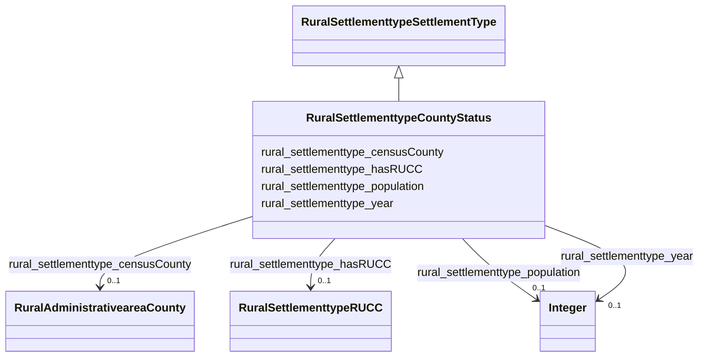

# Class: No class (type) name specified (rural_settlementtype_CountyStatus)


_No class (type) description specified_


URI: [rural:settlementtype/CountyStatus](http://sail.ua.edu/ruralkg/settlementtype/CountyStatus)





## Inheritance
* [RuralSettlementtypeSettlementType](../classes/RuralSettlementtypeSettlementType.md)
    * **RuralSettlementtypeCountyStatus**


## Slots

| Name | Cardinality and Range | Description | Inheritance |
| ---  | --- | --- | --- |
| [rural_settlementtype_censusCounty](../slots/rural_settlementtype_censusCounty.md) | 0..1 <br/> [RuralAdministrativeareaCounty](../classes/RuralAdministrativeareaCounty.md) | No slot (predicate) description specified <br/> 3234 occurrences with subject type rural_settlementtype_CountyStatus and object type rural_administrativearea_County. | direct |
| [rural_settlementtype_population](../slots/rural_settlementtype_population.md) | 0..1 <br/> [xsd:integer](xsd:integer) | No slot (predicate) description specified <br/> 3234 occurrences with subject type rural_settlementtype_CountyStatus and object type integer. | direct |
| [rural_settlementtype_year](../slots/rural_settlementtype_year.md) | 0..1 <br/> [xsd:integer](xsd:integer) | No slot (predicate) description specified <br/> 10 occurrences with subject type rural_settlementtype_RUCC and object type integer.<br/>3234 occurrences with subject type rural_settlementtype_CountyStatus and object type integer. | direct |
| [rural_settlementtype_hasRUCC](../slots/rural_settlementtype_hasRUCC.md) | 0..1 <br/> [RuralSettlementtypeRUCC](../classes/RuralSettlementtypeRUCC.md) | No slot (predicate) description specified <br/> 3234 occurrences with subject type rural_settlementtype_CountyStatus and object type rural_settlementtype_RUCC. | direct |


## Comments

* Status of a county in terms of rural or urban classification.

## Identifier and Mapping Information


### Schema Source


* from schema: rural-kg


## Mappings

| Mapping Type | Mapped Value |
| ---  | ---  |
| self | rural:settlementtype/CountyStatus |
| native | rural-kg/:RuralSettlementtypeCountyStatus |


## LinkML Source

<!-- TODO: investigate https://stackoverflow.com/questions/37606292/how-to-create-tabbed-code-blocks-in-mkdocs-or-sphinx -->

### Direct

<details>
```yaml
name: rural_settlementtype_CountyStatus
conforms_to: No schema conformance document specified
description: No class (type) description specified
title: No class (type) name specified
notes:
- Class with 3234 occurrences.
comments:
- Status of a county in terms of rural or urban classification.
from_schema: rural-kg
rank: 1000
is_a: rural_settlementtype_SettlementType
slots:
- rural_settlementtype_censusCounty
- rural_settlementtype_population
- rural_settlementtype_year
- rural_settlementtype_hasRUCC
class_uri: rural:settlementtype/CountyStatus

```
</details>

### Induced

<details>
```yaml
name: rural_settlementtype_CountyStatus
conforms_to: No schema conformance document specified
description: No class (type) description specified
title: No class (type) name specified
notes:
- Class with 3234 occurrences.
comments:
- Status of a county in terms of rural or urban classification.
from_schema: rural-kg
rank: 1000
is_a: rural_settlementtype_SettlementType
attributes:
  rural_settlementtype_censusCounty:
    name: rural_settlementtype_censusCounty
    description: No slot (predicate) description specified
    comments:
    - 3234 occurrences with subject type rural_settlementtype_CountyStatus and object
      type rural_administrativearea_County.
    examples:
    - description: rural_settlementtype_CountyStatus → rural_administrativearea_County
      object:
        example_object: rural:administrativearea/County_78030
        example_predicate: rural:settlementtype/censusCounty
        example_subject: rural:settlementtype/CountyStatus_78030_2013
    from_schema: rural-kg
    rank: 1000
    slot_uri: rural:settlementtype/censusCounty
    alias: rural_settlementtype_censusCounty
    owner: rural_settlementtype_CountyStatus
    domain_of:
    - rural_settlementtype_CountyStatus
    range: rural_administrativearea_County
  rural_settlementtype_population:
    name: rural_settlementtype_population
    description: No slot (predicate) description specified
    comments:
    - 3234 occurrences with subject type rural_settlementtype_CountyStatus and object
      type integer.
    examples:
    - description: rural_settlementtype_CountyStatus → integer
      object:
        example_object: '54571'
        example_predicate: rural:settlementtype/population
        example_subject: rural:settlementtype/CountyStatus_01001_2013
    from_schema: rural-kg
    rank: 1000
    slot_uri: rural:settlementtype/population
    alias: rural_settlementtype_population
    owner: rural_settlementtype_CountyStatus
    domain_of:
    - rural_settlementtype_CountyStatus
    range: integer
  rural_settlementtype_year:
    name: rural_settlementtype_year
    description: No slot (predicate) description specified
    comments:
    - 10 occurrences with subject type rural_settlementtype_RUCC and object type integer.
    - 3234 occurrences with subject type rural_settlementtype_CountyStatus and object
      type integer.
    examples:
    - description: rural_settlementtype_RUCC → integer
      object:
        example_object: '2013'
        example_predicate: rural:settlementtype/year
        example_subject: rural:settlementtype/RUCC_2013_0
    - description: rural_settlementtype_CountyStatus → integer
      object:
        example_object: '2013'
        example_predicate: rural:settlementtype/year
        example_subject: rural:settlementtype/CountyStatus_01001_2013
    from_schema: rural-kg
    rank: 1000
    slot_uri: rural:settlementtype/year
    alias: rural_settlementtype_year
    owner: rural_settlementtype_CountyStatus
    domain_of:
    - rural_settlementtype_CountyStatus
    - rural_settlementtype_RUCC
    range: integer
  rural_settlementtype_hasRUCC:
    name: rural_settlementtype_hasRUCC
    description: No slot (predicate) description specified
    comments:
    - 3234 occurrences with subject type rural_settlementtype_CountyStatus and object
      type rural_settlementtype_RUCC.
    examples:
    - description: rural_settlementtype_CountyStatus → rural_settlementtype_RUCC
      object:
        example_object: rural:settlementtype/RUCC_2013_5
        example_predicate: rural:settlementtype/hasRUCC
        example_subject: rural:settlementtype/CountyStatus_78030_2013
    from_schema: rural-kg
    rank: 1000
    slot_uri: rural:settlementtype/hasRUCC
    alias: rural_settlementtype_hasRUCC
    owner: rural_settlementtype_CountyStatus
    domain_of:
    - rural_settlementtype_CountyStatus
    range: rural_settlementtype_RUCC
class_uri: rural:settlementtype/CountyStatus

```
</details>