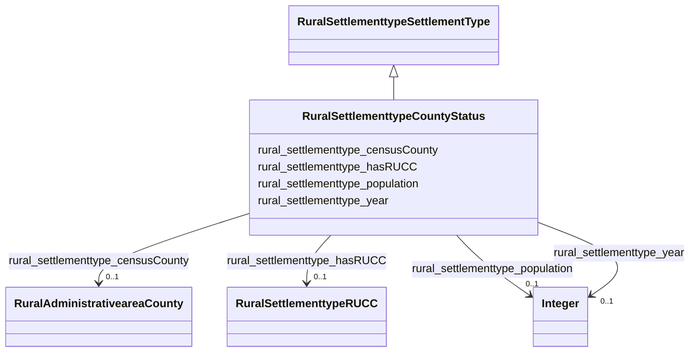

# Class: TODO -- what's a good name for what this class (type) describes? (rural_settlementtype_CountyStatus)


_Status of a county in terms of rural or urban classification._


URI: [rural:settlementtype/CountyStatus](http://sail.ua.edu/ruralkg/settlementtype/CountyStatus)





## Inheritance
* [RuralSettlementtypeSettlementType](../classes/RuralSettlementtypeSettlementType.md)
    * **RuralSettlementtypeCountyStatus**


## Slots

| Name | Cardinality and Range | Description | Inheritance |
| ---  | --- | --- | --- |
| [rural_settlementtype_censusCounty](../slots/rural_settlementtype_censusCounty.md) | 0..1 <br/> [RuralAdministrativeareaCounty](../classes/RuralAdministrativeareaCounty.md) | No slot description provided | direct |
| [rural_settlementtype_hasRUCC](../slots/rural_settlementtype_hasRUCC.md) | 0..1 <br/> [RuralSettlementtypeRUCC](../classes/RuralSettlementtypeRUCC.md) | No slot description provided | direct |
| [rural_settlementtype_year](../slots/rural_settlementtype_year.md) | 0..1 <br/> [xsd:integer](http://www.w3.org/2001/XMLSchema#integer) | No slot description provided | direct |
| [rural_settlementtype_population](../slots/rural_settlementtype_population.md) | 0..1 <br/> [xsd:integer](http://www.w3.org/2001/XMLSchema#integer) | No slot description provided | direct |


## Examples

| Value |
| --- |
| rural:settlementtype/CountyStatus_35035_2013 |


## TODOs

* TODO -- Todos for this class go here
* or you can delete the todos
* if you think the class is perfect.

## Identifier and Mapping Information


### Schema Source


* from schema: rural-kg


## Mappings

| Mapping Type | Mapped Value |
| ---  | ---  |
| self | rural:settlementtype/CountyStatus |
| native | rural-kg/:RuralSettlementtypeCountyStatus |


## LinkML Source

<!-- TODO: investigate https://stackoverflow.com/questions/37606292/how-to-create-tabbed-code-blocks-in-mkdocs-or-sphinx -->

### Direct

<details>
```yaml
name: rural_settlementtype_CountyStatus
description: Status of a county in terms of rural or urban classification.
title: TODO -- what's a good name for what this class (type) describes?
todos:
- TODO -- Todos for this class go here
- or you can delete the todos
- if you think the class is perfect.
notes:
- There are 3234 instances of this class.
examples:
- value: rural:settlementtype/CountyStatus_35035_2013
from_schema: rural-kg
rank: 1000
is_a: rural_settlementtype_SettlementType
slots:
- rural_settlementtype_censusCounty
- rural_settlementtype_hasRUCC
- rural_settlementtype_year
- rural_settlementtype_population
class_uri: rural:settlementtype/CountyStatus

```
</details>

### Induced

<details>
```yaml
name: rural_settlementtype_CountyStatus
description: Status of a county in terms of rural or urban classification.
title: TODO -- what's a good name for what this class (type) describes?
todos:
- TODO -- Todos for this class go here
- or you can delete the todos
- if you think the class is perfect.
notes:
- There are 3234 instances of this class.
examples:
- value: rural:settlementtype/CountyStatus_35035_2013
from_schema: rural-kg
rank: 1000
is_a: rural_settlementtype_SettlementType
attributes:
  rural_settlementtype_censusCounty:
    name: rural_settlementtype_censusCounty
    description: No slot description provided
    todos:
    - TODO -- Todos for this slot go here
    - or you can delete the todos
    - if you think the class is perfect.
    comments:
    - 3234 occurrences with subject type rural_settlementtype_CountyStatus and object
      type rural_administrativearea_County.
    examples:
    - value: rural:settlementtype/CountyStatus_28135_2013 rural:settlementtype/censusCounty
        rural:administrativearea/County_28135
    from_schema: rural-kg
    rank: 1000
    slot_uri: rural:settlementtype/censusCounty
    alias: rural_settlementtype_censusCounty
    owner: rural_settlementtype_CountyStatus
    domain_of:
    - rural_settlementtype_CountyStatus
    range: rural_administrativearea_County
  rural_settlementtype_hasRUCC:
    name: rural_settlementtype_hasRUCC
    description: No slot description provided
    todos:
    - TODO -- Todos for this slot go here
    - or you can delete the todos
    - if you think the class is perfect.
    comments:
    - 3234 occurrences with subject type rural_settlementtype_CountyStatus and object
      type rural_settlementtype_RUCC.
    examples:
    - value: rural:settlementtype/CountyStatus_46043_2013 rural:settlementtype/hasRUCC
        rural:settlementtype/RUCC_2013_9
    from_schema: rural-kg
    rank: 1000
    slot_uri: rural:settlementtype/hasRUCC
    alias: rural_settlementtype_hasRUCC
    owner: rural_settlementtype_CountyStatus
    domain_of:
    - rural_settlementtype_CountyStatus
    range: rural_settlementtype_RUCC
  rural_settlementtype_year:
    name: rural_settlementtype_year
    description: No slot description provided
    todos:
    - TODO -- Todos for this slot go here
    - or you can delete the todos
    - if you think the class is perfect.
    comments:
    - 3234 occurrences with subject type rural_settlementtype_CountyStatus and object
      type integer.
    - 10 occurrences with subject type rural_settlementtype_RUCC and object type integer.
    examples:
    - value: rural:settlementtype/CountyStatus_46019_2013 rural:settlementtype/year
        2013
    - value: rural:settlementtype/RUCC_2013_5 rural:settlementtype/year 2013
    from_schema: rural-kg
    rank: 1000
    slot_uri: rural:settlementtype/year
    alias: rural_settlementtype_year
    owner: rural_settlementtype_CountyStatus
    domain_of:
    - rural_settlementtype_CountyStatus
    - rural_settlementtype_RUCC
    range: integer
  rural_settlementtype_population:
    name: rural_settlementtype_population
    description: No slot description provided
    todos:
    - TODO -- Todos for this slot go here
    - or you can delete the todos
    - if you think the class is perfect.
    comments:
    - 3234 occurrences with subject type rural_settlementtype_CountyStatus and object
      type integer.
    examples:
    - value: rural:settlementtype/CountyStatus_36089_2013 rural:settlementtype/population
        111944
    from_schema: rural-kg
    rank: 1000
    slot_uri: rural:settlementtype/population
    alias: rural_settlementtype_population
    owner: rural_settlementtype_CountyStatus
    domain_of:
    - rural_settlementtype_CountyStatus
    range: integer
class_uri: rural:settlementtype/CountyStatus

```
</details>