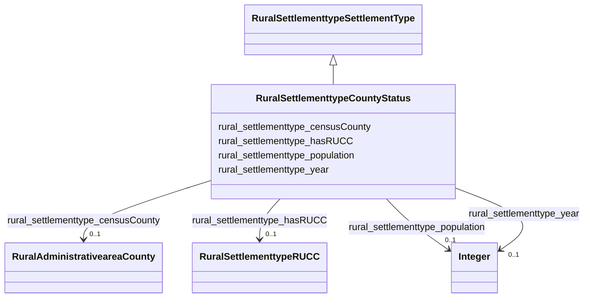

# Class: RuralSettlementtypeCountyStatus


_Status of a county in terms of rural or urban classification._


This class occurs 3234 times.


URI: [rural:settlementtype/CountyStatus](http://sail.ua.edu/ruralkg/settlementtype/CountyStatus)





## Inheritance
* [RuralSettlementtypeSettlementType](../classes/RuralSettlementtypeSettlementType.md)
    * **RuralSettlementtypeCountyStatus**


## Slots

| Name | Cardinality and Range | Description | Inheritance | Occurrences |
| ---  | --- | --- | --- | --- |
| [rural_settlementtype_hasRUCC](../slots/rural_settlementtype_hasRUCC.md) | 0..1 <br/> [RuralSettlementtypeRUCC](../classes/RuralSettlementtypeRUCC.md) |  <br/>  | direct | 3234 |
| [rural_settlementtype_population](../slots/rural_settlementtype_population.md) | 0..1 <br/> [xsd:integer](xsd:integer) |  <br/>  | direct | 3234 |
| [rural_settlementtype_year](../slots/rural_settlementtype_year.md) | 0..1 <br/> [xsd:integer](xsd:integer) |  <br/>  | direct | 3234 |
| [rural_settlementtype_censusCounty](../slots/rural_settlementtype_censusCounty.md) | 0..1 <br/> [RuralAdministrativeareaCounty](../classes/RuralAdministrativeareaCounty.md) |  <br/>  | direct | 3234 |


## LinkML Source

<!-- TODO: investigate https://stackoverflow.com/questions/37606292/how-to-create-tabbed-code-blocks-in-mkdocs-or-sphinx -->

### Direct

<details>

```yaml
name: rural_settlementtype_CountyStatus
description: Status of a county in terms of rural or urban classification.
from_schema: okns:rural-kg
rank: 1000
is_a: rural_settlementtype_SettlementType
slots:
- rural_settlementtype_hasRUCC
- rural_settlementtype_population
- rural_settlementtype_year
- rural_settlementtype_censusCounty
class_uri: rural:settlementtype/CountyStatus

```
</details>

### Induced

<details>

```yaml
name: rural_settlementtype_CountyStatus
description: Status of a county in terms of rural or urban classification.
from_schema: okns:rural-kg
rank: 1000
is_a: rural_settlementtype_SettlementType
attributes:
  rural_settlementtype_hasRUCC:
    name: rural_settlementtype_hasRUCC
    from_schema: okns:rural-kg
    rank: 1000
    slot_uri: rural:settlementtype/hasRUCC
    alias: rural_settlementtype_hasRUCC
    owner: rural_settlementtype_CountyStatus
    domain_of:
    - rural_settlementtype_CountyStatus
    range: rural_settlementtype_RUCC
  rural_settlementtype_population:
    name: rural_settlementtype_population
    from_schema: okns:rural-kg
    rank: 1000
    slot_uri: rural:settlementtype/population
    alias: rural_settlementtype_population
    owner: rural_settlementtype_CountyStatus
    domain_of:
    - rural_settlementtype_CountyStatus
    range: integer
  rural_settlementtype_year:
    name: rural_settlementtype_year
    from_schema: okns:rural-kg
    rank: 1000
    slot_uri: rural:settlementtype/year
    alias: rural_settlementtype_year
    owner: rural_settlementtype_CountyStatus
    domain_of:
    - rural_settlementtype_CountyStatus
    - rural_settlementtype_RUCC
    range: integer
  rural_settlementtype_censusCounty:
    name: rural_settlementtype_censusCounty
    from_schema: okns:rural-kg
    rank: 1000
    slot_uri: rural:settlementtype/censusCounty
    alias: rural_settlementtype_censusCounty
    owner: rural_settlementtype_CountyStatus
    domain_of:
    - rural_settlementtype_CountyStatus
    range: rural_administrativearea_County
class_uri: rural:settlementtype/CountyStatus

```
</details>