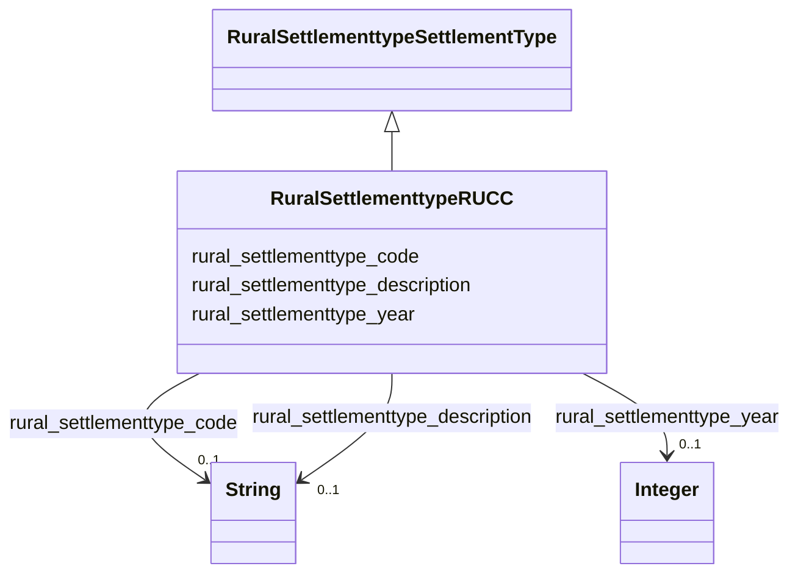

# Class: No class (type) name specified (rural_settlementtype_RUCC)


_No class (type) description specified_


URI: [rural:settlementtype/RUCC](http://sail.ua.edu/ruralkg/settlementtype/RUCC)





## Inheritance
* [RuralSettlementtypeSettlementType](../classes/RuralSettlementtypeSettlementType.md)
    * **RuralSettlementtypeRUCC**


## Slots

| Name | Cardinality and Range | Description | Inheritance |
| ---  | --- | --- | --- |
| [rural_settlementtype_year](../slots/rural_settlementtype_year.md) | 0..1 <br/> [xsd:integer](xsd:integer) | No slot (predicate) description specified <br/> 10 occurrences with subject type rural_settlementtype_RUCC and object type integer.<br/>3234 occurrences with subject type rural_settlementtype_CountyStatus and object type integer. | direct |
| [rural_settlementtype_code](../slots/rural_settlementtype_code.md) | 0..1 <br/> [xsd:string](xsd:string) | No slot (predicate) description specified <br/> 10 occurrences with subject type rural_settlementtype_RUCC and object type string. | direct |
| [rural_settlementtype_description](../slots/rural_settlementtype_description.md) | 0..1 <br/> [xsd:string](xsd:string) | No slot (predicate) description specified <br/> 10 occurrences with subject type rural_settlementtype_RUCC and object type string. | direct |


## Usages

| used by | used in | type | used |
| ---  | --- | --- | --- |
| [RuralSettlementtypeCountyStatus](../classes/RuralSettlementtypeCountyStatus.md) | [rural_settlementtype_hasRUCC](../slots/rural_settlementtype_hasRUCC.md) | range | [RuralSettlementtypeRUCC](../classes/RuralSettlementtypeRUCC.md) |


## Comments

* Rural-Urban Continuum Code classification.

## Identifier and Mapping Information


### Schema Source


* from schema: rural-kg


## Mappings

| Mapping Type | Mapped Value |
| ---  | ---  |
| self | rural:settlementtype/RUCC |
| native | rural-kg/:RuralSettlementtypeRUCC |


## LinkML Source

<!-- TODO: investigate https://stackoverflow.com/questions/37606292/how-to-create-tabbed-code-blocks-in-mkdocs-or-sphinx -->

### Direct

<details>
```yaml
name: rural_settlementtype_RUCC
conforms_to: No schema conformance document specified
description: No class (type) description specified
title: No class (type) name specified
notes:
- Class with 10 occurrences.
comments:
- Rural-Urban Continuum Code classification.
from_schema: rural-kg
rank: 1000
is_a: rural_settlementtype_SettlementType
slots:
- rural_settlementtype_year
- rural_settlementtype_code
- rural_settlementtype_description
class_uri: rural:settlementtype/RUCC

```
</details>

### Induced

<details>
```yaml
name: rural_settlementtype_RUCC
conforms_to: No schema conformance document specified
description: No class (type) description specified
title: No class (type) name specified
notes:
- Class with 10 occurrences.
comments:
- Rural-Urban Continuum Code classification.
from_schema: rural-kg
rank: 1000
is_a: rural_settlementtype_SettlementType
attributes:
  rural_settlementtype_year:
    name: rural_settlementtype_year
    description: No slot (predicate) description specified
    comments:
    - 10 occurrences with subject type rural_settlementtype_RUCC and object type integer.
    - 3234 occurrences with subject type rural_settlementtype_CountyStatus and object
      type integer.
    examples:
    - description: rural_settlementtype_RUCC → integer
      object:
        example_object: '2013'
        example_predicate: rural:settlementtype/year
        example_subject: rural:settlementtype/RUCC_2013_0
    - description: rural_settlementtype_CountyStatus → integer
      object:
        example_object: '2013'
        example_predicate: rural:settlementtype/year
        example_subject: rural:settlementtype/CountyStatus_01001_2013
    from_schema: rural-kg
    rank: 1000
    slot_uri: rural:settlementtype/year
    alias: rural_settlementtype_year
    owner: rural_settlementtype_RUCC
    domain_of:
    - rural_settlementtype_CountyStatus
    - rural_settlementtype_RUCC
    range: integer
  rural_settlementtype_code:
    name: rural_settlementtype_code
    description: No slot (predicate) description specified
    comments:
    - 10 occurrences with subject type rural_settlementtype_RUCC and object type string.
    examples:
    - description: rural_settlementtype_RUCC → string
      object:
        example_object: '0'
        example_predicate: rural:settlementtype/code
        example_subject: rural:settlementtype/RUCC_2013_0
    from_schema: rural-kg
    rank: 1000
    slot_uri: rural:settlementtype/code
    alias: rural_settlementtype_code
    owner: rural_settlementtype_RUCC
    domain_of:
    - rural_settlementtype_RUCC
    range: string
  rural_settlementtype_description:
    name: rural_settlementtype_description
    description: No slot (predicate) description specified
    comments:
    - 10 occurrences with subject type rural_settlementtype_RUCC and object type string.
    examples:
    - description: rural_settlementtype_RUCC → string
      object:
        example_object: Not Applicable
        example_predicate: rural:settlementtype/description
        example_subject: rural:settlementtype/RUCC_2013_0
    from_schema: rural-kg
    rank: 1000
    slot_uri: rural:settlementtype/description
    alias: rural_settlementtype_description
    owner: rural_settlementtype_RUCC
    domain_of:
    - rural_settlementtype_RUCC
    range: string
class_uri: rural:settlementtype/RUCC

```
</details>