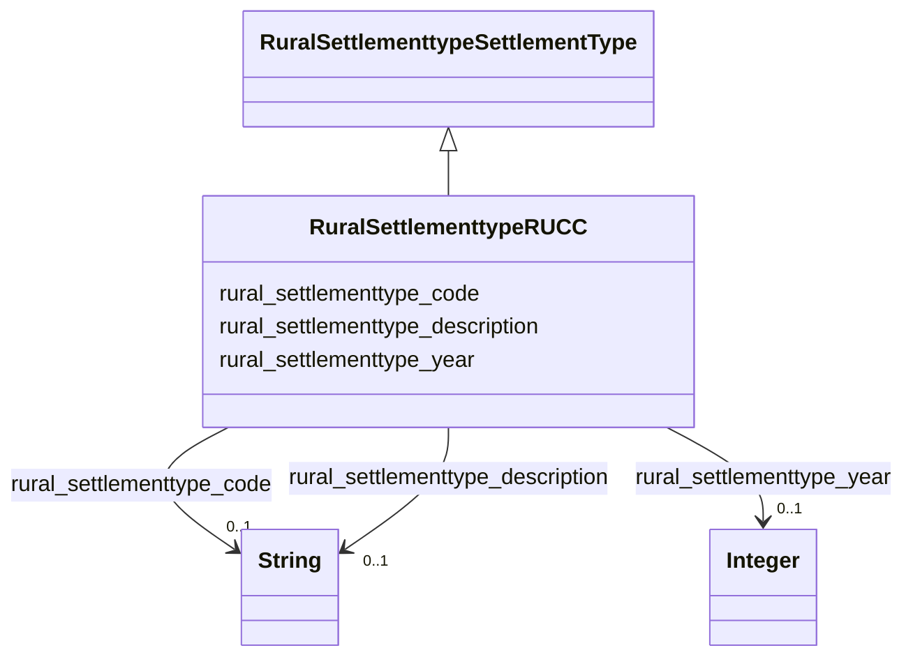

# Class: TODO -- what's a good name for what this class (type) describes? (rural_settlementtype_RUCC)


_Rural-Urban Continuum Code classification._


URI: [rural:settlementtype/RUCC](http://sail.ua.edu/ruralkg/settlementtype/RUCC)





## Inheritance
* [RuralSettlementtypeSettlementType](../classes/RuralSettlementtypeSettlementType.md)
    * **RuralSettlementtypeRUCC**


## Slots

| Name | Cardinality and Range | Description | Inheritance |
| ---  | --- | --- | --- |
| [rural_settlementtype_code](../slots/rural_settlementtype_code.md) | 0..1 <br/> [xsd:string](http://www.w3.org/2001/XMLSchema#string) | TODO -- tell the world what this slot (predicate) describes | direct |
| [rural_settlementtype_year](../slots/rural_settlementtype_year.md) | 0..1 <br/> [xsd:integer](http://www.w3.org/2001/XMLSchema#integer) | TODO -- tell the world what this slot (predicate) describes | direct |
| [rural_settlementtype_description](../slots/rural_settlementtype_description.md) | 0..1 <br/> [xsd:string](http://www.w3.org/2001/XMLSchema#string) | TODO -- tell the world what this slot (predicate) describes | direct |


## Usages

| used by | used in | type | used |
| ---  | --- | --- | --- |
| [RuralSettlementtypeCountyStatus](../classes/RuralSettlementtypeCountyStatus.md) | [rural_settlementtype_hasRUCC](../slots/rural_settlementtype_hasRUCC.md) | range | [RuralSettlementtypeRUCC](../classes/RuralSettlementtypeRUCC.md) |


## Examples

| Value |
| --- |
| rural:settlementtype/RUCC_2013_5 |

## TODOs

* TODO -- Todos for this class go here
* or you can delete the todos
* if you think the class is perfect.

## Identifier and Mapping Information


### Schema Source


* from schema: rural-kg


## Mappings

| Mapping Type | Mapped Value |
| ---  | ---  |
| self | rural:settlementtype/RUCC |
| native | rural-kg/:RuralSettlementtypeRUCC |


## LinkML Source

<!-- TODO: investigate https://stackoverflow.com/questions/37606292/how-to-create-tabbed-code-blocks-in-mkdocs-or-sphinx -->

### Direct

<details>
```yaml
name: rural_settlementtype_RUCC
description: Rural-Urban Continuum Code classification.
title: TODO -- what's a good name for what this class (type) describes?
todos:
- TODO -- Todos for this class go here
- or you can delete the todos
- if you think the class is perfect.
notes:
- There are 10 instances of this class.
examples:
- value: rural:settlementtype/RUCC_2013_5
from_schema: rural-kg
is_a: rural_settlementtype_SettlementType
slots:
- rural_settlementtype_code
- rural_settlementtype_year
- rural_settlementtype_description
class_uri: rural:settlementtype/RUCC

```
</details>

### Induced

<details>
```yaml
name: rural_settlementtype_RUCC
description: Rural-Urban Continuum Code classification.
title: TODO -- what's a good name for what this class (type) describes?
todos:
- TODO -- Todos for this class go here
- or you can delete the todos
- if you think the class is perfect.
notes:
- There are 10 instances of this class.
examples:
- value: rural:settlementtype/RUCC_2013_5
from_schema: rural-kg
is_a: rural_settlementtype_SettlementType
attributes:
  rural_settlementtype_code:
    name: rural_settlementtype_code
    description: TODO -- tell the world what this slot (predicate) describes.
    todos:
    - TODO -- Todos for this slot go here
    - or you can delete the todos
    - if you think the class is perfect.
    comments:
    - 10 occurrences with subject type rural_settlementtype_RUCC and object type string.
    examples:
    - value: rural:settlementtype/RUCC_2013_9 rural:settlementtype/code 9
    from_schema: rural-kg
    rank: 1000
    slot_uri: rural:settlementtype/code
    alias: rural_settlementtype_code
    owner: rural_settlementtype_RUCC
    domain_of:
    - rural_settlementtype_RUCC
    range: string
  rural_settlementtype_year:
    name: rural_settlementtype_year
    description: TODO -- tell the world what this slot (predicate) describes.
    todos:
    - TODO -- Todos for this slot go here
    - or you can delete the todos
    - if you think the class is perfect.
    comments:
    - 3234 occurrences with subject type rural_settlementtype_CountyStatus and object
      type integer.
    - 10 occurrences with subject type rural_settlementtype_RUCC and object type integer.
    examples:
    - value: rural:settlementtype/CountyStatus_46019_2013 rural:settlementtype/year
        2013
    - value: rural:settlementtype/RUCC_2013_5 rural:settlementtype/year 2013
    from_schema: rural-kg
    rank: 1000
    slot_uri: rural:settlementtype/year
    alias: rural_settlementtype_year
    owner: rural_settlementtype_RUCC
    domain_of:
    - rural_settlementtype_CountyStatus
    - rural_settlementtype_RUCC
    range: integer
  rural_settlementtype_description:
    name: rural_settlementtype_description
    description: TODO -- tell the world what this slot (predicate) describes.
    todos:
    - TODO -- Todos for this slot go here
    - or you can delete the todos
    - if you think the class is perfect.
    comments:
    - 10 occurrences with subject type rural_settlementtype_RUCC and object type string.
    examples:
    - value: rural:settlementtype/RUCC_2013_9 rural:settlementtype/description Nonmetro
        - Completely rural or less than 2,500 urban population, not adjacent to a
        metro area
    from_schema: rural-kg
    rank: 1000
    slot_uri: rural:settlementtype/description
    alias: rural_settlementtype_description
    owner: rural_settlementtype_RUCC
    domain_of:
    - rural_settlementtype_RUCC
    range: string
class_uri: rural:settlementtype/RUCC

```
</details>