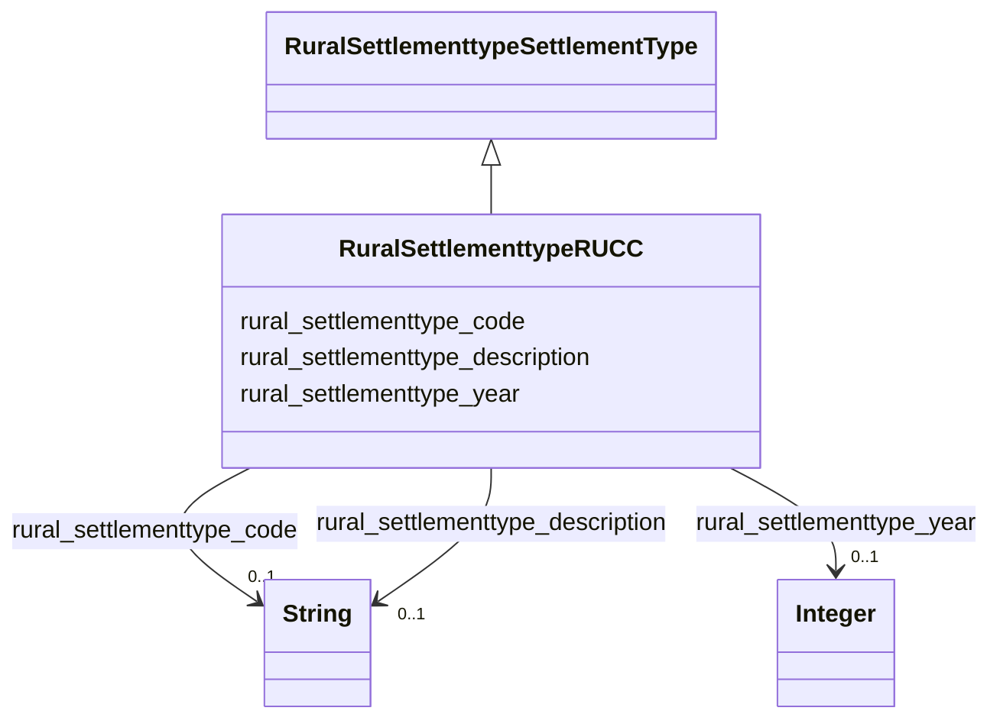

# Class: RuralSettlementtypeRUCC


_Rural-Urban Continuum Code classification._


This class occurs 10 times.


URI: [rural:settlementtype/RUCC](http://sail.ua.edu/ruralkg/settlementtype/RUCC)





## Inheritance
* [RuralSettlementtypeSettlementType](../classes/RuralSettlementtypeSettlementType.md)
    * **RuralSettlementtypeRUCC**


## Slots

| Name | Cardinality and Range | Description | Inheritance | Occurrences |
| ---  | --- | --- | --- | --- |
| [rural_settlementtype_code](../slots/rural_settlementtype_code.md) | 0..1 <br/> [xsd:string](xsd:string) |  <br/>  | direct | 10 |
| [rural_settlementtype_year](../slots/rural_settlementtype_year.md) | 0..1 <br/> [xsd:integer](xsd:integer) |  <br/>  | direct | 10 |
| [rural_settlementtype_description](../slots/rural_settlementtype_description.md) | 0..1 <br/> [xsd:string](xsd:string) |  <br/>  | direct | 10 |


## Usages

| used by | used in | type | used |
| ---  | --- | --- | --- |
| [RuralSettlementtypeCountyStatus](../classes/RuralSettlementtypeCountyStatus.md) | [rural_settlementtype_hasRUCC](../slots/rural_settlementtype_hasRUCC.md) | range | [RuralSettlementtypeRUCC](../classes/RuralSettlementtypeRUCC.md) |


## LinkML Source

<!-- TODO: investigate https://stackoverflow.com/questions/37606292/how-to-create-tabbed-code-blocks-in-mkdocs-or-sphinx -->

### Direct

<details>

```yaml
name: rural_settlementtype_RUCC
description: Rural-Urban Continuum Code classification.
from_schema: okns:rural-kg
rank: 1000
is_a: rural_settlementtype_SettlementType
slots:
- rural_settlementtype_code
- rural_settlementtype_year
- rural_settlementtype_description
class_uri: rural:settlementtype/RUCC

```
</details>

### Induced

<details>

```yaml
name: rural_settlementtype_RUCC
description: Rural-Urban Continuum Code classification.
from_schema: okns:rural-kg
rank: 1000
is_a: rural_settlementtype_SettlementType
attributes:
  rural_settlementtype_code:
    name: rural_settlementtype_code
    from_schema: okns:rural-kg
    rank: 1000
    slot_uri: rural:settlementtype/code
    alias: rural_settlementtype_code
    owner: rural_settlementtype_RUCC
    domain_of:
    - rural_settlementtype_RUCC
    range: string
  rural_settlementtype_year:
    name: rural_settlementtype_year
    from_schema: okns:rural-kg
    rank: 1000
    slot_uri: rural:settlementtype/year
    alias: rural_settlementtype_year
    owner: rural_settlementtype_RUCC
    domain_of:
    - rural_settlementtype_CountyStatus
    - rural_settlementtype_RUCC
    range: integer
  rural_settlementtype_description:
    name: rural_settlementtype_description
    from_schema: okns:rural-kg
    rank: 1000
    slot_uri: rural:settlementtype/description
    alias: rural_settlementtype_description
    owner: rural_settlementtype_RUCC
    domain_of:
    - rural_settlementtype_RUCC
    range: string
class_uri: rural:settlementtype/RUCC

```
</details>