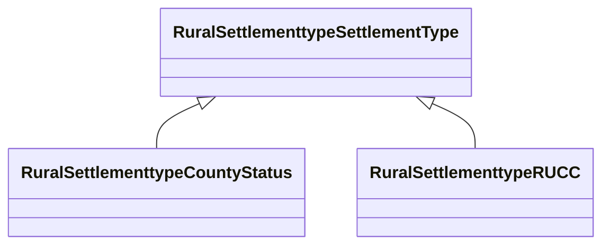

# Class: Settlement Type (rural_settlementtype_SettlementType)


_Rural-Urban Continuum Code (RUCC) is incorporated. Categorize county-level areas into Metro or Nonmetro. It is an indicator for determining the rural-urban continuum code (RUCC) classification_


URI: [rural:settlementtype/SettlementType](http://sail.ua.edu/ruralkg/settlementtype/SettlementType)





## Inheritance
* **RuralSettlementtypeSettlementType**
    * [RuralSettlementtypeCountyStatus](../classes/RuralSettlementtypeCountyStatus.md)
    * [RuralSettlementtypeRUCC](../classes/RuralSettlementtypeRUCC.md)


## Slots

| Name | Cardinality and Range | Description | Inheritance | Occurrences |
| ---  | --- | --- | --- | --- |


## LinkML Source

<!-- TODO: investigate https://stackoverflow.com/questions/37606292/how-to-create-tabbed-code-blocks-in-mkdocs-or-sphinx -->

### Direct

<details>

```yaml
name: rural_settlementtype_SettlementType
description: Rural-Urban Continuum Code (RUCC) is incorporated. Categorize county-level
  areas into Metro or Nonmetro. It is an indicator for determining the rural-urban
  continuum code (RUCC) classification
title: Settlement Type
from_schema: okns:rural-kg
source: http://sail.ua.edu/ruralkg/ontology
rank: 1000
class_uri: rural:settlementtype/SettlementType

```
</details>

### Induced

<details>

```yaml
name: rural_settlementtype_SettlementType
description: Rural-Urban Continuum Code (RUCC) is incorporated. Categorize county-level
  areas into Metro or Nonmetro. It is an indicator for determining the rural-urban
  continuum code (RUCC) classification
title: Settlement Type
from_schema: okns:rural-kg
source: http://sail.ua.edu/ruralkg/ontology
rank: 1000
class_uri: rural:settlementtype/SettlementType

```
</details>