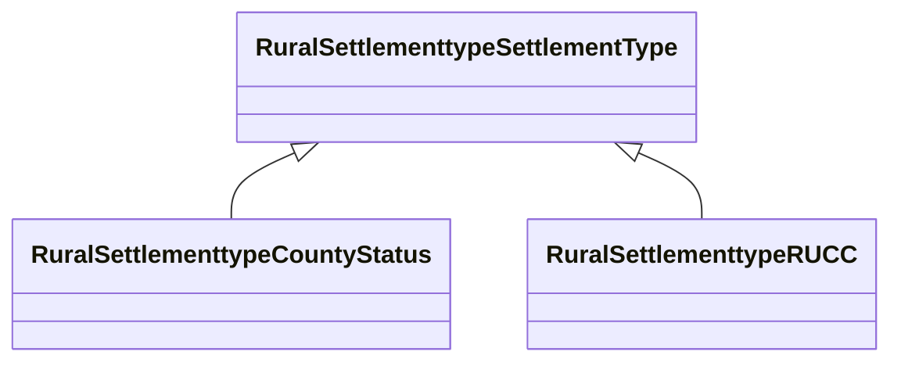

# Class: TODO -- this class is noted as a superclass of another class in this graph but has not itself been defined. (rural_settlementtype_SettlementType)


URI: [rural:settlementtype/SettlementType](http://sail.ua.edu/ruralkg/settlementtype/SettlementType)





## Inheritance
* **RuralSettlementtypeSettlementType**
    * [RuralSettlementtypeCountyStatus](../classes/RuralSettlementtypeCountyStatus.md)
    * [RuralSettlementtypeRUCC](../classes/RuralSettlementtypeRUCC.md)


## Slots

| Name | Cardinality and Range | Description | Inheritance |
| ---  | --- | --- | --- |


## Identifier and Mapping Information


### Schema Source


* from schema: rural-kg


## Mappings

| Mapping Type | Mapped Value |
| ---  | ---  |
| self | rural:settlementtype/SettlementType |
| native | rural-kg/:RuralSettlementtypeSettlementType |


## LinkML Source

<!-- TODO: investigate https://stackoverflow.com/questions/37606292/how-to-create-tabbed-code-blocks-in-mkdocs-or-sphinx -->

### Direct

<details>
```yaml
name: rural_settlementtype_SettlementType
title: TODO -- this class is noted as a superclass of another class in this graph
  but has not itself been defined.
from_schema: rural-kg
rank: 1000
class_uri: rural:settlementtype/SettlementType

```
</details>

### Induced

<details>
```yaml
name: rural_settlementtype_SettlementType
title: TODO -- this class is noted as a superclass of another class in this graph
  but has not itself been defined.
from_schema: rural-kg
rank: 1000
class_uri: rural:settlementtype/SettlementType

```
</details>