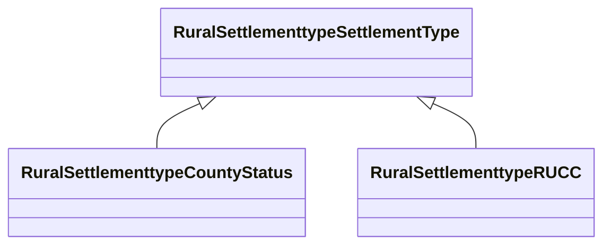

# Class: Settlement Type (rural_settlementtype_SettlementType)


_No class (type) description specified_


URI: [rural:settlementtype/SettlementType](http://sail.ua.edu/ruralkg/settlementtype/SettlementType)





## Inheritance
* **RuralSettlementtypeSettlementType**
    * [RuralSettlementtypeCountyStatus](../classes/RuralSettlementtypeCountyStatus.md)
    * [RuralSettlementtypeRUCC](../classes/RuralSettlementtypeRUCC.md)


## Slots

| Name | Cardinality and Range | Description | Inheritance |
| ---  | --- | --- | --- |


## Comments

* Rural-Urban Continuum Code (RUCC) is incorporated. Categorize county-level areas into Metro or Nonmetro. It is an indicator for determining the rural-urban continuum code (RUCC) classification

## Identifier and Mapping Information


### Schema Source


* from schema: rural-kg


## Mappings

| Mapping Type | Mapped Value |
| ---  | ---  |
| self | rural:settlementtype/SettlementType |
| native | rural-kg/:RuralSettlementtypeSettlementType |


## LinkML Source

<!-- TODO: investigate https://stackoverflow.com/questions/37606292/how-to-create-tabbed-code-blocks-in-mkdocs-or-sphinx -->

### Direct

<details>
```yaml
name: rural_settlementtype_SettlementType
conforms_to: No schema conformance document specified
description: No class (type) description specified
title: Settlement Type
notes:
- Class with 0 occurrences.
comments:
- Rural-Urban Continuum Code (RUCC) is incorporated. Categorize county-level areas
  into Metro or Nonmetro. It is an indicator for determining the rural-urban continuum
  code (RUCC) classification
from_schema: rural-kg
source: http://sail.ua.edu/ruralkg/ontology
rank: 1000
class_uri: rural:settlementtype/SettlementType

```
</details>

### Induced

<details>
```yaml
name: rural_settlementtype_SettlementType
conforms_to: No schema conformance document specified
description: No class (type) description specified
title: Settlement Type
notes:
- Class with 0 occurrences.
comments:
- Rural-Urban Continuum Code (RUCC) is incorporated. Categorize county-level areas
  into Metro or Nonmetro. It is an indicator for determining the rural-urban continuum
  code (RUCC) classification
from_schema: rural-kg
source: http://sail.ua.edu/ruralkg/ontology
rank: 1000
class_uri: rural:settlementtype/SettlementType

```
</details>