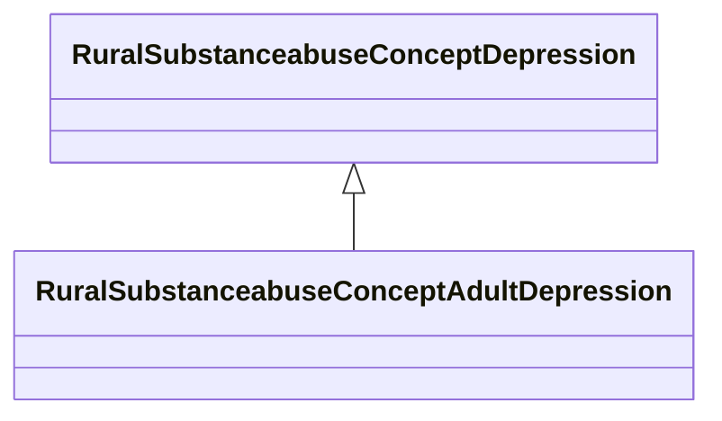

# Class: Adult Depression (rural_substanceabuse_Concept_Adult_Depression)


_Adult-specific depression measures including symptoms, severity, and functional impairment_


URI: [rural:substanceabuse/Concept_Adult_Depression](http://sail.ua.edu/ruralkg/substanceabuse/Concept_Adult_Depression)





## Inheritance
* [RuralSubstanceabuseSubstanceAbuse](../classes/RuralSubstanceabuseSubstanceAbuse.md)
    * [RuralSubstanceabuseConceptMentalHealth](../classes/RuralSubstanceabuseConceptMentalHealth.md)
        * [RuralSubstanceabuseConceptDepression](../classes/RuralSubstanceabuseConceptDepression.md)
            * **RuralSubstanceabuseConceptAdultDepression**


## Slots

| Name | Cardinality and Range | Description | Inheritance | Occurrences |
| ---  | --- | --- | --- | --- |


## LinkML Source

<!-- TODO: investigate https://stackoverflow.com/questions/37606292/how-to-create-tabbed-code-blocks-in-mkdocs-or-sphinx -->

### Direct

<details>

```yaml
name: rural_substanceabuse_Concept_Adult_Depression
description: Adult-specific depression measures including symptoms, severity, and
  functional impairment
title: Adult Depression
from_schema: okns:rural-kg
rank: 1000
is_a: rural_substanceabuse_Concept_Depression
class_uri: rural:substanceabuse/Concept_Adult_Depression

```
</details>

### Induced

<details>

```yaml
name: rural_substanceabuse_Concept_Adult_Depression
description: Adult-specific depression measures including symptoms, severity, and
  functional impairment
title: Adult Depression
from_schema: okns:rural-kg
rank: 1000
is_a: rural_substanceabuse_Concept_Depression
class_uri: rural:substanceabuse/Concept_Adult_Depression

```
</details>