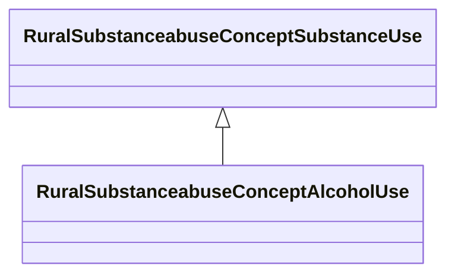

# Class: Alcohol Use (rural_substanceabuse_Concept_Alcohol_Use)


_Comprehensive alcohol use measures including consumption patterns, disorders, and age of initiation_


URI: [rural:substanceabuse/Concept_Alcohol_Use](http://sail.ua.edu/ruralkg/substanceabuse/Concept_Alcohol_Use)





## Inheritance
* [RuralSubstanceabuseSubstanceAbuse](../classes/RuralSubstanceabuseSubstanceAbuse.md)
    * [RuralSubstanceabuseConceptSubstanceUse](../classes/RuralSubstanceabuseConceptSubstanceUse.md)
        * **RuralSubstanceabuseConceptAlcoholUse**


## Slots

| Name | Cardinality and Range | Description | Inheritance | Occurrences |
| ---  | --- | --- | --- | --- |


## LinkML Source

<!-- TODO: investigate https://stackoverflow.com/questions/37606292/how-to-create-tabbed-code-blocks-in-mkdocs-or-sphinx -->

### Direct

<details>

```yaml
name: rural_substanceabuse_Concept_Alcohol_Use
description: Comprehensive alcohol use measures including consumption patterns, disorders,
  and age of initiation
title: Alcohol Use
from_schema: okns:rural-kg
rank: 1000
is_a: rural_substanceabuse_Concept_Substance_Use
class_uri: rural:substanceabuse/Concept_Alcohol_Use

```
</details>

### Induced

<details>

```yaml
name: rural_substanceabuse_Concept_Alcohol_Use
description: Comprehensive alcohol use measures including consumption patterns, disorders,
  and age of initiation
title: Alcohol Use
from_schema: okns:rural-kg
rank: 1000
is_a: rural_substanceabuse_Concept_Substance_Use
class_uri: rural:substanceabuse/Concept_Alcohol_Use

```
</details>