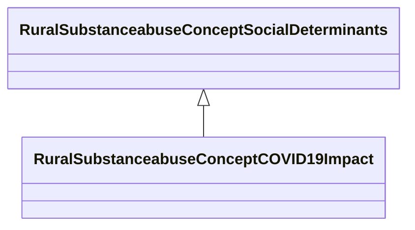

# Class: COVID-19 Impact (rural_substanceabuse_Concept_COVID_19_Impact)


_COVID-19 pandemic effects on substance use, mental health, and service access_


URI: [rural:substanceabuse/Concept_COVID_19_Impact](http://sail.ua.edu/ruralkg/substanceabuse/Concept_COVID_19_Impact)





## Inheritance
* [RuralSubstanceabuseSubstanceAbuse](../classes/RuralSubstanceabuseSubstanceAbuse.md)
    * [RuralSubstanceabuseConceptSocialDeterminants](../classes/RuralSubstanceabuseConceptSocialDeterminants.md)
        * **RuralSubstanceabuseConceptCOVID19Impact**


## Slots

| Name | Cardinality and Range | Description | Inheritance | Occurrences |
| ---  | --- | --- | --- | --- |


## LinkML Source

<!-- TODO: investigate https://stackoverflow.com/questions/37606292/how-to-create-tabbed-code-blocks-in-mkdocs-or-sphinx -->

### Direct

<details>

```yaml
name: rural_substanceabuse_Concept_COVID_19_Impact
description: COVID-19 pandemic effects on substance use, mental health, and service
  access
title: COVID-19 Impact
from_schema: okns:rural-kg
rank: 1000
is_a: rural_substanceabuse_Concept_Social_Determinants
class_uri: rural:substanceabuse/Concept_COVID_19_Impact

```
</details>

### Induced

<details>

```yaml
name: rural_substanceabuse_Concept_COVID_19_Impact
description: COVID-19 pandemic effects on substance use, mental health, and service
  access
title: COVID-19 Impact
from_schema: okns:rural-kg
rank: 1000
is_a: rural_substanceabuse_Concept_Social_Determinants
class_uri: rural:substanceabuse/Concept_COVID_19_Impact

```
</details>