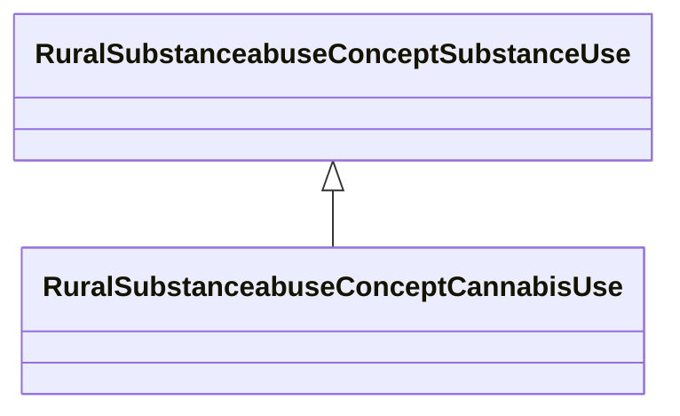

# Class: Cannabis Use (rural_substanceabuse_Concept_Cannabis_Use)


_Marijuana and cannabis product use including blunts, with measures of frequency and disorders_


URI: [rural:substanceabuse/Concept_Cannabis_Use](http://sail.ua.edu/ruralkg/substanceabuse/Concept_Cannabis_Use)





## Inheritance
* [RuralSubstanceabuseSubstanceAbuse](../classes/RuralSubstanceabuseSubstanceAbuse.md)
    * [RuralSubstanceabuseConceptSubstanceUse](../classes/RuralSubstanceabuseConceptSubstanceUse.md)
        * **RuralSubstanceabuseConceptCannabisUse**


## Slots

| Name | Cardinality and Range | Description | Inheritance | Occurrences |
| ---  | --- | --- | --- | --- |


## LinkML Source

<!-- TODO: investigate https://stackoverflow.com/questions/37606292/how-to-create-tabbed-code-blocks-in-mkdocs-or-sphinx -->

### Direct

<details>

```yaml
name: rural_substanceabuse_Concept_Cannabis_Use
description: Marijuana and cannabis product use including blunts, with measures of
  frequency and disorders
title: Cannabis Use
from_schema: okns:rural-kg
rank: 1000
is_a: rural_substanceabuse_Concept_Substance_Use
class_uri: rural:substanceabuse/Concept_Cannabis_Use

```
</details>

### Induced

<details>

```yaml
name: rural_substanceabuse_Concept_Cannabis_Use
description: Marijuana and cannabis product use including blunts, with measures of
  frequency and disorders
title: Cannabis Use
from_schema: okns:rural-kg
rank: 1000
is_a: rural_substanceabuse_Concept_Substance_Use
class_uri: rural:substanceabuse/Concept_Cannabis_Use

```
</details>