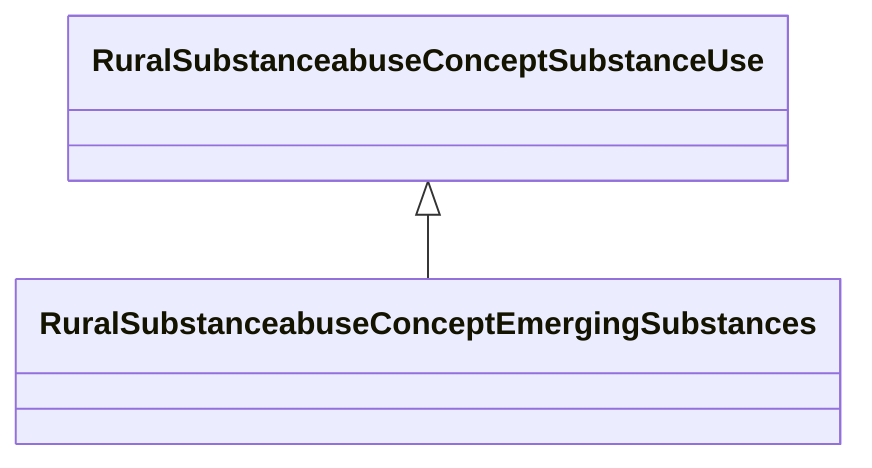

# Class: Emerging Substances (rural_substanceabuse_Concept_Emerging_Substances)


_Emerging and novel substances including illegally made fentanyl, kratom, and synthetic drugs_


URI: [rural:substanceabuse/Concept_Emerging_Substances](http://sail.ua.edu/ruralkg/substanceabuse/Concept_Emerging_Substances)





## Inheritance
* [RuralSubstanceabuseSubstanceAbuse](../classes/RuralSubstanceabuseSubstanceAbuse.md)
    * [RuralSubstanceabuseConceptSubstanceUse](../classes/RuralSubstanceabuseConceptSubstanceUse.md)
        * **RuralSubstanceabuseConceptEmergingSubstances**


## Slots

| Name | Cardinality and Range | Description | Inheritance | Occurrences |
| ---  | --- | --- | --- | --- |


## LinkML Source

<!-- TODO: investigate https://stackoverflow.com/questions/37606292/how-to-create-tabbed-code-blocks-in-mkdocs-or-sphinx -->

### Direct

<details>

```yaml
name: rural_substanceabuse_Concept_Emerging_Substances
description: Emerging and novel substances including illegally made fentanyl, kratom,
  and synthetic drugs
title: Emerging Substances
from_schema: okns:rural-kg
rank: 1000
is_a: rural_substanceabuse_Concept_Substance_Use
class_uri: rural:substanceabuse/Concept_Emerging_Substances

```
</details>

### Induced

<details>

```yaml
name: rural_substanceabuse_Concept_Emerging_Substances
description: Emerging and novel substances including illegally made fentanyl, kratom,
  and synthetic drugs
title: Emerging Substances
from_schema: okns:rural-kg
rank: 1000
is_a: rural_substanceabuse_Concept_Substance_Use
class_uri: rural:substanceabuse/Concept_Emerging_Substances

```
</details>