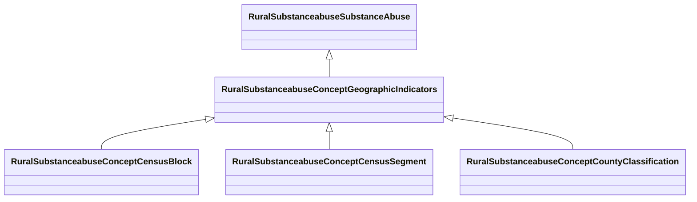

# Class: Geographic Indicators (rural_substanceabuse_Concept_Geographic_Indicators)


_Geographic units and location identifiers used in survey sampling and analysis_


URI: [rural:substanceabuse/Concept_Geographic_Indicators](http://sail.ua.edu/ruralkg/substanceabuse/Concept_Geographic_Indicators)





## Inheritance
* [RuralSubstanceabuseSubstanceAbuse](../classes/RuralSubstanceabuseSubstanceAbuse.md)
    * **RuralSubstanceabuseConceptGeographicIndicators**
        * [RuralSubstanceabuseConceptCensusBlock](../classes/RuralSubstanceabuseConceptCensusBlock.md)
        * [RuralSubstanceabuseConceptCensusSegment](../classes/RuralSubstanceabuseConceptCensusSegment.md)
        * [RuralSubstanceabuseConceptCountyClassification](../classes/RuralSubstanceabuseConceptCountyClassification.md)


## Slots

| Name | Cardinality and Range | Description | Inheritance | Occurrences |
| ---  | --- | --- | --- | --- |


## LinkML Source

<!-- TODO: investigate https://stackoverflow.com/questions/37606292/how-to-create-tabbed-code-blocks-in-mkdocs-or-sphinx -->

### Direct

<details>

```yaml
name: rural_substanceabuse_Concept_Geographic_Indicators
description: Geographic units and location identifiers used in survey sampling and
  analysis
title: Geographic Indicators
from_schema: okns:rural-kg
rank: 1000
is_a: rural_substanceabuse_SubstanceAbuse
class_uri: rural:substanceabuse/Concept_Geographic_Indicators

```
</details>

### Induced

<details>

```yaml
name: rural_substanceabuse_Concept_Geographic_Indicators
description: Geographic units and location identifiers used in survey sampling and
  analysis
title: Geographic Indicators
from_schema: okns:rural-kg
rank: 1000
is_a: rural_substanceabuse_SubstanceAbuse
class_uri: rural:substanceabuse/Concept_Geographic_Indicators

```
</details>