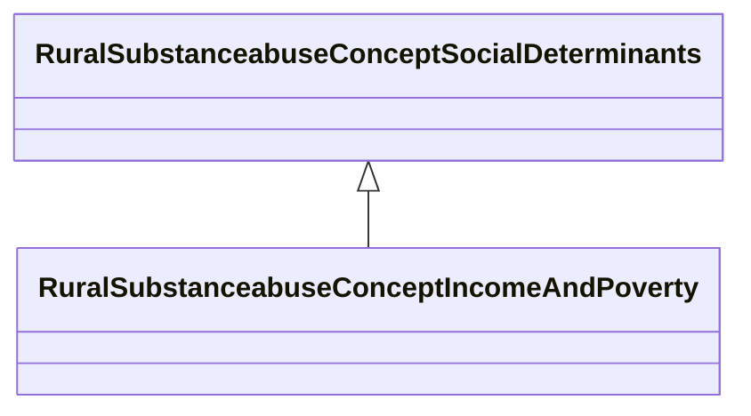

# Class: Income and Poverty (rural_substanceabuse_Concept_Income_and_Poverty)


_Household income, family income, poverty status, and economic hardship_


URI: [rural:substanceabuse/Concept_Income_and_Poverty](http://sail.ua.edu/ruralkg/substanceabuse/Concept_Income_and_Poverty)





## Inheritance
* [RuralSubstanceabuseSubstanceAbuse](../classes/RuralSubstanceabuseSubstanceAbuse.md)
    * [RuralSubstanceabuseConceptSocialDeterminants](../classes/RuralSubstanceabuseConceptSocialDeterminants.md)
        * **RuralSubstanceabuseConceptIncomeAndPoverty**


## Slots

| Name | Cardinality and Range | Description | Inheritance | Occurrences |
| ---  | --- | --- | --- | --- |


## LinkML Source

<!-- TODO: investigate https://stackoverflow.com/questions/37606292/how-to-create-tabbed-code-blocks-in-mkdocs-or-sphinx -->

### Direct

<details>

```yaml
name: rural_substanceabuse_Concept_Income_and_Poverty
description: Household income, family income, poverty status, and economic hardship
title: Income and Poverty
from_schema: okns:rural-kg
rank: 1000
is_a: rural_substanceabuse_Concept_Social_Determinants
class_uri: rural:substanceabuse/Concept_Income_and_Poverty

```
</details>

### Induced

<details>

```yaml
name: rural_substanceabuse_Concept_Income_and_Poverty
description: Household income, family income, poverty status, and economic hardship
title: Income and Poverty
from_schema: okns:rural-kg
rank: 1000
is_a: rural_substanceabuse_Concept_Social_Determinants
class_uri: rural:substanceabuse/Concept_Income_and_Poverty

```
</details>