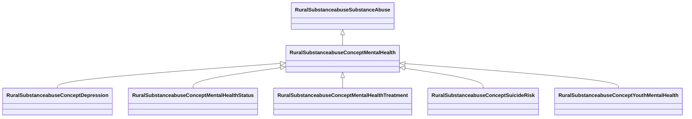

# Class: Mental Health (rural_substanceabuse_Concept_Mental_Health)


_Mental health conditions, symptoms, and treatment across adult and youth populations_


URI: [rural:substanceabuse/Concept_Mental_Health](http://sail.ua.edu/ruralkg/substanceabuse/Concept_Mental_Health)





## Inheritance
* [RuralSubstanceabuseSubstanceAbuse](../classes/RuralSubstanceabuseSubstanceAbuse.md)
    * **RuralSubstanceabuseConceptMentalHealth**
        * [RuralSubstanceabuseConceptDepression](../classes/RuralSubstanceabuseConceptDepression.md)
        * [RuralSubstanceabuseConceptMentalHealthStatus](../classes/RuralSubstanceabuseConceptMentalHealthStatus.md)
        * [RuralSubstanceabuseConceptMentalHealthTreatment](../classes/RuralSubstanceabuseConceptMentalHealthTreatment.md)
        * [RuralSubstanceabuseConceptSuicideRisk](../classes/RuralSubstanceabuseConceptSuicideRisk.md)
        * [RuralSubstanceabuseConceptYouthMentalHealth](../classes/RuralSubstanceabuseConceptYouthMentalHealth.md)


## Slots

| Name | Cardinality and Range | Description | Inheritance | Occurrences |
| ---  | --- | --- | --- | --- |


## LinkML Source

<!-- TODO: investigate https://stackoverflow.com/questions/37606292/how-to-create-tabbed-code-blocks-in-mkdocs-or-sphinx -->

### Direct

<details>

```yaml
name: rural_substanceabuse_Concept_Mental_Health
description: Mental health conditions, symptoms, and treatment across adult and youth
  populations
title: Mental Health
from_schema: okns:rural-kg
rank: 1000
is_a: rural_substanceabuse_SubstanceAbuse
class_uri: rural:substanceabuse/Concept_Mental_Health

```
</details>

### Induced

<details>

```yaml
name: rural_substanceabuse_Concept_Mental_Health
description: Mental health conditions, symptoms, and treatment across adult and youth
  populations
title: Mental Health
from_schema: okns:rural-kg
rank: 1000
is_a: rural_substanceabuse_SubstanceAbuse
class_uri: rural:substanceabuse/Concept_Mental_Health

```
</details>