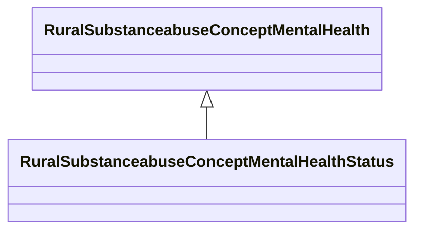

# Class: Mental Health Status (rural_substanceabuse_Concept_Mental_Health_Status)


_Overall mental health status, psychological distress, and functional impairment_


URI: [rural:substanceabuse/Concept_Mental_Health_Status](http://sail.ua.edu/ruralkg/substanceabuse/Concept_Mental_Health_Status)





## Inheritance
* [RuralSubstanceabuseSubstanceAbuse](../classes/RuralSubstanceabuseSubstanceAbuse.md)
    * [RuralSubstanceabuseConceptMentalHealth](../classes/RuralSubstanceabuseConceptMentalHealth.md)
        * **RuralSubstanceabuseConceptMentalHealthStatus**


## Slots

| Name | Cardinality and Range | Description | Inheritance | Occurrences |
| ---  | --- | --- | --- | --- |


## LinkML Source

<!-- TODO: investigate https://stackoverflow.com/questions/37606292/how-to-create-tabbed-code-blocks-in-mkdocs-or-sphinx -->

### Direct

<details>

```yaml
name: rural_substanceabuse_Concept_Mental_Health_Status
description: Overall mental health status, psychological distress, and functional
  impairment
title: Mental Health Status
from_schema: okns:rural-kg
rank: 1000
is_a: rural_substanceabuse_Concept_Mental_Health
class_uri: rural:substanceabuse/Concept_Mental_Health_Status

```
</details>

### Induced

<details>

```yaml
name: rural_substanceabuse_Concept_Mental_Health_Status
description: Overall mental health status, psychological distress, and functional
  impairment
title: Mental Health Status
from_schema: okns:rural-kg
rank: 1000
is_a: rural_substanceabuse_Concept_Mental_Health
class_uri: rural:substanceabuse/Concept_Mental_Health_Status

```
</details>