# Class: Social Determinants (rural_substanceabuse_Concept_Social_Determinants)


_Social, economic, and environmental factors that influence health outcomes_


URI: [rural:substanceabuse/Concept_Social_Determinants](http://sail.ua.edu/ruralkg/substanceabuse/Concept_Social_Determinants)

```mermaid
 classDiagram
    class RuralSubstanceabuseConceptSocialDeterminants
    click RuralSubstanceabuseConceptSocialDeterminants href "../RuralSubstanceabuseConceptSocialDeterminants"
      RuralSubstanceabuseSubstanceAbuse <|-- RuralSubstanceabuseConceptSocialDeterminants
        click RuralSubstanceabuseSubstanceAbuse href "../RuralSubstanceabuseSubstanceAbuse"
      

      RuralSubstanceabuseConceptSocialDeterminants <|-- RuralSubstanceabuseConceptCOVID19Impact
        click RuralSubstanceabuseConceptCOVID19Impact href "../RuralSubstanceabuseConceptCOVID19Impact"
      RuralSubstanceabuseConceptSocialDeterminants <|-- RuralSubstanceabuseConceptCriminalJusticeInvolvement
        click RuralSubstanceabuseConceptCriminalJusticeInvolvement href "../RuralSubstanceabuseConceptCriminalJusticeInvolvement"
      RuralSubstanceabuseConceptSocialDeterminants <|-- RuralSubstanceabuseConceptDemographics
        click RuralSubstanceabuseConceptDemographics href "../RuralSubstanceabuseConceptDemographics"
      RuralSubstanceabuseConceptSocialDeterminants <|-- RuralSubstanceabuseConceptEducation
        click RuralSubstanceabuseConceptEducation href "../RuralSubstanceabuseConceptEducation"
      RuralSubstanceabuseConceptSocialDeterminants <|-- RuralSubstanceabuseConceptEmployment
        click RuralSubstanceabuseConceptEmployment href "../RuralSubstanceabuseConceptEmployment"
      RuralSubstanceabuseConceptSocialDeterminants <|-- RuralSubstanceabuseConceptHealthInsurance
        click RuralSubstanceabuseConceptHealthInsurance href "../RuralSubstanceabuseConceptHealthInsurance"
      RuralSubstanceabuseConceptSocialDeterminants <|-- RuralSubstanceabuseConceptHouseholdComposition
        click RuralSubstanceabuseConceptHouseholdComposition href "../RuralSubstanceabuseConceptHouseholdComposition"
      RuralSubstanceabuseConceptSocialDeterminants <|-- RuralSubstanceabuseConceptIncomeAndPoverty
        click RuralSubstanceabuseConceptIncomeAndPoverty href "../RuralSubstanceabuseConceptIncomeAndPoverty"
      RuralSubstanceabuseConceptSocialDeterminants <|-- RuralSubstanceabuseConceptPhysicalHealth
        click RuralSubstanceabuseConceptPhysicalHealth href "../RuralSubstanceabuseConceptPhysicalHealth"
      RuralSubstanceabuseConceptSocialDeterminants <|-- RuralSubstanceabuseConceptYouthExperiences
        click RuralSubstanceabuseConceptYouthExperiences href "../RuralSubstanceabuseConceptYouthExperiences"
      
      
      
```





## Inheritance
* [RuralSubstanceabuseSubstanceAbuse](../classes/RuralSubstanceabuseSubstanceAbuse.md)
    * **RuralSubstanceabuseConceptSocialDeterminants**
        * [RuralSubstanceabuseConceptCOVID19Impact](../classes/RuralSubstanceabuseConceptCOVID19Impact.md)
        * [RuralSubstanceabuseConceptCriminalJusticeInvolvement](../classes/RuralSubstanceabuseConceptCriminalJusticeInvolvement.md)
        * [RuralSubstanceabuseConceptDemographics](../classes/RuralSubstanceabuseConceptDemographics.md)
        * [RuralSubstanceabuseConceptEducation](../classes/RuralSubstanceabuseConceptEducation.md)
        * [RuralSubstanceabuseConceptEmployment](../classes/RuralSubstanceabuseConceptEmployment.md)
        * [RuralSubstanceabuseConceptHealthInsurance](../classes/RuralSubstanceabuseConceptHealthInsurance.md)
        * [RuralSubstanceabuseConceptHouseholdComposition](../classes/RuralSubstanceabuseConceptHouseholdComposition.md)
        * [RuralSubstanceabuseConceptIncomeAndPoverty](../classes/RuralSubstanceabuseConceptIncomeAndPoverty.md)
        * [RuralSubstanceabuseConceptPhysicalHealth](../classes/RuralSubstanceabuseConceptPhysicalHealth.md)
        * [RuralSubstanceabuseConceptYouthExperiences](../classes/RuralSubstanceabuseConceptYouthExperiences.md)


## Slots

| Name | Cardinality and Range | Description | Inheritance | Occurrences |
| ---  | --- | --- | --- | --- |


## LinkML Source

<!-- TODO: investigate https://stackoverflow.com/questions/37606292/how-to-create-tabbed-code-blocks-in-mkdocs-or-sphinx -->

### Direct

<details>

```yaml
name: rural_substanceabuse_Concept_Social_Determinants
description: Social, economic, and environmental factors that influence health outcomes
title: Social Determinants
from_schema: okns:rural-kg
rank: 1000
is_a: rural_substanceabuse_SubstanceAbuse
class_uri: rural:substanceabuse/Concept_Social_Determinants

```
</details>

### Induced

<details>

```yaml
name: rural_substanceabuse_Concept_Social_Determinants
description: Social, economic, and environmental factors that influence health outcomes
title: Social Determinants
from_schema: okns:rural-kg
rank: 1000
is_a: rural_substanceabuse_SubstanceAbuse
class_uri: rural:substanceabuse/Concept_Social_Determinants

```
</details>