# Class: Substance Use (rural_substanceabuse_Concept_Substance_Use)


_All substance use related measures including alcohol, tobacco, illicit drugs, and prescription drug misuse_


URI: [rural:substanceabuse/Concept_Substance_Use](http://sail.ua.edu/ruralkg/substanceabuse/Concept_Substance_Use)

```mermaid
 classDiagram
    class RuralSubstanceabuseConceptSubstanceUse
    click RuralSubstanceabuseConceptSubstanceUse href "../RuralSubstanceabuseConceptSubstanceUse"
      RuralSubstanceabuseSubstanceAbuse <|-- RuralSubstanceabuseConceptSubstanceUse
        click RuralSubstanceabuseSubstanceAbuse href "../RuralSubstanceabuseSubstanceAbuse"
      

      RuralSubstanceabuseConceptSubstanceUse <|-- RuralSubstanceabuseConceptAlcoholUse
        click RuralSubstanceabuseConceptAlcoholUse href "../RuralSubstanceabuseConceptAlcoholUse"
      RuralSubstanceabuseConceptSubstanceUse <|-- RuralSubstanceabuseConceptCannabisUse
        click RuralSubstanceabuseConceptCannabisUse href "../RuralSubstanceabuseConceptCannabisUse"
      RuralSubstanceabuseConceptSubstanceUse <|-- RuralSubstanceabuseConceptCocaineUse
        click RuralSubstanceabuseConceptCocaineUse href "../RuralSubstanceabuseConceptCocaineUse"
      RuralSubstanceabuseConceptSubstanceUse <|-- RuralSubstanceabuseConceptEmergingSubstances
        click RuralSubstanceabuseConceptEmergingSubstances href "../RuralSubstanceabuseConceptEmergingSubstances"
      RuralSubstanceabuseConceptSubstanceUse <|-- RuralSubstanceabuseConceptHallucinogenUse
        click RuralSubstanceabuseConceptHallucinogenUse href "../RuralSubstanceabuseConceptHallucinogenUse"
      RuralSubstanceabuseConceptSubstanceUse <|-- RuralSubstanceabuseConceptHeroinUse
        click RuralSubstanceabuseConceptHeroinUse href "../RuralSubstanceabuseConceptHeroinUse"
      RuralSubstanceabuseConceptSubstanceUse <|-- RuralSubstanceabuseConceptInhalantUse
        click RuralSubstanceabuseConceptInhalantUse href "../RuralSubstanceabuseConceptInhalantUse"
      RuralSubstanceabuseConceptSubstanceUse <|-- RuralSubstanceabuseConceptOpioidUse
        click RuralSubstanceabuseConceptOpioidUse href "../RuralSubstanceabuseConceptOpioidUse"
      RuralSubstanceabuseConceptSubstanceUse <|-- RuralSubstanceabuseConceptPrescriptionDrugMisuse
        click RuralSubstanceabuseConceptPrescriptionDrugMisuse href "../RuralSubstanceabuseConceptPrescriptionDrugMisuse"
      RuralSubstanceabuseConceptSubstanceUse <|-- RuralSubstanceabuseConceptStimulantUse
        click RuralSubstanceabuseConceptStimulantUse href "../RuralSubstanceabuseConceptStimulantUse"
      RuralSubstanceabuseConceptSubstanceUse <|-- RuralSubstanceabuseConceptSubstanceUseDisorders
        click RuralSubstanceabuseConceptSubstanceUseDisorders href "../RuralSubstanceabuseConceptSubstanceUseDisorders"
      RuralSubstanceabuseConceptSubstanceUse <|-- RuralSubstanceabuseConceptSubstanceUsePatterns
        click RuralSubstanceabuseConceptSubstanceUsePatterns href "../RuralSubstanceabuseConceptSubstanceUsePatterns"
      RuralSubstanceabuseConceptSubstanceUse <|-- RuralSubstanceabuseConceptSubstanceUseTreatment
        click RuralSubstanceabuseConceptSubstanceUseTreatment href "../RuralSubstanceabuseConceptSubstanceUseTreatment"
      RuralSubstanceabuseConceptSubstanceUse <|-- RuralSubstanceabuseConceptTobaccoUse
        click RuralSubstanceabuseConceptTobaccoUse href "../RuralSubstanceabuseConceptTobaccoUse"
      
      
      
```





## Inheritance
* [RuralSubstanceabuseSubstanceAbuse](../classes/RuralSubstanceabuseSubstanceAbuse.md)
    * **RuralSubstanceabuseConceptSubstanceUse**
        * [RuralSubstanceabuseConceptAlcoholUse](../classes/RuralSubstanceabuseConceptAlcoholUse.md)
        * [RuralSubstanceabuseConceptCannabisUse](../classes/RuralSubstanceabuseConceptCannabisUse.md)
        * [RuralSubstanceabuseConceptCocaineUse](../classes/RuralSubstanceabuseConceptCocaineUse.md)
        * [RuralSubstanceabuseConceptEmergingSubstances](../classes/RuralSubstanceabuseConceptEmergingSubstances.md)
        * [RuralSubstanceabuseConceptHallucinogenUse](../classes/RuralSubstanceabuseConceptHallucinogenUse.md)
        * [RuralSubstanceabuseConceptHeroinUse](../classes/RuralSubstanceabuseConceptHeroinUse.md)
        * [RuralSubstanceabuseConceptInhalantUse](../classes/RuralSubstanceabuseConceptInhalantUse.md)
        * [RuralSubstanceabuseConceptOpioidUse](../classes/RuralSubstanceabuseConceptOpioidUse.md)
        * [RuralSubstanceabuseConceptPrescriptionDrugMisuse](../classes/RuralSubstanceabuseConceptPrescriptionDrugMisuse.md)
        * [RuralSubstanceabuseConceptStimulantUse](../classes/RuralSubstanceabuseConceptStimulantUse.md)
        * [RuralSubstanceabuseConceptSubstanceUseDisorders](../classes/RuralSubstanceabuseConceptSubstanceUseDisorders.md)
        * [RuralSubstanceabuseConceptSubstanceUsePatterns](../classes/RuralSubstanceabuseConceptSubstanceUsePatterns.md)
        * [RuralSubstanceabuseConceptSubstanceUseTreatment](../classes/RuralSubstanceabuseConceptSubstanceUseTreatment.md)
        * [RuralSubstanceabuseConceptTobaccoUse](../classes/RuralSubstanceabuseConceptTobaccoUse.md)


## Slots

| Name | Cardinality and Range | Description | Inheritance | Occurrences |
| ---  | --- | --- | --- | --- |


## LinkML Source

<!-- TODO: investigate https://stackoverflow.com/questions/37606292/how-to-create-tabbed-code-blocks-in-mkdocs-or-sphinx -->

### Direct

<details>

```yaml
name: rural_substanceabuse_Concept_Substance_Use
description: All substance use related measures including alcohol, tobacco, illicit
  drugs, and prescription drug misuse
title: Substance Use
from_schema: okns:rural-kg
rank: 1000
is_a: rural_substanceabuse_SubstanceAbuse
class_uri: rural:substanceabuse/Concept_Substance_Use

```
</details>

### Induced

<details>

```yaml
name: rural_substanceabuse_Concept_Substance_Use
description: All substance use related measures including alcohol, tobacco, illicit
  drugs, and prescription drug misuse
title: Substance Use
from_schema: okns:rural-kg
rank: 1000
is_a: rural_substanceabuse_SubstanceAbuse
class_uri: rural:substanceabuse/Concept_Substance_Use

```
</details>