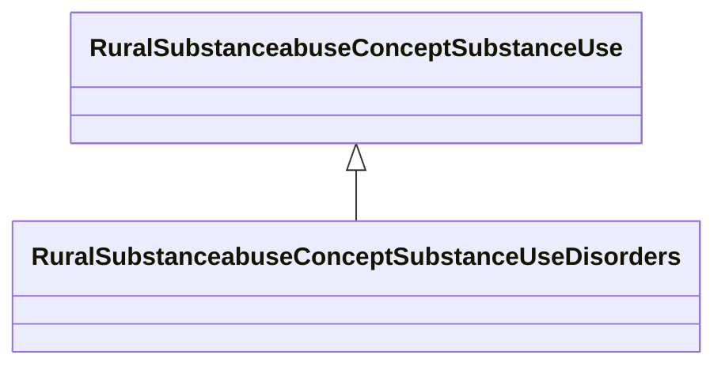

# Class: Substance Use Disorders (rural_substanceabuse_Concept_Substance_Use_Disorders)


_DSM-based substance use disorder diagnoses across all substance categories_


URI: [rural:substanceabuse/Concept_Substance_Use_Disorders](http://sail.ua.edu/ruralkg/substanceabuse/Concept_Substance_Use_Disorders)





## Inheritance
* [RuralSubstanceabuseSubstanceAbuse](../classes/RuralSubstanceabuseSubstanceAbuse.md)
    * [RuralSubstanceabuseConceptSubstanceUse](../classes/RuralSubstanceabuseConceptSubstanceUse.md)
        * **RuralSubstanceabuseConceptSubstanceUseDisorders**


## Slots

| Name | Cardinality and Range | Description | Inheritance | Occurrences |
| ---  | --- | --- | --- | --- |


## LinkML Source

<!-- TODO: investigate https://stackoverflow.com/questions/37606292/how-to-create-tabbed-code-blocks-in-mkdocs-or-sphinx -->

### Direct

<details>

```yaml
name: rural_substanceabuse_Concept_Substance_Use_Disorders
description: DSM-based substance use disorder diagnoses across all substance categories
title: Substance Use Disorders
from_schema: okns:rural-kg
rank: 1000
is_a: rural_substanceabuse_Concept_Substance_Use
class_uri: rural:substanceabuse/Concept_Substance_Use_Disorders

```
</details>

### Induced

<details>

```yaml
name: rural_substanceabuse_Concept_Substance_Use_Disorders
description: DSM-based substance use disorder diagnoses across all substance categories
title: Substance Use Disorders
from_schema: okns:rural-kg
rank: 1000
is_a: rural_substanceabuse_Concept_Substance_Use
class_uri: rural:substanceabuse/Concept_Substance_Use_Disorders

```
</details>