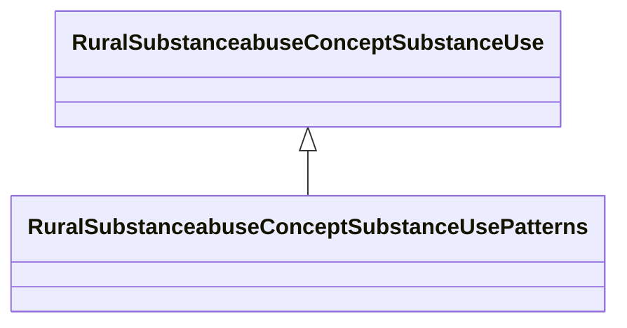

# Class: Substance Use Patterns (rural_substanceabuse_Concept_Substance_Use_Patterns)


_Cross-substance patterns including polysubstance use, age of first use, and recency of use_


URI: [rural:substanceabuse/Concept_Substance_Use_Patterns](http://sail.ua.edu/ruralkg/substanceabuse/Concept_Substance_Use_Patterns)





## Inheritance
* [RuralSubstanceabuseSubstanceAbuse](../classes/RuralSubstanceabuseSubstanceAbuse.md)
    * [RuralSubstanceabuseConceptSubstanceUse](../classes/RuralSubstanceabuseConceptSubstanceUse.md)
        * **RuralSubstanceabuseConceptSubstanceUsePatterns**


## Slots

| Name | Cardinality and Range | Description | Inheritance | Occurrences |
| ---  | --- | --- | --- | --- |


## LinkML Source

<!-- TODO: investigate https://stackoverflow.com/questions/37606292/how-to-create-tabbed-code-blocks-in-mkdocs-or-sphinx -->

### Direct

<details>

```yaml
name: rural_substanceabuse_Concept_Substance_Use_Patterns
description: Cross-substance patterns including polysubstance use, age of first use,
  and recency of use
title: Substance Use Patterns
from_schema: okns:rural-kg
rank: 1000
is_a: rural_substanceabuse_Concept_Substance_Use
class_uri: rural:substanceabuse/Concept_Substance_Use_Patterns

```
</details>

### Induced

<details>

```yaml
name: rural_substanceabuse_Concept_Substance_Use_Patterns
description: Cross-substance patterns including polysubstance use, age of first use,
  and recency of use
title: Substance Use Patterns
from_schema: okns:rural-kg
rank: 1000
is_a: rural_substanceabuse_Concept_Substance_Use
class_uri: rural:substanceabuse/Concept_Substance_Use_Patterns

```
</details>