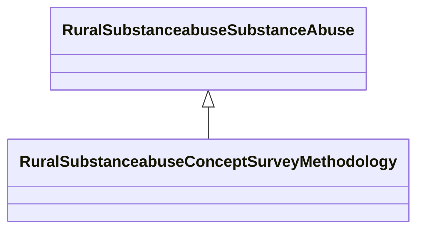

# Class: Survey Methodology (rural_substanceabuse_Concept_Survey_Methodology)


_Survey administration, weighting, and methodological variables_


URI: [rural:substanceabuse/Concept_Survey_Methodology](http://sail.ua.edu/ruralkg/substanceabuse/Concept_Survey_Methodology)





## Inheritance
* [RuralSubstanceabuseSubstanceAbuse](../classes/RuralSubstanceabuseSubstanceAbuse.md)
    * **RuralSubstanceabuseConceptSurveyMethodology**


## Slots

| Name | Cardinality and Range | Description | Inheritance | Occurrences |
| ---  | --- | --- | --- | --- |


## LinkML Source

<!-- TODO: investigate https://stackoverflow.com/questions/37606292/how-to-create-tabbed-code-blocks-in-mkdocs-or-sphinx -->

### Direct

<details>

```yaml
name: rural_substanceabuse_Concept_Survey_Methodology
description: Survey administration, weighting, and methodological variables
title: Survey Methodology
from_schema: okns:rural-kg
rank: 1000
is_a: rural_substanceabuse_SubstanceAbuse
class_uri: rural:substanceabuse/Concept_Survey_Methodology

```
</details>

### Induced

<details>

```yaml
name: rural_substanceabuse_Concept_Survey_Methodology
description: Survey administration, weighting, and methodological variables
title: Survey Methodology
from_schema: okns:rural-kg
rank: 1000
is_a: rural_substanceabuse_SubstanceAbuse
class_uri: rural:substanceabuse/Concept_Survey_Methodology

```
</details>