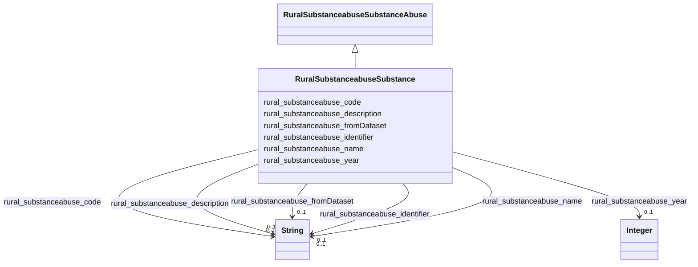

# Class: RuralSubstanceabuseSubstance


_Types of substances that can be abused._


This class occurs 23 times.


URI: [rural:substanceabuse/Substance](http://sail.ua.edu/ruralkg/substanceabuse/Substance)





## Inheritance
* [RuralSubstanceabuseSubstanceAbuse](../classes/RuralSubstanceabuseSubstanceAbuse.md)
    * **RuralSubstanceabuseSubstance**


## Slots

| Name | Cardinality and Range | Description | Inheritance | Occurrences |
| ---  | --- | --- | --- | --- |
| [rural_substanceabuse_code](../slots/rural_substanceabuse_code.md) | 0..1 <br/> [xsd:string](xsd:string) |  <br/>  | direct | 23 |
| [rural_substanceabuse_identifier](../slots/rural_substanceabuse_identifier.md) | 0..1 <br/> [xsd:string](xsd:string) |  <br/>  | direct | 23 |
| [rural_substanceabuse_description](../slots/rural_substanceabuse_description.md) | 0..1 <br/> [xsd:string](xsd:string) |  <br/>  | direct | 23 |
| [rural_substanceabuse_name](../slots/rural_substanceabuse_name.md) | 0..1 <br/> [xsd:string](xsd:string) |  <br/>  | direct | 23 |
| [rural_substanceabuse_year](../slots/rural_substanceabuse_year.md) | 0..1 <br/> [xsd:integer](xsd:integer) |  <br/>  | direct | 23 |
| [rural_substanceabuse_fromDataset](../slots/rural_substanceabuse_fromDataset.md) | 0..1 <br/> [xsd:string](xsd:string) |  <br/>  | direct | 23 |


## LinkML Source

<!-- TODO: investigate https://stackoverflow.com/questions/37606292/how-to-create-tabbed-code-blocks-in-mkdocs-or-sphinx -->

### Direct

<details>

```yaml
name: rural_substanceabuse_Substance
description: Types of substances that can be abused.
from_schema: okns:rural-kg
rank: 1000
is_a: rural_substanceabuse_SubstanceAbuse
slots:
- rural_substanceabuse_code
- rural_substanceabuse_identifier
- rural_substanceabuse_description
- rural_substanceabuse_name
- rural_substanceabuse_year
- rural_substanceabuse_fromDataset
class_uri: rural:substanceabuse/Substance

```
</details>

### Induced

<details>

```yaml
name: rural_substanceabuse_Substance
description: Types of substances that can be abused.
from_schema: okns:rural-kg
rank: 1000
is_a: rural_substanceabuse_SubstanceAbuse
attributes:
  rural_substanceabuse_code:
    name: rural_substanceabuse_code
    from_schema: okns:rural-kg
    rank: 1000
    slot_uri: rural:substanceabuse/code
    alias: rural_substanceabuse_code
    owner: rural_substanceabuse_Substance
    domain_of:
    - rural_substanceabuse_Substance
    range: string
  rural_substanceabuse_identifier:
    name: rural_substanceabuse_identifier
    from_schema: okns:rural-kg
    rank: 1000
    slot_uri: rural:substanceabuse/identifier
    alias: rural_substanceabuse_identifier
    owner: rural_substanceabuse_Substance
    domain_of:
    - rural_substanceabuse_Substance
    range: string
  rural_substanceabuse_description:
    name: rural_substanceabuse_description
    from_schema: okns:rural-kg
    rank: 1000
    slot_uri: rural:substanceabuse/description
    alias: rural_substanceabuse_description
    owner: rural_substanceabuse_Substance
    domain_of:
    - rural_substanceabuse_Substance
    range: string
  rural_substanceabuse_name:
    name: rural_substanceabuse_name
    from_schema: okns:rural-kg
    rank: 1000
    slot_uri: rural:substanceabuse/name
    alias: rural_substanceabuse_name
    owner: rural_substanceabuse_Substance
    domain_of:
    - rural_substanceabuse_Substance
    - rural_substanceabuse_SubstanceRelatedIncident
    range: string
  rural_substanceabuse_year:
    name: rural_substanceabuse_year
    from_schema: okns:rural-kg
    rank: 1000
    slot_uri: rural:substanceabuse/year
    alias: rural_substanceabuse_year
    owner: rural_substanceabuse_Substance
    domain_of:
    - rural_substanceabuse_Substance
    - rural_substanceabuse_SubstanceRelatedIncident
    range: integer
  rural_substanceabuse_fromDataset:
    name: rural_substanceabuse_fromDataset
    from_schema: okns:rural-kg
    rank: 1000
    slot_uri: rural:substanceabuse/fromDataset
    alias: rural_substanceabuse_fromDataset
    owner: rural_substanceabuse_Substance
    domain_of:
    - rural_substanceabuse_Substance
    - rural_substanceabuse_SubstanceRelatedIncident
    range: string
class_uri: rural:substanceabuse/Substance

```
</details>