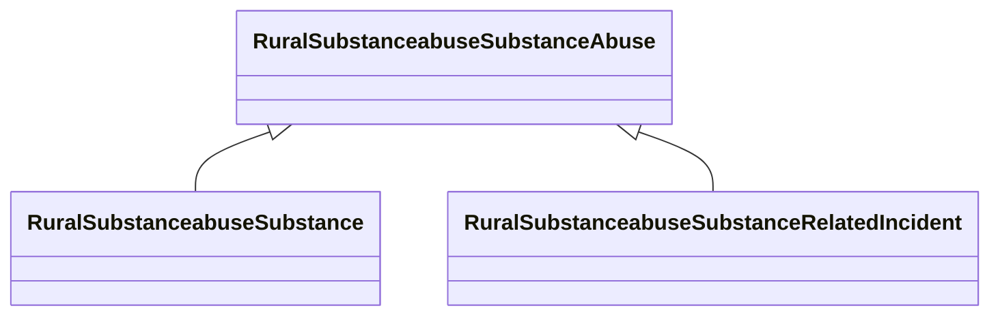

# Class: Substance Abuse (rural_substanceabuse_SubstanceAbuse)


_No class (type) description specified_


URI: [rural:substanceabuse/SubstanceAbuse](http://sail.ua.edu/ruralkg/substanceabuse/SubstanceAbuse)





## Inheritance
* **RuralSubstanceabuseSubstanceAbuse**
    * [RuralSubstanceabuseSubstance](../classes/RuralSubstanceabuseSubstance.md)
    * [RuralSubstanceabuseSubstanceRelatedIncident](../classes/RuralSubstanceabuseSubstanceRelatedIncident.md)


## Slots

| Name | Cardinality and Range | Description | Inheritance |
| ---  | --- | --- | --- |


## Comments

* Categories of substance type and related incident types, extracted from National Survey on Drug Use and Health (NSDUH).

## Identifier and Mapping Information


### Schema Source


* from schema: rural-kg


## Mappings

| Mapping Type | Mapped Value |
| ---  | ---  |
| self | rural:substanceabuse/SubstanceAbuse |
| native | rural-kg/:RuralSubstanceabuseSubstanceAbuse |


## LinkML Source

<!-- TODO: investigate https://stackoverflow.com/questions/37606292/how-to-create-tabbed-code-blocks-in-mkdocs-or-sphinx -->

### Direct

<details>
```yaml
name: rural_substanceabuse_SubstanceAbuse
conforms_to: No schema conformance document specified
description: No class (type) description specified
title: Substance Abuse
notes:
- Class with 0 occurrences.
comments:
- Categories of substance type and related incident types, extracted from National
  Survey on Drug Use and Health (NSDUH).
from_schema: rural-kg
source: http://sail.ua.edu/ruralkg/ontology
rank: 1000
class_uri: rural:substanceabuse/SubstanceAbuse

```
</details>

### Induced

<details>
```yaml
name: rural_substanceabuse_SubstanceAbuse
conforms_to: No schema conformance document specified
description: No class (type) description specified
title: Substance Abuse
notes:
- Class with 0 occurrences.
comments:
- Categories of substance type and related incident types, extracted from National
  Survey on Drug Use and Health (NSDUH).
from_schema: rural-kg
source: http://sail.ua.edu/ruralkg/ontology
rank: 1000
class_uri: rural:substanceabuse/SubstanceAbuse

```
</details>