# Class: Substance Abuse (rural_substanceabuse_SubstanceAbuse)


_Categories of substance type and related incident types, extracted from National Survey on Drug Use and Health (NSDUH)._


URI: [rural:substanceabuse/SubstanceAbuse](http://sail.ua.edu/ruralkg/substanceabuse/SubstanceAbuse)

```mermaid
 classDiagram
    class RuralSubstanceabuseSubstanceAbuse
    click RuralSubstanceabuseSubstanceAbuse href "../RuralSubstanceabuseSubstanceAbuse"
      RuralSubstanceabuseSubstanceAbuse <|-- RuralSubstanceabuseConceptGeographicIndicators
        click RuralSubstanceabuseConceptGeographicIndicators href "../RuralSubstanceabuseConceptGeographicIndicators"
      RuralSubstanceabuseSubstanceAbuse <|-- RuralSubstanceabuseConceptMentalHealth
        click RuralSubstanceabuseConceptMentalHealth href "../RuralSubstanceabuseConceptMentalHealth"
      RuralSubstanceabuseSubstanceAbuse <|-- RuralSubstanceabuseConceptSocialDeterminants
        click RuralSubstanceabuseConceptSocialDeterminants href "../RuralSubstanceabuseConceptSocialDeterminants"
      RuralSubstanceabuseSubstanceAbuse <|-- RuralSubstanceabuseConceptSubstanceUse
        click RuralSubstanceabuseConceptSubstanceUse href "../RuralSubstanceabuseConceptSubstanceUse"
      RuralSubstanceabuseSubstanceAbuse <|-- RuralSubstanceabuseConceptSurveyMethodology
        click RuralSubstanceabuseConceptSurveyMethodology href "../RuralSubstanceabuseConceptSurveyMethodology"
      RuralSubstanceabuseSubstanceAbuse <|-- RuralSubstanceabuseSubstance
        click RuralSubstanceabuseSubstance href "../RuralSubstanceabuseSubstance"
      RuralSubstanceabuseSubstanceAbuse <|-- RuralSubstanceabuseSubstanceRelatedIncident
        click RuralSubstanceabuseSubstanceRelatedIncident href "../RuralSubstanceabuseSubstanceRelatedIncident"
      
      
```





## Inheritance
* **RuralSubstanceabuseSubstanceAbuse**
    * [RuralSubstanceabuseConceptGeographicIndicators](../classes/RuralSubstanceabuseConceptGeographicIndicators.md)
    * [RuralSubstanceabuseConceptMentalHealth](../classes/RuralSubstanceabuseConceptMentalHealth.md)
    * [RuralSubstanceabuseConceptSocialDeterminants](../classes/RuralSubstanceabuseConceptSocialDeterminants.md)
    * [RuralSubstanceabuseConceptSubstanceUse](../classes/RuralSubstanceabuseConceptSubstanceUse.md)
    * [RuralSubstanceabuseConceptSurveyMethodology](../classes/RuralSubstanceabuseConceptSurveyMethodology.md)
    * [RuralSubstanceabuseSubstance](../classes/RuralSubstanceabuseSubstance.md)
    * [RuralSubstanceabuseSubstanceRelatedIncident](../classes/RuralSubstanceabuseSubstanceRelatedIncident.md)


## Slots

| Name | Cardinality and Range | Description | Inheritance | Occurrences |
| ---  | --- | --- | --- | --- |


## LinkML Source

<!-- TODO: investigate https://stackoverflow.com/questions/37606292/how-to-create-tabbed-code-blocks-in-mkdocs-or-sphinx -->

### Direct

<details>

```yaml
name: rural_substanceabuse_SubstanceAbuse
description: Categories of substance type and related incident types, extracted from
  National Survey on Drug Use and Health (NSDUH).
title: Substance Abuse
from_schema: okns:rural-kg
source: http://sail.ua.edu/ruralkg/ontology
rank: 1000
class_uri: rural:substanceabuse/SubstanceAbuse

```
</details>

### Induced

<details>

```yaml
name: rural_substanceabuse_SubstanceAbuse
description: Categories of substance type and related incident types, extracted from
  National Survey on Drug Use and Health (NSDUH).
title: Substance Abuse
from_schema: okns:rural-kg
source: http://sail.ua.edu/ruralkg/ontology
rank: 1000
class_uri: rural:substanceabuse/SubstanceAbuse

```
</details>